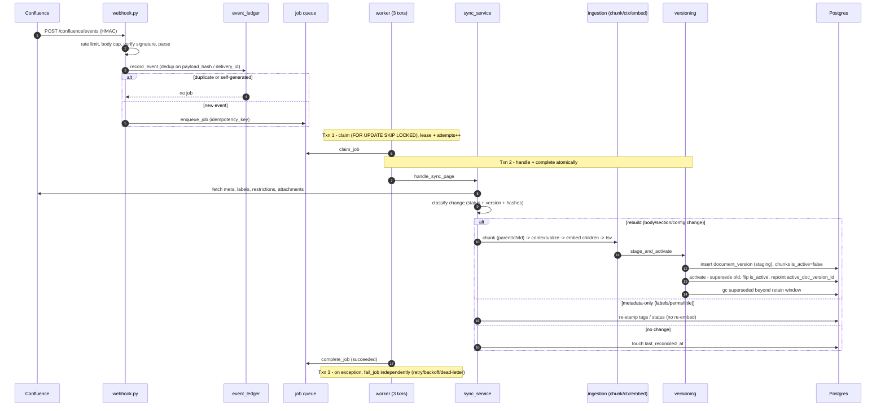
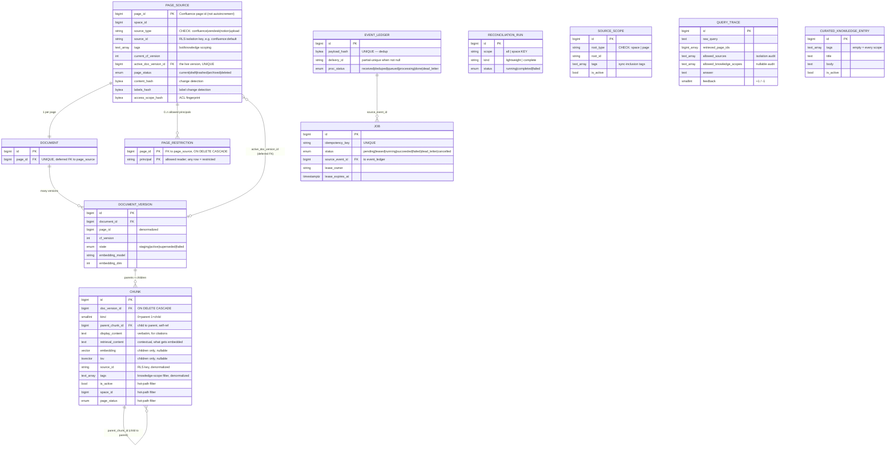
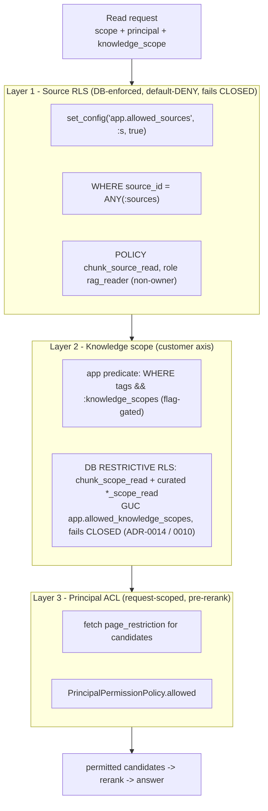
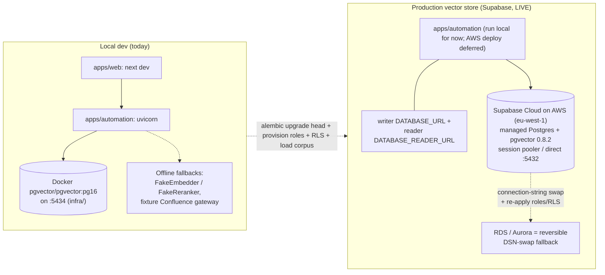

# Omniboost RAG ("Obi") — The Complete System, A→Z

> **Purpose of this document.** One self-contained, maximum-detail reference for the entire Obi RAG
> system — product intent, architecture, both data flows end to end, the data model, the security and
> isolation model, deployment, the frontend widget, every architecture decision, operations, current
> live status, and the forward roadmap. It is written to be fed to a design tool to render as HTML, so
> it is heavily structured (headings, tables, Mermaid diagrams) and each section stands on its own.
>
> **Sources synthesized:** `docs/final_design/01–06`, `docs/rag/DESIGN.md`, `docs/rag/how_this_works.md`,
> `docs/rag/OBI-WIDGET-DESIGN.md`, all ADRs (`docs/adr/0001–0014`), the runbooks (`docs/runbooks/*`),
> `docs/future-ideas/IDEAS.md`, the source-scoping spec, and the authoritative status ledger
> `docs/rag/PLAN.md` §0/§1. Where the older `final_design` docs predate live events (Phase 6 cutover,
> ADR-0013/0014, migrations 0008/0009/0010), this document reconciles to the **current** state.
> Last reconciled: **2026-09-10**.

---

## Table of contents

1. [What Obi is (the one-paragraph version)](#1-what-obi-is)
2. [The accuracy-first contract](#2-the-accuracy-first-contract)
3. [Fixed product decisions](#3-fixed-product-decisions)
4. [Tech stack (as built)](#4-tech-stack-as-built)
5. [Top-level architecture](#5-top-level-architecture)
6. [The write path — ingestion, A→Z](#6-the-write-path--ingestion-az)
7. [The read path — retrieval + answer, A→Z](#7-the-read-path--retrieval--answer-az)
8. [The data model](#8-the-data-model)
9. [Security & isolation](#9-security--isolation)
10. [The frontend widget](#10-the-frontend-widget)
11. [Deployment](#11-deployment)
12. [Evaluation & monitoring](#12-evaluation--monitoring)
13. [Architecture Decision Records (digest)](#13-architecture-decision-records-digest)
14. [Operational runbooks](#14-operational-runbooks)
15. [Current status (authoritative, 2026-09-10)](#15-current-status-authoritative-2026-09-10)
16. [Roadmap & future ideas](#16-roadmap--future-ideas)
17. [Glossary](#17-glossary)

---

## 1. What Obi is

Omniboost RAG (the assistant is branded **"Obi"**) is an **accuracy-first, Confluence-native,
multi-platform retrieval-augmented chat widget**. One backend and one knowledge corpus power a floating
chat widget that can be embedded across multiple third-party hospitality platforms — **Mews, Opera
Cloud, Toast POS** — plus a general standalone deployment, **without forking per platform** and
**without one platform's documentation leaking into another's answers**.

The system is best understood as **two independent flows that share one Postgres corpus**:

- **Ingestion (write path)** — `confluence_sync` → `ingestion`. Turns a Confluence page into searchable
  rows. Runs as the **writer** DB role (table owner; bypasses RLS). Fully built and verified.
- **Retrieval + answer (read path)** — `retrieval` → `rag_agent` → `POST /chat`. Turns a question into
  a grounded, cited, streamed answer. Runs the search as the non-owner **reader** DB role (RLS
  enforced). Fully built and wired to the live widget.

The only seam between them is the shared corpus and one ingestion activation point that stamps
`source_id` / `source_type` / `tags` onto each chunk.

---

## 2. The accuracy-first contract

The product's defining constraint is **accuracy over coverage**: it would rather refuse and route a
user to a human than answer from thin evidence. This is enforced **in code, not merely requested in a
prompt**, at three points:

1. **Forced citations.** Every claim in an answer must cite a retrieved chunk; uncited sentences are
   stripped before the answer is returned (`rag_agent/domain/citations.py::enforce_citations`). If
   nothing survives, the answer degrades to a **refusal** rather than an empty or ungrounded reply.
2. **A hard refusal threshold.** If the top reranked score is below `refusal_min_rerank_score`
   (default **0.10**, `settings.py:99`) the runtime abstains and offers a human hand-off instead of
   guessing.
3. **Database-enforced isolation.** Source-level Postgres Row-Level Security is **default-deny**, so a
   retrieval that forgets to scope returns *zero* rows, never another tenant's rows.

---

## 3. Fixed product decisions

Settled decisions of record (PLAN §1 + the ADRs). Not open for casual re-litigation; changing one
requires a new ADR.

| Decision | Source | Note |
|---|---|---|
| Confluence is the (only, for now) knowledge source | ADR-0002, ADR-0004 | Canonical identity = the Confluence **page id**; all sync is idempotent + version-aware |
| Versioned store with **atomic activation** | ADR-0002 | An index update is immutable and all-or-nothing; the live corpus is never half-rebuilt; rollback is instant |
| **Hybrid** retrieval (dense + keyword), fused by **RRF** | ADR-0002 | `score = Σ 1/(60 + rank)`; cross-encoder reranked; never the answer model as reranker |
| **Cross-encoder rerankers only** — no general-LLM reranker | ADR-0005 | Cheaper per candidate, deterministic enough to eval |
| The answer runtime is a **fixed workflow, not an agent loop** | ADR-0005 | Bounded latency, stage-by-stage testable, auditable refusal + citation enforcement |
| **One CRAG corrective retry** maximum | ADR-0005 | Bounded to protect p95; not an unbounded agent loop |
| **Three layered security controls**, all applied on every read | ADR-0004, ADR-0011, ADR-0014 | Source RLS + knowledge-scope tag filter + page-principal ACL |
| Deterministic **SQL filtering**, never LLM filters | ADR-0002, DESIGN §8 | Keeps recall honest |
| **Postgres + pgvector** is the stack; switching is ruled out | ADR-0001/0002 | See [Deployment](#11-deployment) |
| Frontend/backend stay **one monorepo** for now | ADR-0006, ADR-0010 | Repo split re-deferred until a real second consumer exists (IDEAS #5) |
| Production host = **Supabase Cloud on AWS** | ADR-0013 | Plain Postgres over `psycopg` (a DSN only; no Supabase SDK/REST); RDS/Aurora = reversible fallback |

---

## 4. Tech stack (as built)

| Layer | Technology | Anchor |
|---|---|---|
| Frontend | Next.js + React + TypeScript + Tailwind + semantic design tokens (`apps/web`) | ADR-0001 |
| Backend | Python 3.12+, FastAPI, Pydantic v2, SQLAlchemy 2.0, Alembic (`apps/automation`) | ADR-0001 |
| Package mgmt | `pnpm` workspace for JS/TS; `uv` + Hatchling for Python (never mixed) | root `CLAUDE.md` |
| Contracts | `packages/contracts` — OpenAPI source of truth (`chat.yaml`) → generated TS + hand-authored Pydantic | ADR-0001 |
| Database | **PostgreSQL 16 + pgvector + Postgres full-text search (tsvector)** | ADR-0001 |
| Dense index | pgvector **HNSW** (cosine); `m=16, ef_construction=200` (`models.py:64`) | ADR-0002 |
| Keyword index | Postgres **GIN** over `tsvector` (`models.py:315`) | ADR-0002 |
| Fusion | Reciprocal Rank Fusion, constant `k=60` | ADR-0002, `fusion.py` |
| Reranker | **Cohere `rerank-v3.5`** cross-encoder (`settings.py:83`); `FakeReranker` offline | ADR-0005 |
| Answer model | Anthropic **`claude-sonnet-5`** (`settings.py:58`) | ADR-0009 |
| Routing/rewrite model | Anthropic **`claude-haiku-4-5-20251001`** (`settings.py:57`) | ADR-0009 |
| Embeddings | **Deployed: OpenAI `text-embedding-3-large` @ 3072 → `halfvec(3072)` HNSW** (see note) | ADR-0002 |

### Embedding provider — code default vs deployed `.env`

There are two layers to reconcile:

- **Code default** (`settings.py:61-63`): `embedding_provider="voyage"`, `embedding_model="voyage-3-large"`,
  `embedding_dim=1024`. At ≤2000 dims the HNSW index uses plain `vector_cosine_ops`.
- **Deployed reality** (the gitignored root `.env`, verified 2026-09-07): `EMBEDDING_PROVIDER=openai`,
  `EMBEDDING_MODEL=text-embedding-3-large`, `EMBEDDING_DIM=3072`. **The `.env` overrides the code
  default**, so the actual running config is **OpenAI 3072-dim → the `halfvec(3072)` HNSW path** (pgvector
  caps a plain-`vector` HNSW index at 2000 dims, so >2000 dims forces the halfvec cast). This matches the
  ADR-0002 amendment and DESIGN §1.

Whichever provider is active, **ingestion and retrieval always use the same embedder**, and a change of
embedding model/dim forces a full re-embed via the version-stamp gate (ADR-0002). The Voyage/1024 values
are only the no-`.env` fallback; `VOYAGE_API_KEY` is now set (verified 2026-09-10) but the bake-off that
would flip the provider is not yet run.

---

## 5. Top-level architecture

```mermaid
flowchart LR
  subgraph Browser
    W["Obi widget<br/>apps/web/features/chat"]
  end
  subgraph Next["Next.js (apps/web)"]
    RH["chat route handler /<br/>automation-api proxy<br/>(holds CHAT_API_KEY)"]
  end
  subgraph FastAPI["apps/automation (FastAPI)"]
    WH["POST /confluence/events<br/>(webhook)"]
    CH["POST /chat (SSE)<br/>PATCH /chat/:id/feedback"]
    WK["job worker + scheduler"]
    ING["confluence_sync + ingestion<br/>(writer role)"]
    RET["retrieval + rag_agent<br/>(reader role)"]
  end
  subgraph PG[("PostgreSQL 16 + pgvector + tsvector<br/>(Supabase Cloud on AWS)")]
    T["page_source, document,<br/>document_version, chunk (HNSW+GIN),<br/>page_restriction, event_ledger, job,<br/>query_trace, curated_knowledge_entry, ..."]
  end
  subgraph Ext["External APIs"]
    CF["Confluence REST"]
    EMB["Embeddings (OpenAI / Voyage)"]
    CO["Cohere rerank-v3.5"]
    AN["Anthropic (Sonnet / Haiku)"]
  end

  W -->|"HTTPS (no secret in browser)"| RH
  RH -->|"Bearer CHAT_API_KEY"| CH
  CF -->|"webhook HMAC"| WH
  WH --> ING
  WK --> ING
  ING -->|"writer, owner (exempt via NO FORCE)"| PG
  ING --> EMB
  ING --> AN
  ING --> CF
  CH --> RET
  RET -->|"reader, RLS enforced"| PG
  RET --> EMB
  RET --> CO
  RET --> AN
  CH -->|SSE stream| RH
  RH -->|SSE| W
```

**Caption.** The browser widget never holds a secret — the Next.js proxy injects `CHAT_API_KEY`
server-side and forwards the SSE stream back. `apps/automation` is one FastAPI service with two
independent internal flows: the ingestion/write path (writer DB role, exempt from RLS by table
ownership + `NO FORCE`) fed by the Confluence webhook and the scheduled worker, and the retrieval/answer
path (reader DB role, RLS enforced) behind `POST /chat`. Both share one Postgres + pgvector store
(Supabase Cloud on AWS). External calls: an embedder, Cohere for reranking, Anthropic for
rewrite/answer/vision.

### Repository layout

```
apps/
  automation/   Python 3.12 FastAPI RAG service (uv + Hatchling). The backend.
  web/          Next.js frontend (pnpm). The chat UI (the Obi widget).
packages/       Shared TS packages (design-tokens, contracts).
docs/adr/       Architecture Decision Records.
infra/          Docker compose for local Postgres + pgvector.
```

### Backend structure (`apps/automation/app`)

```
app/
  main.py        FastAPI entrypoint — wiring only, no business rules.
  features/      Business capabilities, each behind ONE public root (__init__.py):
                   confluence_sync, ingestion, retrieval, rag_agent, evaluation
  platform/      Technical capabilities: db, clients, config, jobs, logging.
  shared/        Stable cross-feature primitives (e.g. hashing).
```

**Machine-enforced feature boundaries** (`tools/check_feature_boundaries.py`, ADR-0003): code outside a
feature imports it only at its root (`app.features.<f>`); code inside `<f>` may deep-import itself but
reaches other features at their root; a feature never imports its own root; `platform/**` and `shared/**`
import no features (and `shared/**` imports no `platform/**`). The one deliberate exception is
`platform/db`, whose ~40 ORM classes/enums are imported by full path.

---

## 6. The write path — ingestion, A→Z

The write path turns a Confluence page into searchable rows in Postgres. It runs as the **writer** DB
role (table owner; exempt from RLS via ownership + `NO FORCE`), so ingestion is never blocked by the
read-path isolation policy. Two features own it: `confluence_sync` (get data in, classify the change)
and `ingestion` (turn a page into chunks + embeddings + a new immutable version). **Fully built and
verified.**

```
Confluence webhook (or reconciliation sweep)
  → event_ledger (dedup) → job queue (idempotent enqueue)
  → worker (3-transaction discipline) → sync_service.handle_sync_page (classify change)
  → [rebuild?] chunking (parent/child) → contextualize → embed (children) → tsv (children)
  → stage_and_activate: immutable document_version (staging) → atomic pointer-swap → GC
```



### 6.1 Webhook receipt

`POST /confluence/events`, handler `receive_confluence_event` (`webhook.py:88-93`). STATE-MUTATING, no
LLM. Order inside the handler:

1. **Rate limit** per client IP — `SlidingWindowRateLimiter(webhook_rate_limit_per_minute=300)`.
2. **Body-size cap** — `webhook_max_body_bytes` (512 KiB) → 413.
3. **HMAC signature** — `_verify_signature`: header `X-Hub-Signature-256`; **fail-closed 503** if
   `confluence_webhook_secret` unset; 401 if header missing; strips an optional `sha256=` prefix;
   `expected = hmac.new(secret, raw_body, sha256).hexdigest()`; constant-time `hmac.compare_digest`,
   401 on mismatch.
4. **Parse** JSON (400 on decode / non-dict), then `parse_webhook_payload` → `EventEnvelope`. Tolerates
   nested and flattened webhook shapes; retains the full body in `raw`.
5. **`ingest_event(session, envelope, settings, origin=0)`**.
6. A structured `webhook_event` log line (event_type, page_id, actor, delivery_id, disposition, job_id).

The handler does **no** page fetch or indexing — all deferred to the worker. Each request is one short
transaction via `get_db` / `session_scope()`.

### 6.2 Event-ledger dedup

`ingest_event` (`event_service.py:41-64`):

- **Unsubscribed types dropped** — `envelope.event_type not in ALL_EVENTS` ⇒ ignored. Subscription sets:
  `DELETE_EVENTS` (page trashed/archived/removed/deleted), `SYNC_EVENTS` (created/updated/moved/restored/
  unarchived, attachment created/updated/removed, label added/deleted, page permissions updated),
  `SPACE_EVENTS` (space updated / permissions updated), `ALL_EVENTS = union`.
- **Self-event guard** — if the actor is `confluence_service_account_id`, mark the ledger row
  `done`/`self_generated` and enqueue **no** job — prevents our own writes from looping back.
- **Dedup** — `event_repo.record_event` computes `payload_hash = hash_json(envelope.canonical_dedup_payload())`
  and inserts with a **target-less** `on_conflict_do_nothing()`, so a violation on **either** unique
  constraint — `uq_event_ledger_payload_hash` (canonical content) or `ux_event_ledger_delivery_id`
  (partial-unique delivery id) — is absorbed in one round trip. The dedup key is `(event_type, page_id,
  cf_version, space_id, status, event_timestamp, delivery_id)` and **excludes receive time**, so a
  redelivery is a graceful no-op.

### 6.3 The job queue (`platform/jobs/queue.py`)

A generic, crash-safe Postgres-backed queue. Reconciliation feeds the **same** queue as the webhook —
there is never a blind re-embed path.

- **Enqueue** — `enqueue_job`: idempotent via `on_conflict_do_nothing(index_elements=["idempotency_key"])`.
  Keys per event type: `sync_page:{page_id}:{event_type}:{ver}:{schema}`, `delete_page:{page_id}:{event_type}`
  (priority 50, higher), `reconcile_space:{space_id}:{event_id}`.
- **Claim** — `claim_job`: one `pending`/`failed` row with `available_at <= now`, `ORDER BY priority ASC,
  available_at ASC LIMIT 1` **`FOR UPDATE SKIP LOCKED`**; sets `status=running`, `lease_owner`,
  `lease_expires_at = now + worker_lease_seconds` (120s), increments `attempts`.
- **Complete** — `complete_job` → `succeeded`, clears the lease.
- **Fail / retry / dead-letter** — `fail_job`: truncates error to 4000 chars; if `attempts >=
  max_attempts` (default 5) → `dead_letter`, else `failed` with exponential backoff
  `base_backoff_seconds(5)·2^(attempts-1)`, capped 3600s.
- **Reaper** — `reap_expired`: any `leased`/`running` job whose lease expired resets to `pending`.

### 6.4 The worker's 3-transaction discipline (`application/worker.py`)

`run_once` runs each job in **three separate transactions** so bookkeeping and work never share a
rollback:

- **Txn 1 — Claim.** `claim_job`; committed so the lease + `attempts` increment are durable **before**
  work starts.
- **Txn 2 — Handle + complete atomically.** Re-`get(Job, job_id)`; run the handler; `complete_job` — the
  index mutation and the `succeeded` transition commit **together**. If the handler raises, this txn
  rolls back entirely.
- **Txn 3 — Fail independently.** On exception, a third session re-fetches the job and calls `fail_job` so
  the attempt count + error survive the rollback that undid the work.

Handlers: `_handle_sync_page` → `handle_sync_page`; `_handle_delete_page` → `handle_delete_page`;
`_handle_reconcile_space` → `reconcile_space` (lazily imported to break a module cycle — the one legal
cycle-breaker, ADR-0003). Every handler is idempotent and version-guarded. `drain` processes up to
`max_jobs=100`.

### 6.5 Change classification (`sync_service.py` + `domain/change_detection.py`)

`handle_sync_page` fetches page meta, labels, restrictions, attachments, decides whether to fetch the
body (`decide_body_fetch`), then `classify(...)` produces a `ChangeDecision` and branches:

| Outcome | When | `action` |
|---|---|---|
| gone / deactivated | meta missing, or a trashed/deleted/archived status | `"gone"` / `"deactivated"` |
| **rebuild** | first-ever index, or any class in `_REBUILD_CLASSES` | `"indexed"` |
| metadata-only | a meaningful but non-body change (labels, permissions, title, parent) | `"metadata_only"` |
| no change | nothing meaningful drifted | `"no_change"` |

`_REBUILD_CLASSES`: `body_changed, section_added/updated/removed/moved, index_config_change`. It
**excludes `attachment_changed`** deliberately — a rebuild at the same `cf_version` would violate
`uq_document_version_idem`. `classify` is driven by **status + version + hashes**, not the raw webhook
`event_type` (event type only routes the job type). Gone-statuses short-circuit; first-ever index ⇒
`body_changed`; a version guard skips work when `meta.version <= local.current_cf_version` and config is
unchanged; a pipeline-config change forces `index_config_change`.

### 6.6 Chunking — parent/child (`domain/chunking.py`)

Two tiers (`ChunkConfig`):

- **Parents** (`kind=0`): group a section's blocks into ~`parent_target` (1200) token spans, hard cap
  `parent_max` (2000). The **context unit** — not embedded, expanded at retrieval.
- **Children** (`kind=1`): ~`child_target` (400) token windows within a single parent (`child_min`=150,
  `child_max`=750), `child_overlap_ratio` (0.12) overlap. The **embedding / match unit**.

Split priority: page → heading section → block (tables/code kept whole) → paragraph → sentence/word →
token. Each chunk carries **stable identity keys** (ADR-0002): `section_key`, `positional_key`,
`content_key` (`sha256_text`), and `stable_key` (position + content), so editing one section reuses
unchanged embeddings. Parent↔child persisted in `_link_chunks`: parents flushed first, each child mapped
to its parent, children linked `prev_chunk_id`/`next_chunk_id` in reading order.

### 6.7 Contextualization (`application/contextualizer.py`)

Each child's embedded **`retrieval_content`** is distinct from the verbatim **`display_content`** used in
citations. The contextualizer always prepends a factual metadata prefix (page title + heading path joined
by ` > `) and, when enabled, an LLM-written 1–2 sentence situating context, composed as
`prefix\n\n<llm ctx>\n\ntext`. The LLM path fires only when `contextualization_enabled` and an Anthropic
key are present; it uses the **whole page as a prompt-cached system block** (billed once per page, capped
at `contextualization_max_doc_chars`) and the `routing_model` (`claude-haiku-4-5`), `max_tokens=128`,
instructed to add context "using only information present in the document." **Fail-soft**: on
`AnthropicError` it returns `""` (metadata-only) — contextualization never fails ingestion.

### 6.8 Embedding (`platform/clients/embeddings_client.py`)

Only **children** are embedded, and only the indexes that actually need re-embedding
(`versioning._resolve_children` — diff-matched children reuse the old embedding + retrieval_content).
Provider chosen by `build_embedding_provider`: `OpenAIEmbeddingProvider`, `VoyageEmbeddingProvider`,
`FakeEmbeddingProvider` (deterministic, offline), or a local provider. Resilience: a per-call abuse cap
(`embedding_max_texts_per_call`, 20k), splitting into `embedding_max_batch` (128) batches, a circuit
breaker after `embedding_breaker_threshold` (5) consecutive failures, bounded retry with `min(0.3·2^n, 4)`
backoff. `services.embedding_model` reflects the **actual** producer, so switching providers reads as a
config change the version-stamp gate turns into a full re-embed.

### 6.9 Keyword `tsv`

Populated on **child** chunks only: `tsv = to_tsvector('english', title + heading path + text)` — the
config is a SQL literal, the text a bound parameter. Parents get no `tsv`. Indexed by the GIN
`ix_chunk_tsv_gin`.

### 6.10 Versioning, activation, rollback, GC (`application/versioning.py`)

An index update is **immutable and atomic** (ADR-0002). `stage_and_activate` runs in the caller's single
transaction:

1. **Ensure the `document`**; compute reusable children (returns `[]` when pipeline config changed — a
   full re-embed release gate; `_pipeline_config_matches` compares embedding_model/dim,
   contextualization_version, retrieval_schema_version).
2. **Create the new `document_version` in `staging`**, recording content/structure hashes and every
   pipeline version stamp.
3. **Build chunks** with `is_active=False`, link parents↔children.
4. **Validation gate:** if there are no child chunks, mark the version `failed` and raise — a bad build
   never activates.
5. **`_activate`** (the pointer swap): supersede the old active version (`superseded`, its chunks
   `is_active=False`); set the new version `active`, its chunks `is_active=True`; upsert `page_source`
   with `active_doc_version_id = new_version.id` plus title/url/hashes/pipeline stamps/`tags`/
   `current_cf_version`. Because `page_source.active_doc_version_id` is a `UNIQUE` deferrable FK and
   `document_version` has a partial-unique "one active per document" index, the swap is all-or-nothing —
   the live corpus is never half-rebuilt.
6. **`_gc_superseded`**: keep `DEFAULT_RETAIN_SUPERSEDED = 2` superseded versions for rollback; older
   ones are set `failed` then deleted (chunks cascade via FK).

**Rollback** — `rollback_to`: supersede the current, reactivate the target version's chunks, repoint
`active_doc_version_id`/`current_cf_version`, and restore the target's change-detection hashes + pipeline
stamps so the next sync does not falsely report `no_change` (a Phase 4.6 fix).

**Source-tag activation seam (ADR-0004):** the single activation point stamps `source_type="confluence"`,
`source_id="confluence:default"` (constants today, a parameter when a second source lands) onto both
chunks and `page_source`.

### 6.11 Reconciliation sweeps (`application/reconciliation.py`)

A safety-net catching anything the webhook missed; both kinds route through the **same job queue**:

- **Lightweight** (daily, `lightweight_recon_cron="0 3 * * *"`): cheap drift signals — `_needs_sync`
  enqueues a `sync_page` when version, status, parent, or title drift.
- **Complete** (every `complete_recon_interval_days=14`): enqueues a `sync_page` for **every** live scoped
  page (re-checks labels/permissions/attachments even without a version bump) and deactivates orphans
  directly.

`_sweep_space` lists live pages, applies the `source_scope` resolution to restrict to scoped pages,
enqueues via `_enqueue_sync` (threading `source_scope` tags into the job payload so the worker stamps them
at activation), and purges registry rows no active root covers. Each run is a `reconciliation_run` with
per-bucket counts. **Space discovery** unions registry spaces with spaces implied by any `source_scope`
row — this is what lets a brand-new space get its first sweep.

### 6.12 `source_scope` + knowledge-scope label→tag resolution

Two distinct tag systems, **unioned** (never one replacing the other):

**(a) Confluence label → knowledge-scope tag** (`domain/knowledge_scope.py`, ADR-0011). A page's native
Confluence labels (fetched every sync for `labels_hash`) are intersected with the recognized set
(`Settings.knowledge_scope_set`, loaded from repo-root `config/knowledge_scopes.json`).
`resolve_knowledge_scope_tags`: provider tags = matched labels minus the base scope; **more than one
provider label ⇒ a quarantined conflict** — zero label-derived tags contributed, `knowledge_scope_conflict`
logged, self-heals on the next sync (never "first wins," never "available everywhere"). `handle_sync_page`
computes `final_tags = sorted(source_scope_tags ∪ label_tags)`.

**(b) `source_scope` roots → tags-by-page** (`domain/scope_resolver.py`). A `space` root covers all live
pages; a `page` root covers itself + descendants via a `parent_id` walk over the live page list.
`resolve_space_scope` distinguishes "no rows ever" (unrestricted) from "rows exist, all inactive"
(restrict to the empty set — deactivating a space's last root purges its coverage). These `source_scope`
tags encode *sync inclusion*, a different axis from knowledge scope.

Tags are stamped on `chunk.tags` and `page_source.tags` at activation and updated in place on the
metadata-only path. The **readiness gate** `verify_knowledge_scope_coverage` counts active chunks whose
tags overlap none of the recognized scopes and reports `is_ready` only when that count is zero — the
machine gate that must pass before `enable_knowledge_scope_filtering` is flipped on.

> **Note (post-rename, 2026-09):** the recognized scope set is now the four `obi-*-test` values —
> `obi-general-test` (always-present base), `obi-mews-test`, `obi-operacloud-test`, `obi-toast-test`.
> The older `general/mews/opera-cloud/toast` names appear in earlier docs; the live vocabulary is the
> `obi-*-test` set.

### 6.13 Attachment ingestion

Confluence **page attachments** (PDF/DOCX/XLSX/CSV/HTML) flow through the *same* chunk/embed pipeline as
body text (a Phase 4.6 wiring). `extract_attachment` is native-first and **never raises**: images → empty
text + `needs_ocr` flag (OCR is only flagged, never run); CSV/HTML/Markdown/text via stdlib; PDF via
`pypdf` (flags `needs_ocr` when native text < 20 chars); DOCX via `python-docx`; XLSX via `openpyxl`; a
missing library ⇒ `method="skipped"`, no crash. `attachment_to_blocks` wraps extracted text under a
synthetic heading path `["Attachments", title]`, so it chunks/contextualizes/embeds identically to body.

Orchestration: only on a rebuild; attachments sorted by id; capped at
`confluence_attachment_max_per_page` (200); per-attachment fail-soft; oversized enforced at download via
`confluence_attachment_max_bytes` (20 MB).

**Known limitation:** attachment content is **not** folded into `content_hash`/`structure_hash`, and
`attachment_changed` alone does **not** trigger a rebuild (would collide with `uq_document_version_idem`).
So an attachment-only change waits for the next body edit or a pipeline-version bump. **Visual content is
intentionally text-only today** — images produce empty text + a never-acted-on `needs_ocr` flag, and PDFs
go through `pypdf` (flattens layout). Confluence **body** tables *are* preserved (structured HTML kept
whole), so the deficit is concentrated in PDF/scanned attachments and images, not native page tables.

---

## 7. The read path — retrieval + answer, A→Z

The read path turns a user question into a grounded, cited, streamed answer. It is a **fixed workflow,
not an agent loop** (ADR-0005): every stage is a plain function, so refusal and citation enforcement are
auditable and latency is bounded. Two features own it: `retrieval` (hybrid search + rerank + permission)
and `rag_agent` (the answer runtime + `POST /chat`). The search runs as the non-owner **reader** role, so
RLS is actually enforced.

Stage order **as it actually runs** (`AnswerService.answer`, `answer_service.py:165-332`):

```
POST /chat → auth + rate-limit + validate → [small-talk?] → [clarification?] → rewrite
  → embed → dense ∥ keyword (RLS + knowledge-scope scoped) → RRF → principal ACL filter
  → cross-encoder rerank (≤75 → k) → CRAG retry (if weak) → refusal check
  → parent-context expansion → grounded generation → enforce citations → (+ image analysis)
  → SSE stream + write query_trace
```

> **Ordering note:** DESIGN.md lists refusal *before* CRAG, but the runtime runs CRAG *before* the
> refusal decision — refusing before attempting the corrective retry would defeat its purpose.

```mermaid
sequenceDiagram
  autonumber
  participant U as Browser widget
  participant PX as Next.js proxy
  participant API as POST /chat (router)
  participant AS as AnswerService
  participant HR as HybridRetriever (reader)
  participant PG as Postgres (RLS)
  participant CO as Cohere rerank
  participant AN as Anthropic

  U->>PX: message + history
  PX->>API: Bearer CHAT_API_KEY, ChatRequestBody
  API->>API: auth, IP rate limit, validate, idempotency
  API->>AS: answer(history, principal, knowledge_scope)
  alt small talk / clarification
    AS->>AN: light generation (no retrieval, no trace)
    AN-->>AS: reply
  else normal question
    AS->>AN: rewrite to standalone query (routing_model)
    AS->>HR: retrieve_with_context(query, scope, k, knowledge_scopes)
    HR->>PG: set_config app.allowed_sources + app.allowed_knowledge_scopes + HNSW GUCs
    HR->>PG: keyword (GIN) then dense (HNSW) over candidate_k=75
    HR->>HR: RRF fuse (k0=60), tie-break by keyword rank
    HR->>PG: fetch page_restriction for candidates -> principal ACL filter
    HR->>CO: rerank <=75 permitted -> top k
    CO-->>HR: scored top-k
    AS->>HR: CRAG retry once if weak (verbatim query)
    AS->>AS: decide_refusal (top_score < 0.10 -> refuse)
    AS->>HR: fetch_parent_texts (child -> parent context)
    AS->>AS: prepend curated hits, build evidence block
    AS->>AN: grounded generation (answer_model), forced citations
    AN-->>AS: answer text
    AS->>AS: enforce_citations (strip uncited; degrade to refusal if none)
    opt image on last turn
      AS->>AN: generate_image_analysis (separate, uncited call)
    end
    HR->>PG: write query_trace (writer engine)
  end
  AS-->>API: Answer
  API-->>PX: SSE start / token / citations / done
  PX-->>U: SSE stream
```

### 7.1 `POST /chat` — the HTTP + LLM surface

Handler `post_chat` (`router.py:428-450`), returns a `StreamingResponse(media_type="text/event-stream")`.
Both an HTTP and an LLM surface, so it carries the full `securing-http-and-llm-endpoints` control set
(ADR-0005 decision 10):

| Control | Mechanism | Anchor |
|---|---|---|
| C1 Auth | `_verify_api_key`: Bearer token; **fail-closed 503** if `chat_api_key` unset; constant-time `hmac.compare_digest` vs current **and** previous key (both compares always run, for rotation overlap); 401 on mismatch | router.py:254-267, 435 |
| C2 Rate limit | `SlidingWindowRateLimiter(chat_rate_limit_per_minute=20, max_tracked_keys=1000)`; **key is client-IP only, never the principal**; 429 over limit | router.py:232-240, 270-276 |
| C3 Input validation | `ChatRequestBody` (`extra="forbid"`): history ≥1 turn, ends on a `user` turn; per-turn `content` ≤ `chat_max_message_chars` (4000); turns ≤ `chat_max_history_turns` (20); numeric-principal rejected; `knowledge_scope` slug-validated (`^[a-z0-9](?:[a-z0-9-]{0,62}[a-z0-9])?$`); per-turn image count ≤ 4, per-image bytes ≤ 5 MB | router.py:164-199, 279-307 |
| C4 Timeout/retry/breaker | Anthropic client `answer_timeout_seconds=30`, `answer_max_retries=2`, `answer_breaker_threshold=5` | settings.py:115-117 |
| C5 Output cap | Answer text capped at `chat_output_max_answer_chars` (8000) before streaming | router.py:392 |
| C6 PII redaction | `redact_pii` over the assembled prompt on every LLM call (text only — **not** image bytes) | pii.py:39-45 |
| C7 Idempotency | optional `Idempotency-Key` header → `TTLCache`; key = `sha256(key \| history \| principal \| knowledge_scope)` | router.py:243-251, 310-331 |
| C9 Audit logging | structured `chat_request` log incl. `refusal_reason`; secret never logged | answer_service.py:245-268 |
| C10 Cost/abuse caps | per-call `max_tokens` (rewrite 200, answer 800, small-talk 150, image 500); Anthropic abuse cap on `user_text` | llm_client.py:45-52 |

**SSE lifecycle** (`_stream_answer`): `start` → `token` deltas → `citations` → `done`. Each event is
`data: {json}\n\n`. Answer is **chunked-replay** of the fully citation-enforced text (not per-model-token
streaming): sliced by `chat_token_chunk_chars` (40), paced `chat_stream_interval_ms` (15 ms). A
generation failure after the 200 is committed surfaces as an SSE `error` event, not a 5xx. `imageAnalysis`
rides only on `done`.

**Feedback:** `patch_chat_feedback` (`PATCH /chat/{trace_id}/feedback`), body `feedback: Literal[-1, 1]`,
same auth + rate limit, updates the same trace row via the writer engine.

### 7.2 Pre-pipeline short-circuits

Before any retrieval, `AnswerService.answer` checks two branches (both skip retrieval and write no
`query_trace` row):

- **Small talk** (`is_small_talk`) — a closed exact-match frozenset over the whole normalized message. A
  real question that merely happens to be short does **not** match. Small talk runs **first**, so a
  message that is arguably both small talk and ambiguous resolves as small talk (ADR-0008 tie-break).
- **Clarification** (`decide_clarification`) — gated behind `enable_clarification_branch` (default off,
  ADR-0008). Heuristic first: empty ⇒ not ambiguous; ≥12 words ⇒ not ambiguous; else one cheap LLM
  classifier call. If ambiguous, returns `Answer(needs_clarification=True, refused=False)` with a
  clarifying question — an open conversation turn, deliberately **not** a refusal. Both classifier and
  generator fail *open*.

### 7.3 Query rewrite

When the last turn has non-empty text and `rewrite_enabled` (default true), `AnthropicQueryRewriter.rewrite`
turns multi-turn history into a standalone query — one cheap `routing_model` (`claude-haiku-4-5`) call,
`max_tokens=200`. Single-turn history skips the call; an `AnthropicError` fails **open** to the verbatim
last turn. The rewritten query is stored on the trace.

### 7.4 Embed + hybrid search

`HybridRetriever._search` runs inside one reader-role transaction:

1. **Embed the query** — same provider as ingestion. An empty text-only turn never embeds.
2. **Set per-transaction GUCs** — `apply_hnsw_gucs` sets `SET LOCAL hnsw.ef_search=100` and
   `hnsw.iterative_scan='relaxed_order'`; `apply_source_scope` runs `SELECT set_config('app.allowed_sources',
   :s, true)` with the **bound** comma-joined source list; and (post-ADR-0014) the retriever sets
   `app.allowed_knowledge_scopes` on the same reader txn from the raw scopes. An empty source list ⇒
   default-deny.
3. **Dense ∥ keyword** — conceptually parallel, but run **sequentially** in the one synchronous
   transaction (keyword first, then dense).
   - **Dense** (`dense_search`): cosine `<=>` over the HNSW index, `ORDER BY dist ASC, page_id ASC LIMIT
     candidate_k`. Casts both sides to `halfvec(dim)` when `dim >= 2001` (**the deployed path**).
   - **Keyword** (`keyword_search`): `ts_rank(tsv, …)` over the GIN index with an OR-converted
     `plainto_tsquery` (`&` rewritten to `|`), `ORDER BY score DESC, page_id ASC`.
   - Both carry `_base_filters`: `is_active AND kind=1 AND page_status='current'`, plus `space_id`,
     `source_id = ANY(:sources)` (explicit predicate alongside RLS), and the knowledge-scope
     `tags && :knowledge_scopes` overlap.
   - `candidate_k` default **75**.

### 7.5 RRF fusion

`reciprocal_rank_fusion`: `score = Σ weight / (k0 + rank)`, 1-based rank, **`k0 = 60`**. Called as
`[kw_pages, dense_pages]`. Ties broken by keyword rank then page id.

### 7.6 The three security filters (order)

1. **Source RLS** — `app.allowed_sources` GUC + explicit `source_id = ANY(:sources)` predicate. Isolates
   whole source systems. Default-deny.
2. **Knowledge-scope tag filter** — in-SQL `tags && :knowledge_scopes`, backed by `ix_chunk_tags_gin`.
   **Double-gated:** the app predicate applies only when `enable_knowledge_scope_filtering` is on AND the
   caller passed scopes. **(Post-ADR-0014, the DB-level RESTRICTIVE scope RLS is enforced independent of
   this flag — see [§9](#9-security--isolation).)**
3. **Page-principal ACL** — after fusion, on the candidate set only: `fetch_page_scopes` loads each page's
   `space_id` + `page_restriction` principals fresh, builds a request-scoped `PrincipalPermissionPolicy`,
   filters. `classify_scope`: all-digits ⇒ space-level trust; otherwise a principal string.

**Security-critical invariant:** permission filtering runs **before** rerank — the cross-encoder never
scores a document the principal cannot see. **Recall note:** the principal ACL is a *post-fusion* filter,
so a heavily-restricted principal can be left with fewer than `k` candidates; accepted today (measure
before changing).

### 7.7 Cross-encoder rerank

`to_rerank = allowed[: rerank_depth]` (default 75); rerank texts = one representative child per page,
`left(title || ' ' || retrieval_content, 4000)`. `self._reranker.rerank(query, docs, top_k=k)` with `k`
from the caller (default `retrieve_k=5`). Provider: **Cohere `rerank-v3.5`** with timeout/retry/breaker
and an abuse cap `rerank_max_docs=1000`; retryable on `{408,409,429}` and ≥500. `FakeReranker`
(order-preserving) fires offline / on an empty key, making CI deterministic.

### 7.8 Refusal threshold

`decide_refusal(top_score, refusal_min_rerank_score=0.10, has_image)`: if `has_image` ⇒ never refuse;
if `top_score is None` ⇒ refuse `no_candidates`; if `top_score < threshold` ⇒ refuse `weak_score`; else
proceed. A refusal skips generation, logs a `human_handoff` record, and renders distinct copy per reason
(the three-value taxonomy `no_candidates | weak_score | no_citations`). The `0.10` threshold is a
conservative provisional set from the Phase 3.5.5 fixture, flagged for re-tuning on a real gold set.

### 7.9 One CRAG corrective retry

`_apply_crag_retry`, `crag_max_retries=1`. Runs **between retrieval and the refusal check**. No-op if
retries ≤ 0, if the rewrite equalled the original query, or if the first result already scored ≥
threshold. Otherwise it retries once with the **user's verbatim `original_query`**, same scope, same `k`,
same knowledge-scope allow-list, and keeps whichever result scored higher. Not an agent loop.

### 7.10 Parent-context expansion

Children retrieve; **parents ground**. `fetch_parent_texts` re-applies the source-scope GUC on a fresh
session and joins `chunk c JOIN chunk p ON p.id = c.parent_chunk_id`, returning each parent's
**`display_content`** keyed by child id. The parent text — not the matched child — feeds the generator.

### 7.11 Grounded generation + forced citations

`build_evidence_block` renders `[marker] title\n<parent text>` blocks, markers = 1-based hit position.
`AnthropicAnswerGenerator.generate` calls `answer_model` (`claude-sonnet-5`), `max_tokens=800`, with a
**prompt-cached** system block instructing "answer ONLY from the numbered evidence" and "cite every
factual claim with its marker." Generation errors **propagate** (no fail-open — an ungrounded answer is
worse than an error).

**Enforcement is in code, not prompt-trust:** `enforce_citations(raw_answer, valid_markers)` keeps a
sentence only if it cites ≥1 valid numbered marker; invalid/hallucinated markers are stripped from
survivors. If **no** markers survive, the answer degrades to a `no_citations` refusal.

**Limitation — marker validity, not entailment.** Enforcement verifies a *valid numbered marker*, not
that the cited passage actually supports the claim. The planned upgrade is a sampled
semantic-entailment / groundedness check over `(claim, cited_passage)` pairs, runnable
sampled/async-for-monitoring so the hot path stays fast.

### 7.12 Curated-knowledge layer (always-present)

`_fetch_curated_entries(allowed_scopes)` → `fetch_curated_entries`: `SELECT … FROM
curated_knowledge_entry WHERE is_active AND (tags = '{}' OR tags && :allowed_scopes) ORDER BY id LIMIT
:curated_knowledge_max_entries` (default 5). Empty `tags` ⇒ applies to every scope. Curated hits are
**prepended** to retrieved hits so they get markers `[1..k]`. Each curated hit gets a synthetic
`page_id="curated:<id>"` and a **negative** `chunk_id = -entry.id` so it never collides with real ids;
its body is injected into `parent_texts` under that negative id. It rides through the identical
evidence/citation machinery — grounded and citation-enforced exactly like retrieved evidence.
**(Post-ADR-0014, `curated_knowledge_entry` now carries the RESTRICTIVE scope RLS too — see §9.)**

### 7.13 Vision / image analysis (ADR-0009)

`has_image = bool(history[-1].images)`. An image-bearing turn still runs the full text-retrieval path;
what changes is (a) `decide_refusal` will not refuse on `weak_score`/`no_candidates` when `has_image`,
and (b) a **second, independent** generation call `generate_image_analysis(original_query, images)` runs
with `IMAGE_ANALYSIS_SYSTEM_PROMPT` (includes a prompt-injection defensive instruction), `max_tokens=500`,
failing **open** to a short notice. Its output is **never** passed through `enforce_citations` and never
carries a citation marker — so an image can never forge a fake Confluence citation. Image bytes are
**not** PII-redacted (a disclosed, accepted gap). Small-talk/clarification branches drop attached images.

### 7.14 Tracing

`HybridRetriever._trace` writes one `query_trace` row on a separate **writer** session so RLS never
blocks the insert. It records `raw_query`, `retrieved_page_ids`, `retrieved_chunk_ids`, `rerank_scores`,
`allowed_sources`, `embedding_model`, `reranker_model`, `latency_ms`, and `allowed_knowledge_scopes` (the
isolation audit trail). The answer runtime updates the same row with `rewritten_query`, `answer`,
`citations`; feedback updates it later. Small-talk/clarification write no trace row.

### 7.15 Answer caching (PLAN 5.2)

`CachingAnswerService` decorates `AnswerService` with **exact-match caching only** (semantic caching
deliberately deferred). Cache key = `sha256(history | scope | knowledge_scope)` — both principal and
knowledge_scope are bound in to prevent cross-principal / cross-scope replay leaks.
`TTLCache(chat_answer_cache_ttl_seconds=300, chat_answer_cache_max_entries=500)`.

---

## 8. The data model

All tables in `apps/automation/app/platform/db/models.py`; enums in `enums.py`; RLS + roles in
`schema.py`. There are **11 mapped tables**. `source_type` everywhere is a **CHECK constraint**
(`IN ('confluence','zendesk','notion','upload')`), never a PG enum, so new connectors need no `ALTER TYPE`
(ADR-0004). Chunk kinds: `KIND_PARENT=0`, `KIND_CHILD=1`.



**Caption.** `page_source` is the canonical per-page registry. Each page has exactly one `document`
(stable logical identity across re-indexes), which owns many immutable `document_version`s, each owning
the `chunk` rows (parents + children). `page_source.active_doc_version_id` is a **deferrable UNIQUE FK**
to the live version — the mechanism behind the atomic pointer-swap. `event_ledger`/`job` are the ingestion
plumbing; `reconciliation_run`, `source_scope`, `query_trace`, `curated_knowledge_entry` are supporting
tables with no hard FK into the corpus graph.

### 8.1 Table-by-table (essentials)

- **`page_source`** — one row per Confluence page. PK `page_id` (the Confluence id itself). Carries
  `space_id`, `parent_id`, `current_cf_version`, title/url, the live-version pointer
  `active_doc_version_id` (UNIQUE deferrable FK), provider-tag columns `source_type`/`source_id`/`tags`,
  five `NOT NULL` change-detection hashes (`content_hash`, `structure_hash`, `attachment_manifest_hash`,
  `access_scope_hash`, `labels_hash`), and pipeline version stamps.
- **`page_restriction`** — one row per (page, allowed principal). Composite PK `(page_id, principal)`,
  FK `ON DELETE CASCADE`. **Any row ⇒ restricted; zero rows ⇒ unrestricted.** Queried fresh per search
  for the candidate set only.
- **`document`** — one row per page; stable logical identity across versions. `page_id` FK UNIQUE.
- **`document_version`** — one immutable snapshot per (page × cf_version × config). `state`
  (`staging|active|superseded|failed`); records the exact pipeline config; idempotency
  `uq_document_version_idem = (document_id, cf_version, retrieval_schema_version, embedding_model)`;
  **at most one active per document** via partial-unique `ux_document_version_one_active` — the invariant
  behind the atomic swap.
- **`chunk`** — one row per parent section OR child window. Self-ref `parent_chunk_id`; linked-list
  `prev/next`. Diff keys `stable_key`/`positional_key`/`content_key`. Two content columns:
  **`display_content`** (verbatim, citations) and **`retrieval_content`** (what gets embedded). `embedding`
  and `tsv` nullable (children only). Denormalized hot-path filters (`is_active`, `space_id`,
  `page_status`, `source_id`, `tags`) so search never joins.
- **`event_ledger`** — one row per delivery. `payload_hash` UNIQUE (content-dedup); `delivery_id`
  partial-unique. `origin` (0 webhook / 1 recon / 2 manual), `proc_status`, `self_generated`, JSONB
  `payload`.
- **`job`** — the crash-safe queue. `idempotency_key` UNIQUE; `status`; lease fields; two partial indexes
  `ix_job_claim` and `ix_job_lease`; claimed with `FOR UPDATE SKIP LOCKED`.
- **`reconciliation_run`** — one row per drift sweep; counters + JSONB report.
- **`source_scope`** — one row per configured sync root. `root_type` CHECK (`space`|`page`), `tags`
  (sync-inclusion), `is_active`; unique `(root_type, root_id)`.
- **`query_trace`** — one row per request; written via the **writer** engine. Retrieval + answer +
  feedback fields on one row; `allowed_sources`/`allowed_knowledge_scopes` are the isolation audit trail.
- **`curated_knowledge_entry`** — admin-maintained always-present knowledge. `tags` (empty ⇒ every scope),
  `title`, `body`, `is_active`. **(Post-ADR-0014 it now carries the RESTRICTIVE scope RLS; previously it
  had none.)**

### 8.2 The search indexes (partial, on active child rows)

| Index | Type | Column / expression | Partial predicate |
|---|---|---|---|
| `ix_chunk_embedding_hnsw` | HNSW | `embedding` (halfvec cast when dim > 2000) | `is_active AND kind=1 AND embedding IS NOT NULL` |
| `ix_chunk_tsv_gin` | GIN | `tsv` | `is_active AND kind=1` |
| `ix_chunk_tags_gin` | GIN | `tags` | `is_active` |
| `ix_chunk_active_space` | btree | `(is_active, space_id)` | `is_active` |
| `ix_chunk_active_source` | btree | `(is_active, source_id)` | `is_active` |

**Dense (HNSW) — dimension-aware.** pgvector caps a plain `vector` HNSW index at 2000 dims. Build opts
`m=16, ef_construction=200`. At the deployed 3072 dims the index is `(embedding::halfvec(3072))
halfvec_cosine_ops` and retrieval mirrors the cast. Distance is cosine (`<=>`).

**Filtered-ANN tuning ladder.** HNSW recall degrades under selective RLS/tag filters. Current mitigation:
`hnsw.iterative_scan='relaxed_order'` + `ef_search=100` per transaction. If recall proves insufficient,
escalate in order: (1) raise `ef_search`; (2) tenant table partitioning by `source_id`/customer; (3)
binary/scalar quantization; (4) StreamingDiskANN via `pgvectorscale` (**not available on Supabase** — a
Tiger Data extension, so it implies self-host). Climb the ladder only against measured recall loss.

### 8.3 Enums (one PG type each)

| Class | PG type | Values |
|---|---|---|
| `PageStatus` | `page_status` | current, draft, trashed, archived, deleted |
| `DocState` | `doc_state` | staging, active, superseded, failed |
| `EventProcStatus` | `event_proc_status` | received, deduped, queued, processing, done, dead_letter |
| `JobStatus` | `job_status` | pending, leased, running, succeeded, failed, dead_letter, cancelled |
| `ReconStatus` | `recon_status` | running, completed, failed |
| `ChangeClass` | `change_class` | no_change, body_changed, section_added/updated/removed/moved, title_changed, parent_changed, labels_changed, attachment_changed, permissions_changed, status_changed, parser_only, index_config_change, full_rebuild |

---

## 9. Security & isolation

The isolation story is a **layered model applied on every read**, plus a writer/reader role split.



### 9.1 Layer 1 — Source-level Postgres RLS (ADR-0004)

Isolates whole **source systems** (`source_id`, e.g. `confluence:default`). Enforced in the database by a
non-owner role so it survives an application bug.

- **Policy** (`apply_chunk_rls`): `ALTER TABLE chunk ENABLE ROW LEVEL SECURITY`; **`NO FORCE`** (see
  ADR-0013 below); `CREATE POLICY chunk_source_read ON chunk FOR SELECT USING (source_id =
  ANY(string_to_array(current_setting('app.allowed_sources', true), ',')))`.
- **GUC bound per transaction** as a parameter, never `SET LOCAL` (which cannot bind a parameter — an
  injection vector or a silent default-deny). `SELECT set_config('app.allowed_sources', :s, true)`.
- **Default-deny proof:** an unset GUC ⇒ `current_setting(..., true)` returns NULL ⇒ `source_id =
  ANY(NULL)` never true ⇒ **zero rows**. A retrieval that forgets to scope leaks nothing.
- **Belt-and-suspenders recall:** `_base_filters` also carries the explicit `source_id = ANY(:sources)`
  predicate; `ix_chunk_active_source` lets the planner use it.

### 9.2 Layer 2 — Knowledge-scope / customer axis (ADR-0011 + **ADR-0014**)

Scopes answers to a declared platform (`obi-general-test` + the active one of
`obi-mews-test`/`obi-operacloud-test`/`obi-toast-test`). **Two mechanisms now enforce this, one soft and
one hard:**

- **Soft (app-layer):** `AND tags && :knowledge_scopes` (Postgres array-overlap), backed by
  `ix_chunk_tags_gin`. **Double-gated** — applied only when `enable_knowledge_scope_filtering` is on AND
  the caller passed scopes. This is a correctness/recall feature.
- **Hard (DB-enforced, ADR-0014 / migration `0010`):** a **RESTRICTIVE** RLS policy on `chunk`
  (`chunk_scope_read`) and `curated_knowledge_entry` (`*_scope_read`), keyed on a new per-txn GUC
  `app.allowed_knowledge_scopes` that mirrors `app.allowed_sources`. RESTRICTIVE so it **ANDs** with the
  source policy (a permissive policy would OR and weaken isolation). Predicate: `'*'` (opt-out) `OR
  cardinality(tags)=0` (untagged = global, so untagged/single-tenant corpora keep working) `OR
  tags && :scopes`. **Unset GUC ⇒ tagged rows denied (fail closed).** Enforced **independent of the
  `enable_knowledge_scope_filtering` flag** — the retriever/curated read set the GUC on every reader txn
  from the raw scopes; the flag now only governs the redundant app predicate.

> **This closes the pre-ADR-0014 finding:** source RLS failed *closed* (unset scope ⇒ zero rows) but the
> customer scope used to fail *open* (unset ⇒ everything). ADR-0014 makes the customer axis fail closed
> like source RLS. **Status:** code + tests + migration `0010` DONE and committed; **live apply to
> Supabase pending** (`alembic upgrade head`, `0009`→`0010`). Until applied live, the live DB still relies
> on the app-layer predicate for the customer axis.

### 9.3 Layer 3 — Page-level principal ACL (ADR-0005 / Phase 4.3)

Enforces per-page read restrictions *within* a source. `page_restriction` persists the real principal list
per page (any row ⇒ restricted, zero rows ⇒ unrestricted). At query time, `fetch_page_scopes` loads the
candidate set's `space_id` + principals **fresh**, builds a request-scoped `PrincipalPermissionPolicy`,
and filters **after fusion, before rerank**. `classify_scope`: all-digits ⇒ space-level trust, otherwise a
principal string. Numeric principals are rejected at the HTTP boundary.

### 9.4 The writer / reader role split (ADR-0004 + ADR-0013)

| Role | Grants | Used by |
|---|---|---|
| **writer** (table owner) | owns tables; exempt from RLS via ownership + `NO FORCE` (no SUPERUSER/BYPASSRLS needed on managed PG) | worker / webhook / reconcile / ingestion + all `query_trace` inserts and feedback updates |
| **`rag_reader`** | `LOGIN`, **non-owner**, `NOSUPERUSER NOCREATEDB NOCREATEROLE NOBYPASSRLS`, `GRANT SELECT` on read tables | `HybridRetriever` (the search transaction) |

`ensure_reader_role` creates the reader and grants `SELECT` (+ default privileges). The reader engine
binds to `database_reader_url` and **fails closed** (`ReaderRoleMisconfiguredError`) if that is empty
outside an offline env — so a misconfigured deploy cannot silently run reads on the RLS-bypassing owner
connection. Writes stay on the owner engine, so RLS never blocks ingestion or the trace insert.

> **Managed-Postgres note (ADR-0013, resolved):** `chunk` was originally under **`FORCE ROW LEVEL
> SECURITY`**, which makes even the owner policy-bound — safe locally only because the writer was a
> `SUPERUSER`. Managed Postgres (Supabase/RDS) gives no true superuser, so FORCE would have filtered the
> writer to zero rows and broken ingestion. The fix (migration `0008`): keep RLS **ENABLE**d, **drop
> FORCE**; the owner is exempt by ownership, the non-owner reader stays policy-bound. Applied live.

> **Supabase public-role note (Phase 13.1, migration `0009`, applied live):** Supabase grants
> `anon`/`authenticated` (the public REST roles) `SELECT` on all tables, so **RLS is the only privacy
> fence**. RLS stays ON for all tables; `0009` adds `rag_reader`-scoped `*_reader_read` policies on the
> non-`chunk` tables (`page_source`, `page_restriction`, `curated_knowledge_entry`) so the reader can read
> its page-ACL + curated tables while `anon`/`authenticated` stay default-denied.

### 9.5 Answer-path security controls

`POST /chat` and `PATCH /chat/{trace_id}/feedback` carry the full `securing-http-and-llm-endpoints`
control set (auth, IP-keyed rate limiting, input validation, timeout/retry/breaker, output cap, PII
redaction, idempotency, audit logging, per-call token/cost caps — the table in [§7.1](#71-post-chat--the-http--llm-surface)).
`CHAT_API_KEY` is a server-to-server secret, never sent to the browser and never logged; its overlap-window
rotation is in `docs/runbooks/chat-api-key-rotation.md`.

### 9.6 What is hard vs soft today

| Boundary | Mechanism | Fails | Hard boundary? |
|---|---|---|---|
| Source system (`source_id`) | Postgres RLS, default-deny, non-owner role (ENABLE + NO FORCE) | closed | **Yes** (live) |
| Page principal (ACL) | request-scoped policy over `page_restriction`, pre-rerank | closed (no principal ⇒ unrestricted only) | Yes, within a source |
| Knowledge scope (customer/platform) | RESTRICTIVE scope RLS (`0010`) + app-layer `tags && :scopes` | **closed** (once `0010` is applied live) | **Yes** (code done; live apply pending) |

---

## 10. The frontend widget

> Scope: the floating chat widget UI only (`apps/web/src/features/chat`). Source of visual truth:
> `docs/rag/reference/obi-mockup/`. The widget is the app's **only** chat surface — the old full-page
> `/chat` route was removed once the widget covered everything.

### 10.1 Component map (`apps/web/src/features/chat/ui/`)

| Component | Role |
|---|---|
| `chat-session-provider.tsx` | Conversation state machine + the widget's UI-copy `locale`; mounted once in `app/layout.tsx`. |
| `chat-widget.tsx` | The feature's only UI export — `ChatLauncher` + conditional `TeaserPopup` while closed, `FloatingFrame` wrapping `panel-body` while open. |
| `use-widget-visibility.ts` | Launcher/teaser timing — teaser 3000ms after mount if closed, repeats 20000ms after each close. |
| `chat-launcher.tsx` / `teaser-popup.tsx` | Closed-state launcher + proactive nudge card. |
| `floating-frame.tsx` | Open-state chrome — fixed-position overlay pinned to the right edge; carries `data-obi-widget-root` for screenshot capture. |
| `panel-body.tsx` | Composition root: header + contour background + message list + composer; owns the screenshot handler + capture flash. |
| `panel-header.tsx` / `menu.tsx` / `language-menu.tsx` | Chrome bar + dropdown menus + the real six-locale switcher. |
| `contour-background.tsx` | Ambient wavy-line SVG behind the thread (decoration). |
| `message-list.tsx` / `message-bubble.tsx` | Thread rendering — greeting, empty-state chip, per-turn bubbles/citations/feedback. |
| `typing-indicator.tsx` | Waiting-for-first-token state. |
| `composer.tsx` | Input + send + image attachments (file-picker + clipboard-paste + screenshot); `forwardRef` exposing `addAttachmentFile`. |
| `attachment-strip.tsx` / `image-lightbox.tsx` | Thumbnail preview row + full-size zoom overlay (local preview only, no analysis). |
| `icon-button.tsx` / `assistant-mark.tsx` | Shared primitives. |

Public root `index.ts` exports `ChatWidget` + `ChatSessionProvider` + view-model types only.

### 10.2 Design tokens (`packages/design-tokens/src/tokens.ts`)

- **Color** — `surface #f6f8fa`, `surfaceRaised #ffffff`, `surfaceSunken #f0f1f5`, `text #30313d`,
  `textMuted #687385`, `accent #635bff`, `accentHover #4f47e6`, `accentSecondary #8f8af7`, `border
  #e6e8ee`, `success #1f7a45`/`successBg`, `danger #df1b41`/`dangerBg`.
- **Shadow** `sm/md/lg`; **zIndex** `widget`/`widgetMenu`; **motion** `fast/base/slow/easing`.
- Font **Inter** via `next/font/google`, wired app-wide. `radius`/`spacing` reused as-is.

### 10.3 Product state (widget)

| Piece | Status |
|---|---|
| Brand visuals | Real Omniboost brand tokens, app-wide. |
| Only chat surface | The floating widget (full-page `/chat` removed). |
| Screenshot capture | **Real** DOM capture (`html-to-image`) → same attachment pipeline + click-to-zoom. Only the *analysis* is unbuilt (no vision backend wired). |
| File/paste image attach | **Real** capture/preview/remove/zoom; honest stub on send (dropped as text-only with a notice). |
| Suggestion chip | **Real** — "What can you help me with?" sent through the real session. |
| Language switcher (6 locales) | **Real for the widget's own UI copy only** — does not change what language the RAG agent answers in. |
| Assistant name "Obi" | Mockup placeholder, not a confirmed product decision. |

**Screenshot capture** hides the widget's own root (via `[data-obi-widget-root]`), captures
`document.body` to a PNG `Blob` via `html-to-image`, wraps it in a `File`, and hands it to the composer —
indistinguishable from a picked/pasted image. Chosen over `getDisplayMedia()` (which needs a
permission/source prompt each time). The **analysis half is Phase 7** — a vision-capable model call, a
retrieval-grounding decision, and a `securing-http-and-llm-endpoints` pass — not started.

**Known widget debt:** the JS test suite was not re-run after the contour/i18n/`/chat`-removal passes;
`chat-panel.test.tsx` was deleted with `ChatPanel`; some component tests fail for missing a
`ChatSessionProvider`. A real layout bug (zero-height thread) shipped and was caught only live, then fixed
with `h-full` on the panel-body root. Verified live in a browser; no automated end-to-end coverage of the
current state.

---

## 11. Deployment



- **Local dev:** both apps run against a Docker `pgvector/pgvector:pg16` container on **:5434**, with
  deterministic offline fallbacks (Fake embedder/reranker, fixture Confluence) so the whole system runs
  with **no API keys**.
- **Production vector store:** **Supabase Cloud on AWS** (project `vtpbwkbbkfukfmytlqns`, region
  `eu-west-1`, port `:5432`, pgvector `0.8.2`), reached by plain DSN — **no Supabase SDK/REST**. Separate
  writer (`DATABASE_URL`) and reader (`DATABASE_READER_URL`) connection strings. **The Phase 6 cutover is
  DONE and live** (ADR-0013). **Prod user traffic is not switched yet** — the backend runs locally against
  Supabase for now; a containerized **AWS deploy is committed but deferred** (never Vercel/other).
- **RDS/Aurora** is a documented, reversible fallback (a DSN swap + role/RLS re-apply).
- **No scale/latency/QPS/SLA target is defined** (corpus today ≈ the four `obi-*-test` test pages). The
  store choice is not validated against a future scale requirement because none has been written down.

### 11.1 The gate (from `apps/automation`)

```
make up        # start Postgres (pgvector) on :5434
make migrate   # alembic upgrade head
make check     # boundaries + tests (the enforced gate)
make eval      # retrieval evaluation baseline
make web-dev   # Next.js dev server
uvicorn app.main:app   # serve (enable_background_jobs=true adds scheduler + worker)
```

`make check` bundles the enforced subset (`make boundaries` + tests). Ruff/Pyright are tracked at
no-regression against the ADR-0003 D1 baseline, not zero. **While `.env` points at Supabase, `make check`
needs `DATABASE_URL=<local docker DSN>` overridden** (the test fixture provisions roles as superuser
against a `<db>_test` database).

---

## 12. Evaluation & monitoring

**Component-level eval is the 2026 posture** — score retrieval and generation *separately*:

- **Retrieval metrics** — recall@k, context relevance.
- **Generation metrics** — groundedness/faithfulness, answer relevance.

Together these are the "RAG triad" (context relevance + groundedness + answer relevance). **The gold set
does not exist yet (Phase 5.4)** and it is the shared unblocker: the *same* gold set tunes the embedder
bake-off, the reranker migration, and the refusal-threshold retune. **LLM-as-judge caveats** apply: use a
*different* judge model than the generator, run each judgment 2–3× to measure variance, validate
machine-generated cases. Wire **index-freshness / held-out recall telemetry** as ongoing monitoring — the
mitigation for the #1 warned 2026 RAG failure: silent staleness and silent recall loss under filtering.

**Current eval reality (2026-09-10):** `make eval` (`run_baseline.py`) is a DB-free, zero-API
manifest-order baseline (the floor to beat), not a live eval. `latency_metrics.py` is pure helpers,
unwired to a real endpoint. A bounded in-process harness has been run (real OpenAI embed + Cohere rerank +
Anthropic generation, capped) against the **local** corpus: **latency p50 ≈ 5.9s / p95 ≈ 7.4s (PASS vs
10s target)**; **5/5 red-team structural guards held** (no system-prompt leak, citations enforced, secret
refused, injected-marker refused). **Still to do:** run against the Supabase reader with scope filtering
ON, true TTFT/SSE via the server path, and the embedder bake-off — all bounded by a **$5** live-spend cap.

**Considered and rejected:** adaptive/query-complexity routing and MMR/contextual-compression — 2026
techniques for large, noisy, high-variance corpora; our design is the opposite (a fixed, auditable
workflow over a curated, modest-scale corpus). Not justified until an eval shows retrieval quality or
diversity is the bottleneck.

---

## 13. Architecture Decision Records (digest)

Thirteen ADRs govern the system (the sequence skips 0012 — it does not exist). Each is summarized as
**context → decision → rationale → consequences**; exact identifiers are preserved.

### ADR-0001 — Repository Archetype and Stack *(Accepted 2026-07-28)*
- **Context.** A new system needs event-driven ingestion, document processing, model orchestration, a
  versioned vector store, and a streaming chat UI.
- **Decision.** Build an **Application Platform**: `apps/web` (Next.js/React/TS/Tailwind, thin SSE proxy),
  `apps/automation` (Python 3.12 FastAPI/Pydantic v2/SQLAlchemy 2.0/Alembic; owns sync, ingestion,
  retrieval, RAG runtime, evals), `packages/contracts` (OpenAPI source of truth → generated TS +
  hand-authored Pydantic). Data = **Postgres 16 + pgvector + tsvector**.
- **Rationale / rejected.** Automation is Python per the org language split; UI+proxy are TS. One FastAPI
  service exposes chat, so no separate `apps/api`. Rejected extending the Node/Express Mewsy prototype
  and a single server-rendered Python service.

### ADR-0002 — Retrieval and Versioning Model *(Accepted 2026-07-28)*
- **Context.** Accuracy/recall are top priority; correctness of the versioned store underpins everything.
- **Decision (6 points).** (1) Canonical identity = the Confluence **page id**; all sync idempotent +
  version-aware. (2) **Immutable `document_version`** (staging→active→superseded); activation = a
  single-transaction pointer swap; N superseded kept for rollback. (3) Stable section/chunk identity from
  `(page_id, heading_path, position, normalized content)` so edits reuse unchanged embeddings. (4)
  **Hybrid** dense (HNSW) + keyword (GIN) fused by **RRF `Σ 1/(60+rank)`**, cross-encoder reranked,
  parent-child expansion under a token budget. (5) Mandatory pre-model filters on every retrieval. (6)
  Full re-embed only on model/dim/content/contextualization/chunking/parser/schema change, eval-gated.
- **Amendment (Phase 3).** OpenAI `text-embedding-3-large` @ **3072** dims exceeds pgvector's 2000-dim
  `vector` HNSW cap → index on a **`halfvec(3072)` cast** (`halfvec_cosine_ops`), full-precision kept in
  the column; retrieval mirrors the cast. ≤2000 dims stays plain `vector_cosine_ops`.

### ADR-0003 — Feature Boundary Enforcement *(Accepted 2026-08-07)*
- **Context.** Feature slices existed but cross-feature imports reached into submodules — a
  convention-only boundary.
- **Decision.** Every feature exposes **one public root** (`__init__.py`); `platform/clients` too.
  **Machine-enforced** by `tools/check_feature_boundaries.py` (four rules), wired as `make boundaries` in
  `make check`. Backend uses `app/{features, platform, shared}` (`components/` is UI-only). `platform/db`
  is **deliberately not faceted** (~40 ORM classes = a namespaced vocabulary). One legal cycle-breaker:
  `worker.py` lazily imports `reconciliation`.
- **Deviation D1 (the quality gate).** Ruff/Pyright are **no-regression, not zero**, against a dirty
  baseline (amended 2026-08-11: Pyright 31→34).

### ADR-0004 — Multi-Source Provider Tagging and Row-Level Security *(Accepted 2026-08-07)*
- **Context.** One backend + one corpus must power many scoped chatbots with a hard, default-deny
  boundary; the schema had no source/tenant column.
- **Decision (10 points).** Provider-tag columns (`source_type` as a **CHECK**, `source_id` the isolation
  key, `tags`) on `page_source`/`chunk` only. **Two layered controls on every read:** source RLS + page
  ACL. **Postgres RLS keyed by `source_id`, default-deny** (`chunk_source_read`, GUC `app.allowed_sources`
  bound via `set_config` — never `SET LOCAL`). **Writer/reader role split** (`rag_reader` non-owner, no
  BYPASSRLS). Belt-and-suspenders explicit `source_id = ANY(:sources)` + `ix_chunk_active_source`.
  **pgvector ≥ 0.8** pinned first (`hnsw.iterative_scan` for filtered-ANN). One ingestion seam stamps
  `confluence:default`. The RLS + a **negative isolation test** ship in the same PR.
- **Rationale.** A DB-enforced boundary survives an application bug; the failure mode is "no results,"
  never "wrong tenant's results." *(Later: 0013 drops FORCE; 0014 adds a second orthogonal RLS axis.)*

### ADR-0005 — Reranking and the Answer Pipeline *(Accepted 2026-08-07)*
- **Context.** Reranking is the accuracy priority but no reranker/answer-runtime existed (`/chat` was a
  501 stub).
- **Decision (10 points).** **Cross-encoder rerankers only** (Cohere `rerank-v3.5` / local; never an LLM
  reranker), with a `Reranker` Protocol + `FakeReranker` offline fallback. **Rerank after the permission
  filter, before the top-k slice**; `candidate_k` 40→75. The **answer runtime is a fixed workflow, not an
  agent loop** — a new `rag_agent` feature: rewrite → retrieve/RRF/rerank → parent-expand → grounded
  generate → refusal → **one CRAG retry**. **Forced citations** (uncited claims stripped in code).
  **Refusal threshold** (`refusal_min_rerank_score`). `/chat` is both HTTP + LLM surface → full control
  set; must not be wired before ADR-0004's reader engine + RLS exist.

### ADR-0006 — Defer Multi-Product Extraction *(Accepted 2026-08-10; reinstated by 0010)*
- **Decision.** No repo split / new shared package / multi-tenant abstraction now. A second full
  deployment ("Muse") already works via env-driven config against a second `.env`. **ADR-0004 is NOT the
  multi-deployment mechanism** (it isolates sources inside one DB; Muse gets its own database). Revisit
  only on a committed second-product launch + a real second Postgres.

### ADR-0007 — Frontend/Backend Repository Separation *(Accepted 2026-08-10; superseded by 0010)*
- **Decision (historical).** Split `apps/web`/`apps/automation` into independently deployable repos now;
  publish `contracts`/`design-tokens` as versioned packages. Never executed — sat blocked on three open
  decisions (registry, repo names, monorepo fate).

### ADR-0008 — Ambiguity Clarification and Fallback *(Accepted 2026-08-11; extends 0005)*
- **Decision (9 points).** A new **pre-retrieval clarification short-circuit** (`decide_clarification`,
  heuristic-first then LLM), **flag-gated default off** (`enable_clarification_branch`). Extend `Answer`
  with `needs_clarification`/`clarification_question`/`clarification_options` — **no new SSE event**.
  **Three-value refusal taxonomy** `no_candidates | weak_score | no_citations` surfaced for distinct
  copy. Clarification is **not** a refusal. Human hand-off is a **stub** (a structured log + static CTA;
  Salesforce is the eventual target, deferred). Reuses the existing `ambiguity` `EvalKind`.

### ADR-0009 — Vision-Grounded Image Analysis *(Accepted 2026-08-11; extends 0005)*
- **Decision (8 points).** **Inline base64** images on `ChatTurn.images` (no upload endpoint), **only on
  the newest turn** (not replayed). An image turn still runs full text retrieval; `decide_refusal` gains
  `has_image` and won't refuse on `weak_score`/`no_candidates` when an image is present. Vision is a
  **second, independent generation call** (`generate_image_analysis`) — **never citation-enforced, never
  carries a marker**, fails open. `Answer.imageAnalysis` streams over `token`. **PII redaction does NOT
  cover image bytes** (disclosed gap). Per-turn image count + per-image byte caps. **Image-borne prompt
  injection** flagged as a new threat class requiring a live adversarial pass.

### ADR-0010 — Re-defer Frontend/Backend Repository Separation *(Accepted 2026-08-12)*
- **Decision.** Reverse ADR-0007; reinstate ADR-0006 items 1–2. Phase 4.8 content moved to IDEAS #5
  (preserved, not deleted). Phase 9 now waits only on Phase 7. Revisit trigger mirrors ADR-0006.

### ADR-0011 — Confluence-Label-Driven Knowledge-Scope Tagging and Retrieval Filtering *(Accepted 2026-08-21; amended 2026-09-09)*
- **Context.** Promotes IDEAS #8/#2: the widget must serve multiple platforms without leakage. ADR-0004's
  `tags` column was written but **read by nothing** at query time.
- **Decision (8 points).** A knowledge scope = a recognized Confluence **label** + the always-recognized
  base. **Label-derived tags are additive** (unioned with `source_scope` tags). **One provider label per
  page**; >1 ⇒ **quarantined to empty** (fail-closed, self-heals). **Retrieval = a hard SQL filter**
  `tags && :scopes` (partial GIN `ix_chunk_tags_gin`), **behind `enable_knowledge_scope_filtering`
  (dark)**. Hard filter, not a soft bias (this phase). `knowledge_scope` is a **request-level** value
  resolved once (`resolve_allowed_scopes`, always includes base). A **fourth prompt layer** — always-present
  `curated_knowledge_entry` — prepended as synthetic cited hits (reuses citation machinery).
- **Amendment (2026-09-09).** Scope set renamed to the four **`obi-*-test`** values (`obi-general-test`,
  `obi-mews-test`, `obi-operacloud-test`, `obi-toast-test`).

### ADR-0013 — Production Vector Store = Managed Postgres (Supabase on AWS) + drop FORCE on chunk RLS *(Accepted 2026-09-09)*
- **Context.** The engine (Postgres+pgvector+tsvector) is settled; only the **host** was open. Blocking
  fact: `chunk` was under **`FORCE ROW LEVEL SECURITY`**, which subjects even the owner — safe locally
  only because the writer was a SUPERUSER, which **no managed Postgres grants**, so cutover would filter
  the writer to zero rows and break ingestion.
- **Decision.** **D1** Host = **Supabase Cloud on AWS** (RDS/Aurora = reversible fallback). **D2** No
  lock-in — plain Postgres over `psycopg` (a DSN only). **D3** Connect via the **session pooler / :5432**
  (never :6543); pgvector ≥ 0.8. **D4** **Keep RLS ENABLEd, drop FORCE** — the non-superuser owner is
  exempt by ownership, the non-owner reader stays policy-bound (migration `0008_drop_force_rls`).
- **Note.** Explicitly does NOT address the customer-axis fail-open → that's Phase 11.1a / ADR-0014.

### ADR-0014 — Customer/Knowledge-Scope Isolation Backstop (DB-level, fail-closed) *(Accepted 2026-09-10)*
- **Context.** The four-customer boundary was enforced **only** by an app-layer predicate behind a
  fail-open flag; all four scopes share one `source_id` and `curated_knowledge_entry` had no tenant
  policy. Source isolation failed closed; the customer axis did not — a gate before any public deploy.
- **Decision.** **D1** A second **`AS RESTRICTIVE`** RLS policy per table (`chunk_scope_read`,
  `curated_knowledge_entry_scope_read`) keyed on a new GUC **`app.allowed_knowledge_scopes`** — RESTRICTIVE
  so it **ANDs** with the source policy. **D2** Fail-closed: unset GUC ⇒ tagged rows denied;
  `cardinality(tags)=0` ⇒ untagged = global; `'*'` ⇒ opt-out for internal/eval. **D3** Enforced
  **independent of the flag** (the reader sets the GUC on every txn from the raw scopes; the flag now only
  governs the redundant app predicate) — an intentional contract change. **D4** Owner unaffected
  (ownership + NO FORCE). Migration `0010_customer_scope_rls`.
- **Chosen over** per-customer `source_id` (needs a data migration + collapses the two axes) and a second
  *permissive* policy (ORs, weakens isolation). Not a full multi-tenant auth story — no per-user→customer
  binding yet (still one shared `CHAT_API_KEY`); that's 11.1c + the deferred AWS deploy.

### Cross-reference map

- **0007 supersedes 0006** (items 1–2) → **0010 supersedes 0007 and reinstates 0006** items 1–2. Net:
  the FE/BE repo split is **deferred** (IDEAS #5); 0007 is historical.
- **0002** amends itself (halfvec index) and points to 0005 for reranking.
- **0013 modifies 0004's Decision 3** (drops FORCE). **0014 mirrors 0004's RLS pattern** on a new axis
  (`app.allowed_knowledge_scopes` ∥ `app.allowed_sources`) and **hardens 0011's** fail-open predicate.
- **0008 and 0009 both extend 0005** and reuse the "additive optional `Answer` field, no new SSE event"
  pattern; **0011 decision 7 reuses 0009 decision 4's** additive-cited-section precedent.
- **Migration sequence** (independent of ADR numbers): `0001_core_schema` → 0004's source-columns+RLS →
  `0008_drop_force_rls` → `0009` (reader RLS read-access) → `0010_customer_scope_rls`.

---

## 14. Operational runbooks

Three runbooks live in `docs/runbooks/`. All steps run from `apps/automation`; every step is idempotent;
no credential is ever printed or logged.

### 14.1 Supabase / managed-Postgres vector-store cutover

**Purpose.** Stand up the schema, roles, and corpus on a fresh managed-Postgres instance and prove
ADR-0004 isolation holds there (the Phase 6 / ADR-0013 procedure). The app talks plain Postgres over
`psycopg` — the whole runbook is "provision Postgres + load data + swap a DSN," no lock-in.

**Preconditions.** pgvector **≥ 0.8**; connect via the **session pooler / `:5432`** (never the `:6543`
transaction pooler — it breaks session-scoped `SET`/prepared statements); writer/owner DSN in root `.env`
as `DATABASE_URL` (`postgresql+psycopg://…?sslmode=require`); the reader DSN is *derived* by the script.

**Procedure.**
1. **Preflight** — `uv run python scripts/setup_supabase.py preflight` (connectivity, identity, pgvector
   gate; exits non-zero if auth fails or pgvector < 0.8; expect `is_superuser=off`).
2. **Migrate as owner** — `uv run alembic upgrade head` then `uv run alembic current` (expect the head).
3. **Provision the reader** — `uv run python scripts/setup_supabase.py provision-reader` (creates/refreshes
   `rag_reader`, re-asserts RLS, applies the 0009 reader policies, writes `DATABASE_READER_URL` into `.env`).
   > ⚠️ **Fresh Supabase reader — run the pgvector `extensions` GRANT BY HAND.** pgvector's types live in
   > the supabase-owned `extensions` schema; the reader ships with no `USAGE`, so dense queries fail
   > (`type "halfvec" does not exist`). `provision-reader` *attempts* it but no-ops on Supabase (owner
   > can't grant on a schema it doesn't own). Once, as the project owner:
   > ```sql
   > GRANT USAGE ON SCHEMA extensions TO rag_reader;
   > ALTER ROLE rag_reader SET search_path = public, extensions;
   > ```
   > On local/RDS (pgvector in `public`) this is a no-op.
4. **Load the corpus** — `pg_dump --data-only` the **five content tables** (`page_source`, `document`,
   `document_version`, `source_scope`, `chunk`) from the local dev DB and restore **in a single
   transaction** (circular deferred FKs `page_source ⇄ document_version` need `BEGIN…COMMIT`; the
   **non-deferrable** self-FK `chunk.parent_chunk_id` must be made `DEFERRABLE` for the load then reverted).
   Never transplant `job`/`query_trace`/`reconciliation_run` (runtime state). Fallback: rebuild from
   Confluence via `scripts/run_reconciliation_once.py` (costs OpenAI spend — ask first).
5. **Prove parity** — `verify-isolation` (owner sees rows; reader no-GUC=0, scoped=only its source,
   bogus=0; + the reader halfvec/non-chunk/anon/scope-axis checks) and `make eval`.
6. **Cut over / roll back** — cutover = leaving `DATABASE_URL` on the managed instance; **rollback = a
   one-line `.env` revert** (the old store is untouched).

**Backups & monitoring (before any public cutover).** The corpus is reproducible from Confluence, so
backups protect against *operational* loss. Confirm managed daily backups (free-tier has none); keep a
cheap periodic `pg_dump` own-copy of the five content tables. **Watch:** reader health (a synthetic
read-path probe — the `extensions`-GRANT failure is invisible until a query runs); RLS still ON
(`relrowsecurity=true` on every table + all policies present — a dropped policy re-exposes rows to `anon`);
pgvector stays ≥ 0.8; 429s/latency; cost.

**First live run (2026-09-09, recorded).** Project `vtpbwkbbkfukfmytlqns`, `eu-west-1`, pgvector 0.8.2:
migrate → provision-reader → corpus load (9/9/9/85/9) → verify-isolation (owner 85, reader no-GUC 0 /
scoped 85 / bogus 0) + `make eval` recall@5 1.000 + 483 tests. Prod traffic not switched (by design).

### 14.2 Apply reader-RLS fix (migration 0009) to Supabase — **✅ COMPLETED on the current project**

**Status.** `0009` **is applied** on the live project (head `0009_reconcile_non_chunk_rls`); the three
`*_reader_read` policies exist; `rag_reader` reads its non-`chunk` tables while `anon`/`authenticated` stay
denied. **Do not re-run** against the current project — retained as the procedure for a **fresh deploy**.

**Why not just "disable RLS."** On Supabase, `anon` (the unauthenticated public REST role) has `SELECT`
on all tables; with RLS on + no policy it reads 0 rows. **Disable RLS and `anon` can read the whole corpus
over the public internet.** The fix keeps RLS on and adds a policy letting **only** `rag_reader` back in.

**What 0009 does.** Ensures RLS ON for every non-`chunk` table + adds a `FOR SELECT TO rag_reader USING
(true)` policy to `page_source`, `page_restriction`, `curated_knowledge_entry`. `chunk` unchanged.

**Procedure (recommended).** `uv run alembic current` (fresh deploy < 0009) → `uv run alembic upgrade
head` → `uv run alembic current` (expect `0009`). **Verify** in the SQL editor: 3 reader policies scoped
`{rag_reader}`; RLS still ON everywhere. **Rollback** ⚠️ never `downgrade` against Supabase (re-exposes to
`anon`) — instead drop the three `*_reader_read` policies.

### 14.3 Rotating `CHAT_API_KEY`

**Purpose.** `CHAT_API_KEY` is the shared secret between the web SSE proxy and `/chat`; never browser-sent,
never logged. Lives in two `.env` files (root + `apps/web/.env.local`), so a naive swap 401s during the
window between restarts — hence an **overlap window** where the API accepts current **and** previous key
(`chat_api_key` + `chat_api_key_previous`, both constant-time compared).

**Procedure.** (1) `uv run python scripts/rotate_chat_api_key.py --apply` (writes a fresh key as
`CHAT_API_KEY` in both files, moves the old to `CHAT_API_KEY_PREVIOUS`). (2) Restart both processes.
(3) Verify the chat UI end to end. (4) `uv run python scripts/rotate_chat_api_key.py --finish` (blanks
`CHAT_API_KEY_PREVIOUS`; restart automation once more). **Cadence:** monthly/quarterly or on suspected
compromise. On a real deploy, replace the file-editing half with the platform secret store, keeping the
same two-step overlap shape.

### 14.4 The source-scoping design (context for operators)

The **`source_scope`** table (roots of `root_type` `space` or `page`, each carrying `tags`) defines the
**corpus boundary** — which Confluence roots get *synced*. `resolve_scope_roots` is a pure function: a
`space` root = all live pages in the space; a `page` root = itself + descendants via a `parent_id` walk
over the already-fetched page list (no extra API calls). Removing a root **purges** exactly the pages no
other active root covers (via the existing `deactivate_page` path). This is the **ingest-time** mechanism
that decides which roots feed which tags — distinct from the **retrieval-time** knowledge-scope label
filter (ADR-0011). A **folder** root type is not yet supported (IDEAS #7). Seeded via
`scripts/seed_source_scope.py` (migrations stay data-independent).

---

## 15. Current status (authoritative, 2026-09-10)

`docs/rag/PLAN.md` §0 is the authoritative ledger. HEAD = `1be08d4` on `feat/rag-phase-3.5`; **no git
remote configured — everything is local-only, nothing pushed.**

### 15.1 Where things stand in one paragraph

The **entire pipeline is built and green** — ingestion, retrieval, answer runtime, the widget, security
layers, evaluation harness. The **Supabase cutover is done and live** (schema head `0009`, pgvector 0.8.2,
reader role proven, four `obi-*-test` test pages, isolation proven end-to-end). The **last critical gate**
before a public deploy is applying migration **`0010`** (customer-scope RLS backstop — code done, tests
green, committed; **live apply pending, needs the operator**). Then the eval remainder (embedder bake-off +
live red-team + TTFT) and, behind a product decision, label-driven ingestion.

### 15.2 Fixed product decisions (PLAN §1)

1. **"Provider" = source system.** Confluence now; Zendesk/Notion/uploads later. Many sources → one
   corpus; each bot scoped to a subset.
2. **Hard security boundary between scopes** via Postgres RLS + app checks, **default-deny**.
3. **Confluence-only for now** — add source/tag columns + RLS + one clean activation seam; don't generalize
   the Confluence gateway yet.

Adjacent settled directions: accuracy first, speed second; **keep one monorepo** (no physical split);
**deploy target = AWS only** (persistent host, not serverless), committed but deferred, runs locally for
now; **prod vector store = Supabase on AWS** (RDS fallback); the knowledge/vector layer cannot be its own
service (its isolation *is* RLS on one shared DB); Graph RAG stays off; **never** `DISABLE RLS` or run the
`0009` downgrade on Supabase (either re-exposes the corpus to `anon`).

### 15.3 Phase-by-phase status

| Phase | What | Status |
|---|---|---|
| 0 | Governing design + ADRs | **DONE** |
| 1 | Confluence sync core (webhook, dedup, queue, worker, reconcile) | **DONE** |
| 2 | Ingestion transform (chunk/context/embed/version/activate/rollback/GC) | **DONE** |
| 3 | Hybrid retriever (dense ∥ keyword → RRF) | **DONE** |
| 3.5.1–3.5.6 | pgvector≥0.8 · reranker · provider tagging + source RLS + `rag_reader` · tracing · measure · source-scoping | **DONE** |
| 4.1–4.7 | `rag_agent` · answer workflow · `page_restriction` ACL · `/chat` SSE · web UI · 4.6 fixes backlog (16) · Obi widget | **DONE** |
| 4.8 | FE/BE repo split | **REMOVED** → IDEAS #5 (ADR-0010) |
| 5.1–5.3 | key rotation · answer caching · deterministic red-team | **DONE** |
| 5.4 → 12.4 | live-LLM red-team + latency/cost + embedder bake-off + adaptive routing | **partial** — red-team + latency PASS on local path; **bake-off unblocked, not built**; adaptive routing not started |
| 6 | Supabase cutover + ADR-0013 + FORCE-RLS drop (`0008`) | **DONE + committed `db4d0af`; LIVE** (traffic not switched) |
| 7 | Vision image analysis (attachments + screenshot) | **DONE** |
| 9 | Vague-query clarification/fallback (ADR-0008) | **DONE** |
| 10.1–10.7 | knowledge-scope config · label→tag · migration `0007` · retrieval filter · contract threading · curated layer · backfill+flip | **DONE** |
| 10.8 → 12.1 | live label-sync + scope switcher | switcher committed `bdcaff8`; live-run **pending** |
| 10.9 → 12.3 | user acceptance pass | **pending** (operator-run) |
| 10.10 → 12.2 | label-gated ingestion | **not started** (needs decision + ADR) |
| **11.1a** | **customer-isolation DB backstop** (ADR-0014, migration `0010`) | **CODE DONE + committed `d6d6d67`; NOT applied live** |
| 11.1b | owner DSN out of the read core | not started |
| 11.1c | public-exposure hardening | deferred with the AWS deploy |
| 11.2 | module-boundary hardening (config injection, refile curated repo, single trace-writer, secret partition) | not started |
| 11.3 / 11.4 | repo-split prereqs / git extraction | **DE-SCHEDULED** → IDEAS #5 |
| 13.1 | migration `0009` reader RLS on non-`chunk` tables | **DONE + committed `f52d24a`; APPLIED LIVE** |
| 13.1a | P0: reader pgvector `extensions` access | **RESOLVED** (`96a7511`; operator ran the GRANT live; reader retrieval proven `5c0deb8`) |
| 13.2 | `verify-isolation` extended + `provision-reader` applies `0009` (+ scope-axis `1be08d4`) | **DONE + committed `ec7c372`/`1be08d4`** |
| 13.3 / 13.4 | doc reconciliation sweep + runbook backups/monitoring | **DONE + committed `7d79a07`** |
| 13.5 | prove tag-differentiation on LIVE data | **DONE** (4 `obi-*-test` pages, four-scope isolation proven live) |

**Test trajectory:** 99 (P3) → 483 (P6) → 502 pass (current, `1be08d4`); web 171 pass. Counts require a
**local docker DSN override** (the fixture provisions roles as superuser and `.env` points at Supabase).
`make boundaries` clean; ruff/pyright at the ADR-0003 D1 no-regression baseline.

### 15.4 Live Supabase state

- **Project** `vtpbwkbbkfukfmytlqns`, region **eu-west-1**, port **:5432** (session pooler), pgvector
  **0.8.2**.
- **Alembic head applied LIVE = `0009_reconcile_non_chunk_rls`.** Migration **`0010_customer_scope_rls`
  exists + is committed but is NOT applied live** — applying it (`alembic upgrade head`, `0009`→`0010`) is
  the top pending operator step; the reader already has the `extensions` grant, so no extra step.
- **Schema:** 11 ORM tables + `alembic_version`. HNSW `halfvec(3072)` + GIN `tsv` + partial GIN `tags`.
- **RLS posture:** ON for all tables; `chunk_source_read` (source axis, `force=false`); the three
  `*_reader_read` policies (0009). `anon`/`authenticated` hold `SELECT` on all tables → **RLS is the only
  privacy fence.** `0010` (unapplied) adds the RESTRICTIVE `*_scope_read` customer axis.
- **Reader role** `rag_reader` provisioned NOSUPERUSER/NOBYPASSRLS, login proven, P0 `extensions` grant
  applied by the operator (a *fresh* reader still needs it by hand).
- **Live corpus:** the 4 `obi-*-test` pages (Confluence folder `1671168029`, space `701857803`,
  `source_id=confluence:default`): `obi-general-test` (base), `obi-mews-test` ("bananas"),
  `obi-operacloud-test` ("apples"), `obi-toast-test` ("grapes"). Owner sees 93 chunks / 13 `page_source`
  rows = the 4 test pages + 9 soft-deleted Base pages (`status=deleted`, ignored by retrieval).
- **Isolation proven live end-to-end** as the actual `rag_reader`: `apples`→Opera 0.367 in
  operacloud-scope and **absent** in general-scope; `bananas`→Mews 0.345; `anon` default-denied;
  eval recall@5 = 1.000.
- **Measured eval (2026-09-10, local corpus, real APIs, capped):** latency p50 **5.9s** / p95 **7.4s**
  (PASS vs 10s); red-team **5/5** structural guards held. **Spend cap: ≤ $5 total; ~$0.5 used.**

### 15.5 What still needs to happen (the ordered next steps)

1. **Apply `0010` live** (`0009`→`0010`) — the customer-scope RLS backstop; the last CRITICAL pre-public
   gate. **Needs the operator.**
2. **Embedder bake-off + eval remainder** — re-embed into a 1024-dim table for Voyage vs OpenAI; live
   red-team against the Supabase reader with scope filtering ON; true TTFT/SSE; finish the retrieval grid.
   **Needs the operator** (live spend, within the $5 cap).
3. **Label-driven ingestion** (12.2) — **needs a product decision + an ADR** before code.
4. Then 11.1b, 11.2, and the deferred AWS containerize/deploy (carries 11.1c) → public HTTPS → register
   the Confluence webhook.

---

## 16. Roadmap & future ideas

From `docs/future-ideas/IDEAS.md` — a backlog of ideas raised in conversation. **None are scoped or
scheduled** until they go through the PLAN process (design → ADR if durable → phase with acceptance
criteria). Numbering skips #6.

| # | Idea | Status |
|---|---|---|
| **0** | **Verify live Confluence → RAG propagation for every mutation** (add/edit/label/move/delete/restore, incl. folders) end to end | Unscheduled umbrella over Phase 12.1 + reconciliation + NEXT FIXES #6. Blocked on a **public webhook URL** (backend is localhost); reconciliation is `source_scope`-driven, not label-driven. |
| **1** | **Clarify before searching** on an underspecified question | **Promoted → Phase 9 (DONE).** The "connect me to a human" CTA is a placeholder address; the real contact + Salesforce hand-off is an open product decision. |
| **2** | **Account/tier/integration awareness** — tailor answers/scope to the asker | **Partially promoted → Phase 10** (declared-scope hard filter). Still open: soft/blended scoping for comparison questions; a "Baze" per-client integration signal (identity unverified); an actual account/tier data model. |
| **3** | **Screenshot-grounded guidance** (vision) | **Promoted → Phase 7 (DONE for capture/attach).** The *analysis* half needs a vision backend + a security pass — the widget's screenshot is real, its analysis is not yet wired. |
| **4** | **Segment retrieval by connector instance** (e.g. two QuickBooks accounts in one deployment) | Unscheduled. A *different axis* from Phase 10 (which platform's docs); ADR-0011 lists it as a non-goal. Plausibly a small `tags`/`source_id` extension. |
| **5** | **Frontend/backend repository separation** (separate git repos, published packages) | **De-scheduled TWICE (ADR-0007 → ADR-0010); operator leans toward never.** Clean FE/BE separation stays *inside* the monorepo (Phase 11.1/11.2). Three open decisions if revived: registry, two repo names, monorepo fate. The one worth doing regardless — a `contracts`↔Pydantic drift test — may fold into 11.2. |
| **7** | **Folder-level `source_scope` roots** (space / page / **folder**) | Unscheduled. Today a `page` root pointed at a folder id resolves to an empty set — a **silent zero-coverage no-op** (folders aren't v2 pages). Needs a `folder` root type + gateway folder enumeration + a mixed folder/page parent walk. |
| **8** | **Multi-provider platform architecture** — one reusable core, provider-scoped knowledge | **Knowledge/RAG piece promoted → Phase 10 / ADR-0011.** Still deferred: multi-label pages (quarantined), explicit cross-scope "search everything," soft scoping, connector-instance tagging, FE/BE reusability (#5). |

**Closing note in the file:** once any idea gets real shape, draw the target pipeline as a Mermaid diagram
showing how clarification, account context, screenshots, and corpus segmentation compose with the existing
`rewrite → retrieve → rerank → ground → refuse → CRAG` pipeline.

### The immediate roadmap (from PLAN §0, in order)

1. **Apply migration `0010` live** to Supabase — the last CRITICAL pre-public-deploy gate (customer
   isolation fail-open → fail-closed). *Needs the operator.*
2. **Embedder bake-off + eval remainder** — Voyage vs OpenAI on a 1024-dim re-embed; live red-team against
   the Supabase reader; true TTFT/SSE; finish the retrieval grid. *Needs the operator (live spend, ≤ $5).*
3. **Label-driven ingestion** — *needs a product decision + an ADR* before code.
4. Then 11.1b (owner DSN out of the read core), 11.2 (module-boundary hardening), and the deferred AWS
   containerize/deploy (carries 11.1c) → public HTTPS → register the Confluence webhook.

---

## 17. Glossary

| Term | Meaning |
|---|---|
| **Obi** | The product/assistant brand name for the Omniboost RAG chat widget. |
| **RAG** | Retrieval-Augmented Generation — retrieve evidence, then generate an answer grounded in it. |
| **RLS** | Postgres Row-Level Security — per-row visibility enforced by the database, default-deny here. |
| **RRF** | Reciprocal Rank Fusion — combines the dense and keyword ranked lists (`Σ 1/(60+rank)`). |
| **HNSW** | Hierarchical Navigable Small World — pgvector's ANN index for dense vectors. |
| **halfvec** | pgvector 16-bit float vector type; used because HNSW caps plain `vector` at 2000 dims. |
| **tsvector / GIN** | Postgres full-text search vector + its inverted index (the keyword signal). |
| **CRAG** | Corrective RAG — one bounded retry with the verbatim query if the first result is weak. |
| **Cross-encoder reranker** | A model that scores (query, doc) pairs jointly; here Cohere `rerank-v3.5`. |
| **parent / child chunk** | Child = the embedded/matched window; parent = the larger context unit expanded at answer time. |
| **display_content / retrieval_content** | Verbatim text for citations vs contextualized text that gets embedded. |
| **source_id** | The RLS isolation key for a whole source system (e.g. `confluence:default`). |
| **knowledge scope / tags** | The customer/platform axis (`obi-*-test`); filters which platform's docs answer. |
| **source_scope** | The DB table defining which Confluence roots get *synced* (the corpus boundary). |
| **principal / page_restriction** | Per-page read ACL; any restriction row ⇒ the page is restricted. |
| **GUC** | A Postgres runtime setting (`app.allowed_sources`, `app.allowed_knowledge_scopes`) bound per-txn. |
| **writer / reader role** | Owner role (ingestion, exempt from RLS) vs non-owner `rag_reader` (search, RLS-bound). |
| **document_version** | An immutable snapshot of a page's index; activation is an atomic pointer-swap. |
| **query_trace** | One audit/observability row per answered request. |
| **curated_knowledge_entry** | Admin-maintained always-present knowledge, prepended to retrieved evidence. |
