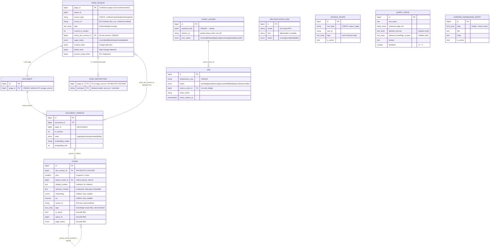

# 04 — Data Model

All tables are defined in `apps/automation/app/platform/db/models.py`; enums in
`platform/db/enums.py`; RLS + roles in `platform/db/schema.py`. There are **11 mapped tables**
(models.py:572-586). Historical docs (`how_this_works.md`) still say "10 tables" — that count
predates `curated_knowledge_entry`, added in Phase 10; the current count is 11.

Shared column helpers: `_pk()` = `BigInteger, primary_key, autoincrement` (models.py:87-88);
`_ts_created()` = `timestamptz NOT NULL server_default now()` (models.py:91-92). `EMB_DIM =
get_settings().embedding_dim` (models.py:46). `source_type` everywhere is a **CHECK constraint**
(`IN ('confluence','zendesk','notion','upload')`, models.py:52-53), never a PG enum, so new
connectors need no `ALTER TYPE` (ADR-0004). Chunk kinds: `KIND_PARENT = 0`, `KIND_CHILD = 1`
(models.py:56-57).

## Scale posture & store choice (2026)

Current corpus is **9 pages / 85 chunks**, and **no scale or latency target is defined** — an honest
missing number (per `CLAUDE.md`, we do not invent one). The store verdict follows from that: **Postgres
+ pgvector is the 2026 default under ~10M vectors**, and we sit 5–6 orders of magnitude below it.
Migrating to a dedicated vector DB is warranted only at a **named bottleneck** — roughly >~10–47M
vectors, sustained >~500 QPS, or a sub-20ms p99 requirement under load — none of which is in evidence.

Two reasons Postgres is *better* positioned than a dedicated vector DB for *our* requirements, not just
adequate: relational **immutable versioning** (the `document`/`document_version`/`chunk` graph below)
and **Postgres RLS** give us hard, transactional isolation and point-in-time version integrity that a
bolt-on vector store would make us reassemble. And a store switch would **not** remove the
customer-axis isolation work — you would rebuild that boundary in the new store regardless (see
`05-security-isolation.md` Layer 2), so it is not a shortcut around the isolation model.

## ER diagram

Caption: `page_source` is the canonical per-page registry. Each page has exactly one `document`
(stable logical identity across re-indexes), which owns many immutable `document_version`s, each
owning the `chunk` rows (parents + children). `page_source.active_doc_version_id` is a **deferrable
FK** to the live version and is `UNIQUE`, which is the mechanism behind the atomic pointer-swap.
`event_ledger` and `job` are the ingestion plumbing; `reconciliation_run`, `source_scope`,
`query_trace`, and `curated_knowledge_entry` are supporting tables with no hard FK into the corpus
graph.

## Table-by-table

### `page_source` (models.py:95-158) — one row per Confluence page
The canonical registry. PK `page_id` (the Confluence id itself, not autoincrement, models.py:100).
Carries `space_id`, `parent_id`, `current_cf_version`, `title`, `source_url`, `source_modified_at`,
and the live-version pointer `active_doc_version_id` (FK → `document_version.id`, deferrable INITIALLY
DEFERRED, `UNIQUE` via `uq_page_source_active_doc_version_id`, models.py:114-118, 151). Provider-tag
columns `source_type`/`source_id`/`tags` (models.py:103-111). Five change-detection hashes, all
`LargeBinary NOT NULL`: `content_hash`, `structure_hash`, `attachment_manifest_hash`,
`access_scope_hash`, `labels_hash` (models.py:127-131). Pipeline version stamps
(`parser_version`, `chunker_version`, `contextualization_version`, `embedding_model`, `embedding_dim`,
`retrieval_schema_version`, models.py:134-139). Indexes on `space_id`, `parent_id`, `source_id`,
`page_status`, `last_reconciled_at` (models.py:153-157).

### `page_restriction` (models.py:161-177) — one row per (page, allowed principal)
Persisted per-page read ACL (PLAN 4.3). Composite PK `(page_id, principal)` (models.py:173-176);
`page_id` FK → `page_source.page_id` `ON DELETE CASCADE`. **Semantics:** any row present ⇒ the page is
restricted to the listed principals; **zero rows ⇒ unrestricted** (models.py:162-168). Queried fresh
per search for the candidate set only (never the whole corpus).

### `document` (models.py:180-194) — one row per page
Stable logical identity that survives across versions. PK `id`; `page_id` FK → `page_source.page_id`
(deferrable, **`unique=True`**, models.py:188-193) — one document per page.

### `document_version` (models.py:197-241) — one immutable snapshot per (page × cf_version × config)
PK `id`; `document_id` FK → `document.id`; denormalized `page_id`; `cf_version`; `state` enum
(`staging|active|superseded|failed`, models.py:206-208). Records the exact pipeline config it was
built under (`parser_version`…`embedding_model`/`embedding_dim`/`retrieval_schema_version`,
models.py:212-217) and `built_by_job_id`, `activated_at`, `superseded_at`. **Idempotency uniqueness:**
`(document_id, cf_version, retrieval_schema_version, embedding_model)` = `uq_document_version_idem`
(models.py:225-231). **At most one active version per document:** partial unique index
`ux_document_version_one_active` on `document_id` `WHERE state = 'active'` (models.py:235-240) — the
invariant that guarantees the live corpus is never half-swapped.

### `chunk` (models.py:244-342) — one row per parent section OR child window
The searchable rows. PK `id`; `doc_version_id` FK → `document_version.id` `ON DELETE CASCADE`;
`kind` (0 parent / 1 child); self-referential `parent_chunk_id` FK → `chunk.id` `ON DELETE CASCADE`
(child → parent, models.py:262-264); linked-list `prev_chunk_id`/`next_chunk_id`. Diff/identity keys
`stable_key`, `positional_key`, `content_key` (all `LargeBinary`, models.py:258-260) drive the
re-embed-reuse gate. Two content columns: **`display_content`** (verbatim, used in citations) and
**`retrieval_content`** (metadata prefix + situating context, what actually gets embedded,
models.py:287-288). `embedding` = `Vector(EMB_DIM)` **nullable** (children only, models.py:292);
`tsv` = `TSVECTOR` **nullable** (children only, models.py:293). Denormalized hot-path filter columns
so search never joins: `is_active`, `space_id`, `page_status`, `source_id`, `tags`,
`retrieval_schema_version`, `embedding_model`, `access_scope` (models.py:269-302). Uniqueness
`(doc_version_id, stable_key)` (models.py:307). See the index section below for the two search
indexes.

**Which columns back a hard boundary.** Both `source_id` and `tags` back **hard**, database-enforced
boundaries (`05-security-isolation.md`). `source_id` is enforced by Postgres RLS (`chunk_source_read`,
ADR-0004) + the explicit `source_id = ANY(:sources)` predicate, default-deny; RLS is `ENABLE`d + `NO
FORCE` so it is portable to managed Postgres with the owner exempt by ownership (ADR-0013). `tags` on
the customer axis is enforced by a second `RESTRICTIVE` scope-GUC RLS policy (`chunk_scope_read`,
ADR-0014) keyed on `app.allowed_knowledge_scopes` — fail-closed and independent of the feature flag —
with the app-layer `tags && :scopes` predicate as defense-in-depth on top. The same DB-backstop story
holds for `curated_knowledge_entry.tags` below (its own `curated_knowledge_entry_scope_read` policy).

### `event_ledger` (models.py:345-387) — one row per webhook/reconcile delivery
Dedup + audit. `payload_hash` `LargeBinary NOT NULL`, **`UNIQUE`** (`uq_event_ledger_payload_hash`,
models.py:374) — the content-dedup key. `delivery_id` with **partial-unique** index
`ux_event_ledger_delivery_id` `WHERE delivery_id IS NOT NULL` (models.py:375-380). `origin` (0 webhook
/ 1 recon / 2 manual), `proc_status` enum (`received|deduped|queued|processing|done|dead_letter`),
`self_generated`, `dead_letter_reason`, JSONB `payload`. Partial index on `proc_status` for the
active states (models.py:382-386).

### `job` (models.py:390-441) — one row per unit of background work
The crash-safe queue. `idempotency_key` String(256) **`UNIQUE`** (`uq_job_idempotency_key`,
models.py:426). `status` enum (`pending|leased|running|succeeded|failed|dead_letter|cancelled`).
Lease fields `lease_owner`/`lease_expires_at`, scheduling `available_at`, `attempts`/`max_attempts`
(default 5, models.py:408), `last_error`, `source_event_id` FK → `event_ledger.id`. Two partial
indexes: `ix_job_claim` (status, available_at, priority) `WHERE status IN ('pending','failed')`
(models.py:427-433) and `ix_job_lease` `WHERE status IN ('leased','running')` (models.py:434-439).
Claimed with `FOR UPDATE SKIP LOCKED` (models.py:391).

### `reconciliation_run` (models.py:444-468) — one row per drift sweep
Report row: `scope` (`all` | `space:KEY`), `kind` (`lightweight` | `complete`), `status` enum,
counters `pages_scanned`/`drift_detected`/`jobs_enqueued`/`orphans_deleted`/`errors`, JSONB `report`.

### `source_scope` (models.py:474-507) — one row per configured sync root
Narrows/tags reconciliation (PLAN 3.5.6). `root_type` CHECK (`space` | `page`, models.py:471),
`root_id`, `tags` (sync-inclusion tags), `is_active`. Unique `(root_type, root_id)`
(`uq_source_scope_root`, models.py:503). Partial index on `is_active` (models.py:506). **Note:**
`source_scope.tags` encode *sync inclusion* (which pages get ingested), a different axis from
knowledge-scope tags — the two are unioned at ingestion (ADR-0011).

### `query_trace` (models.py:510-545) — one row per retrieval/answer request
The tracing scoreboard, written via the **writer** engine so RLS never blocks the insert
(models.py:513-514). Retrieval fields (`raw_query`, `retrieved_page_ids`, `retrieved_chunk_ids`,
`rerank_scores`, `allowed_sources`, `embedding_model`, `reranker_model`, `latency_ms`,
`allowed_knowledge_scopes`) + Phase-4 answer fields filled on the same row (`rewritten_query`,
`answer`, `citations` JSONB, `feedback` ±1). `allowed_sources`/`allowed_knowledge_scopes` are the
isolation audit trail. Small-talk and clarification short-circuits write **no** trace row.

### `curated_knowledge_entry` (models.py:548-569) — one row per always-present knowledge item
Admin-maintained knowledge (Phase 10.6). `tags` (empty ⇒ applies to every scope, models.py:560-562),
`title`, `body`, `is_active`. **No FKs, no unique constraints, no explicit indexes.** Isolation is the
customer-axis `RESTRICTIVE` scope-GUC RLS policy `curated_knowledge_entry_scope_read` (ADR-0014 /
migration `0010`), fail-closed like `chunk`, with tag filtering as defense-in-depth (see
`05-security-isolation.md`).

## The two search indexes (both partial, on active child rows)

Both live in `Chunk.__table_args__` and cover **only active child chunks**, which keeps them small
and means search never scans parents or superseded rows.

| Index | Type | Column / expression | Partial predicate | Anchor |
|---|---|---|---|---|
| `ix_chunk_embedding_hnsw` | HNSW | `embedding` (see cast rule) | `is_active AND kind = 1 AND embedding IS NOT NULL` | models.py:65, 68-84, 313 |
| `ix_chunk_tsv_gin` | GIN | `tsv` | `is_active AND kind = 1` | models.py:315-320 |

**Dense (HNSW) — dimension-aware.** pgvector caps a plain `vector` HNSW index at 2000 dims
(`_HNSW_MAX_VECTOR_DIM = 2000`, models.py:63). Build opts `m=16, ef_construction=200` (models.py:64).
- If `EMB_DIM > 2000` (**the deployed config: `.env` sets `EMBEDDING_DIM=3072`, so this is the live
  path**): the index expression is `(embedding::halfvec(EMB_DIM)) halfvec_cosine_ops` (models.py:70-76).
  Retrieval mirrors the cast when `dim >= 2001` (`_HALFVEC_MIN_DIM`, search_repo.py:17, 117-119).
- If `EMB_DIM ≤ 2000` (the `settings.py` *default* is 1024, but the deployed `.env` overrides it to
  3072 — see `01-system-overview.md`): the index is a plain `vector_cosine_ops` HNSW on the `embedding`
  column (models.py:77-84), and retrieval uses plain `vector` (search_repo.py:120-122).

Distance is cosine (`<=>`); dense search orders `dist ASC, page_id ASC` (search_repo.py:124-127).

**Keyword (GIN).** Over `tsv`. Retrieval builds an OR-converted tsquery (`plainto_tsquery` with `&`
rewritten to `|`, search_repo.py:76, 88-90) and ranks with `ts_rank`, ordering `score DESC, page_id
ASC` (search_repo.py:91).

**Filtered-ANN tuning ladder.** HNSW recall degrades when the query also carries selective RLS/tag
filters (the filtered-ANN problem). Current mitigation is `hnsw.iterative_scan='relaxed_order'` (set
per-transaction alongside `ef_search`, see `03-retrieval.md` §4). If recall under filtering ever proves
insufficient, escalate **in this order**: (1) raise `ef_search`; (2) **tenant table partitioning**
(partition `chunk` by `source_id`/customer so each scan hits a smaller index); (3) binary/scalar
**quantization**; (4) **StreamingDiskANN via `pgvectorscale`**. Note the last lever is **not available
on Supabase** — `pgvectorscale` is a Tiger Data/Timescale extension — so choosing it implies self-host,
Tiger Cloud, or Option B (a dedicated index alongside Postgres). Climb the ladder only against measured
recall loss, not preemptively.

**A third relevant index: knowledge-scope.** `ix_chunk_tags_gin` — GIN over `tags` `WHERE is_active`
(models.py:335-340, Phase 10 migration 0007). Backs the `tags && :knowledge_scopes` array-overlap
filter. Plus two source/space partial indexes: `ix_chunk_active_space (is_active, space_id) WHERE
is_active` (models.py:321-326) and `ix_chunk_active_source (is_active, source_id) WHERE is_active`
(models.py:328-333).

## Enums (enums.py) — StrEnum, one PG type each

| Class | PG type | Values |
|---|---|---|
| `PageStatus` | `page_status` | current, draft, trashed, archived, deleted (enums.py:8-13) |
| `DocState` | `doc_state` | staging, active, superseded, failed (enums.py:16-20) |
| `EventProcStatus` | `event_proc_status` | received, deduped, queued, processing, done, dead_letter (enums.py:23-29) |
| `JobStatus` | `job_status` | pending, leased, running, succeeded, failed, dead_letter, cancelled (enums.py:32-43) |
| `ReconStatus` | `recon_status` | running, completed, failed (enums.py:46-49) |
| `ChangeClass` | `change_class` | no_change, body_changed, section_added/updated/removed/moved, title_changed, parent_changed, labels_changed, attachment_changed, permissions_changed, status_changed, parser_only, index_config_change, full_rebuild (enums.py:52-67) |
