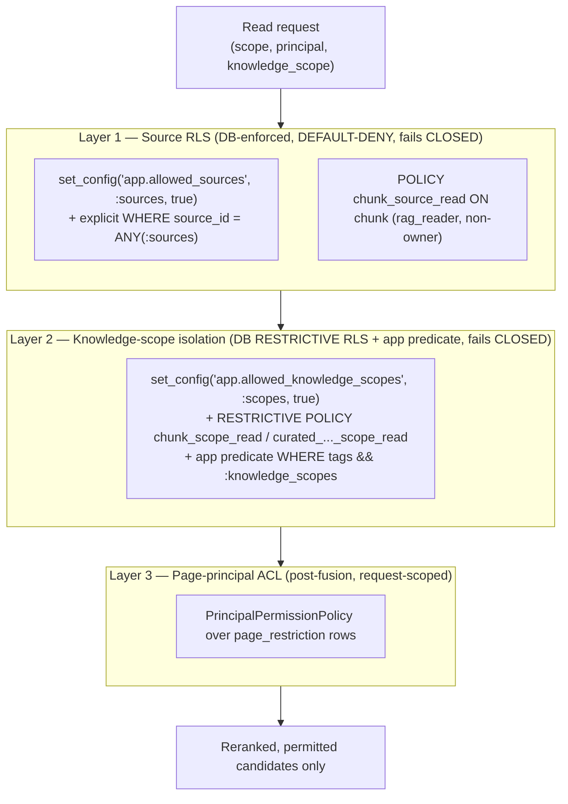

# 05 — Security & Isolation

> **What this document is.** The target isolation design — how the system is meant to keep sources,
> customers, and pages apart on every read. It is written in the present tense as the design of record;
> which pieces are already live on which host is tracked in `docs/rag/PLAN.md` §0, not here.

The isolation model is **three layers plus a writer/reader role split**, applied on every read. Two of
the three layers are **database-enforced Row-Level Security**, so an application bug cannot widen access;
the third is a request-scoped page ACL.

## The three layers (all apply on every read)



Caption: Layers 1 and 2 are hard, database-enforced, default-deny boundaries — an unset scope returns
zero rows, never another tenant's. Layer 1 isolates whole source systems; Layer 2 isolates the customer/
platform axis with a `RESTRICTIVE` policy that ANDs on top of Layer 1, backed by a redundant app-layer
predicate. Layer 3 (page-principal ACL) runs after fusion, before rerank, on the candidate set only.

### Layer 1 — Source-level Postgres RLS (ADR-0004)

Isolates whole **source systems** (`source_id`, e.g. `confluence:default`; later `zendesk:*`, etc.).
Enforced in the database by a non-owner role so it survives an application bug.

- **Policy** (`apply_chunk_rls`, schema.py:52-68):
  ```sql
  ALTER TABLE chunk ENABLE ROW LEVEL SECURITY;
  ALTER TABLE chunk NO FORCE ROW LEVEL SECURITY;             -- ADR-0013: owner exempt by ownership, not superuser
  CREATE POLICY chunk_source_read ON chunk FOR SELECT
    USING (source_id = ANY(string_to_array(current_setting('app.allowed_sources', true), ',')));
  ```
  RLS is `ENABLE`d but **`NO FORCE`** (ADR-0013): the non-owner `rag_reader` is fully policy-bound, while
  the table owner (the writer) is exempt **by ownership** — it needs neither `SUPERUSER` nor `BYPASSRLS`,
  so the same policy works on managed Postgres (Supabase/RDS) where no true superuser exists.
- **GUC** — the scope is bound **per transaction** as a parameter, never `SET LOCAL`: `SELECT
  set_config('app.allowed_sources', :s, true)` (search_repo.py:38-49). `SET LOCAL` cannot bind a
  parameter — using it would be an injection vector or a silent default-deny (ADR-0004 decision 5).
- **Default-deny proof:** an unset GUC ⇒ `current_setting(..., true)` returns `NULL` ⇒
  `string_to_array(NULL, ',')` ⇒ `source_id = ANY(NULL)` is never true ⇒ **zero rows**. A retrieval
  that forgets to scope leaks nothing; it returns nothing (schema.py:55-56). Asserted by a negative
  isolation test (a wrong `source_id` → 0 rows).
- **Belt-and-suspenders recall:** `_base_filters` also carries the explicit `source_id = ANY(:sources)`
  predicate (search_repo.py:63), and `ix_chunk_active_source` lets the planner use it. RLS is the
  security net; the explicit `WHERE` is correctness + recall.
- **pgvector ≥ 0.8 prerequisite:** a narrow RLS predicate prunes the HNSW candidate set, so an ANN
  scan can under-return. `hnsw.iterative_scan='relaxed_order'` (pgvector 0.8+) is the safety valve, set
  per transaction alongside the scope GUC.

### Layer 2 — Knowledge-scope isolation (ADR-0011 + ADR-0014)

Scopes answers to a declared platform (`obi-general-test` + the active one of `obi-mews-test` /
`obi-operacloud-test` / `obi-toast-test`). All four scopes share **one `source_id`**, so Layer 1 does
not separate them — the customer axis is isolated in its own right, in two mutually-reinforcing parts:

- **Database backstop — `RESTRICTIVE` scope-GUC RLS (ADR-0014, the hard boundary).** A second RLS policy
  per protected table — `chunk_scope_read` on `chunk` and `curated_knowledge_entry_scope_read` on
  `curated_knowledge_entry` — keyed on a per-transaction GUC `app.allowed_knowledge_scopes` that mirrors
  `app.allowed_sources`. The retriever and curated read set it on **every** reader transaction via
  `apply_knowledge_scope`, with a **bound** `set_config(..., true)` parameter (never interpolated). The
  policies are `AS RESTRICTIVE` on purpose: PostgreSQL **ANDs** restrictive policies with the permissive
  source policy, so a row is visible only if it passes *both* axes (a second permissive policy would OR
  and weaken isolation). Predicate:
  `current_setting('app.allowed_knowledge_scopes', true) = '*'  OR  cardinality(tags) = 0  OR  tags && :scopes`.
  - **Unset GUC** (a dropped call / bug) ⇒ `current_setting` is NULL ⇒ a *tagged* row is denied — **fail
    closed** for the content that needs isolating.
  - **`cardinality(tags) = 0`** ⇒ an untagged chunk is global (the security floor — untagged/single-tenant
    corpora and the always-on base keep working).
  - **`'*'`** ⇒ an *explicit* opt-out for the internal/eval path only; the public `/chat` path always
    resolves a real, non-empty scope list (always including `obi-general-test`), so it never sets `'*'`.
- **Application predicate — `AND tags && :knowledge_scopes` (ADR-0011, defense-in-depth).** A hard SQL
  filter (Postgres array-overlap) backed by `ix_chunk_tags_gin` (search_repo.py:64-69), applied when the
  `enable_knowledge_scope_filtering` construction flag is on and the caller passed scopes
  (retriever.py:116, 128-132). It adds recall/planner benefit and the ADR-0011 Decision-1 untagged-drop
  on top of the DB backstop.

The two are decoupled: **the DB backstop is enforced independent of the feature flag** (ADR-0014 D3) —
the flag now governs only the redundant app predicate, so passing `knowledge_scopes` isolates tagged
content at the database even with the flag off. The owner (writer) is exempt by ownership + `NO FORCE`
(ADR-0013), so ingestion and trace writes are untouched; only the non-owner `rag_reader` read path is
policed.

### Layer 3 — Page-level principal ACL (ADR-0005 / Phase 4.3)

Enforces per-page read restrictions *within* a source. `page_restriction` persists the real principal
list per page (written by `confluence_sync`; any row ⇒ restricted, zero rows ⇒ unrestricted). At query
time, `fetch_page_scopes` loads the candidate set's `space_id` + principals **fresh**, builds a
request-scoped `PrincipalPermissionPolicy`, and filters after fusion, **before** rerank
(retriever.py:167-176). `classify_scope` interprets the incoming scope: all-digits ⇒ space-level
trust, otherwise a principal string. (A Phase 4.6 fix removed the domain layer's ability to reinterpret
a numeric principal as space-level trust by shape alone; numeric principals are rejected at the HTTP
boundary, router.py:178-188.)

## The writer / reader role split

| Role | Grants | Used by |
|---|---|---|
| **writer** (table owner) | owns tables; exempt from RLS **by ownership + `NO FORCE`** (ADR-0013), needs no `SUPERUSER`/`BYPASSRLS` | worker / webhook / reconcile / ingestion + all `query_trace` inserts and feedback updates |
| **`rag_reader`** | `LOGIN`, **non-owner**, `NOSUPERUSER NOCREATEDB NOCREATEROLE NOBYPASSRLS`, `GRANT SELECT` on read tables | `HybridRetriever` (the search transaction) |

`ensure_reader_role` (schema.py:78-102) creates the reader with the restrictive attributes and grants
`SELECT` (+ default privileges). The reader engine (`get_reader_engine`, engine.py:49-64) binds to
`database_reader_url`, and **fails closed** (`ReaderRoleMisconfiguredError`) if that is empty outside an
offline env — so a misconfigured deploy cannot silently run reads on the RLS-bypassing owner
connection (a Phase 4.6.10 fix). Writes stay on the owner engine, so RLS never blocks ingestion or the
trace insert.

## Answer-path security controls (`POST /chat`)

`POST /chat` and `PATCH /chat/{trace_id}/feedback` are both an HTTP and an LLM surface and carry the
full `securing-http-and-llm-endpoints` control set — auth (Bearer, fail-closed, dual-key constant-time
compare), IP-keyed rate limiting, strict input validation, timeout/retry/breaker, output cap, PII
redaction, idempotency, audit logging, and per-call token/cost caps. See
[`03-retrieval.md`](./03-retrieval.md) §1 for the control table. `CHAT_API_KEY` is a server-to-server
secret, never sent to the browser and never logged; its overlap-window rotation is documented in
`docs/runbooks/chat-api-key-rotation.md`.

## Two design decisions worth calling out

Both exist because a naïve reading of the model would get them wrong; both are ratified in ADRs.

### Managed-Postgres RLS without a superuser (ADR-0013)

The obvious way to let ingestion bypass the read policy is `FORCE ROW LEVEL SECURITY` off a `SUPERUSER`
writer — which works locally but **breaks on managed Postgres** (Supabase/RDS/Aurora grant no true
superuser, so a `FORCE`d policy would filter the owner to zero rows and stall ingestion). The design
keeps RLS **`ENABLE`d but `NO FORCE`** and relies on **table ownership** for the writer's exemption
(`apply_chunk_rls`). The reader is a non-owner and stays fully policy-bound, so isolation is unchanged;
the owner is exempt without any elevated role. This is what makes the same isolation model portable to
the managed host.

### Fail-closed on the customer axis (ADR-0014)

Because all four customer scopes share one `source_id`, the source policy (Layer 1) cannot separate them
— so the customer axis gets **its own** `RESTRICTIVE` scope-GUC RLS policy (Layer 2 above). The choice
of `RESTRICTIVE` (ANDs with source RLS) and of GUC-default-deny (unset ⇒ tagged rows denied) is what
makes the customer boundary fail *closed*, symmetric with source RLS, rather than depending on an
app-layer predicate that a dropped call or a flag flip could silently disable. Enforcement is independent
of `enable_knowledge_scope_filtering`, so the flag is a recall knob, not the security boundary.

## Summary of the isolation model

| Boundary | Mechanism | Fails | Hard security boundary? |
|---|---|---|---|
| Source system (`source_id`) | Postgres RLS, default-deny, non-owner role (ADR-0004, `NO FORCE` per ADR-0013) | closed | **Yes** |
| Knowledge scope (customer/platform) | `RESTRICTIVE` scope-GUC RLS (ADR-0014) + app-layer `tags && :scopes` (ADR-0011) | closed | **Yes** |
| Page principal (ACL) | request-scoped policy over `page_restriction`, pre-rerank | closed (no principal ⇒ unrestricted only) | Yes, within a source |

> **Not a full multi-tenant auth story.** These layers close the *data-layer* boundary. They do **not**
> add a per-user→customer binding at the edge — the public path still trusts one shared `CHAT_API_KEY`
> and the scope it is handed. That edge binding is separate work (Phase 11.1c + the deferred AWS deploy);
> live rollout status for every layer here lives in `docs/rag/PLAN.md` §0.
