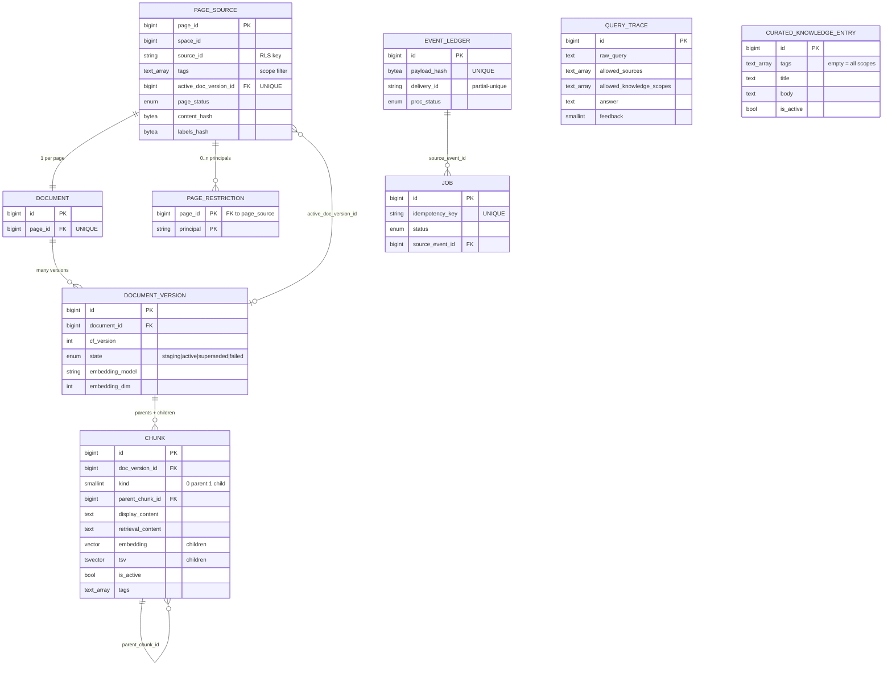
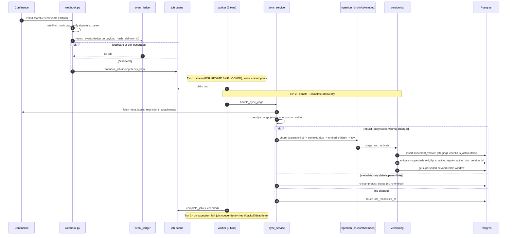
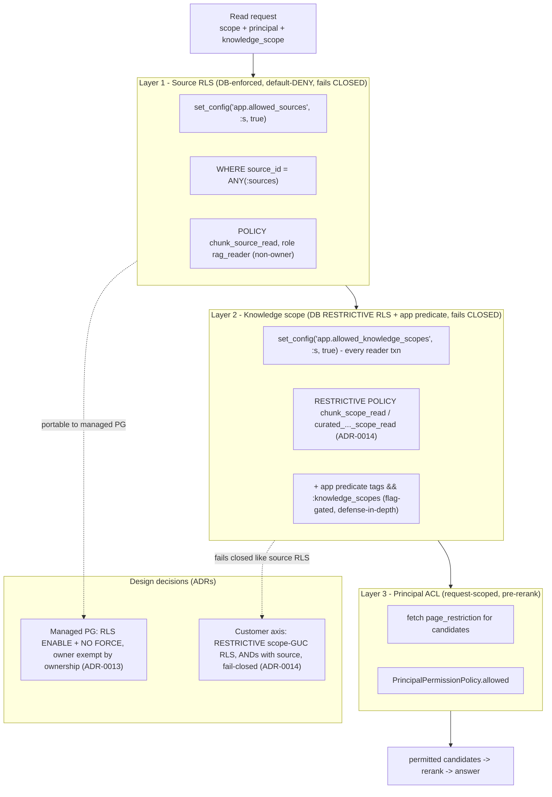
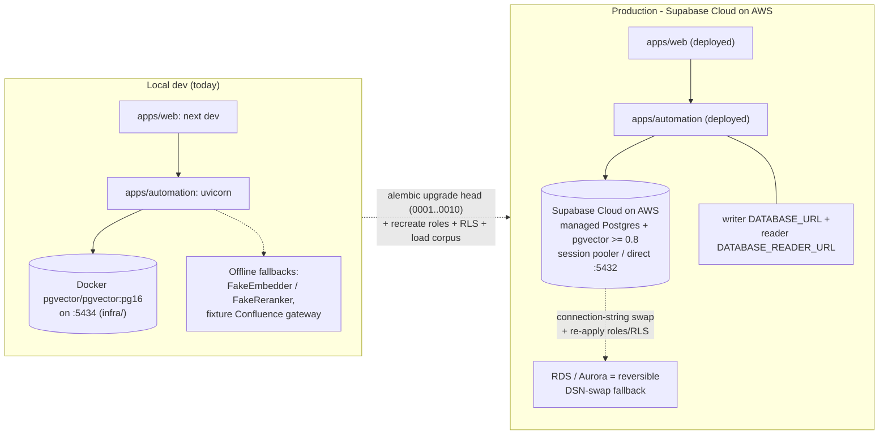

# 06 — System Visualization

The whole system as a set of Mermaid diagrams: top-level architecture, the data model, the ingestion
sequence, the retrieval + answer sequence, the security layering, and the deployment view. Each
diagram has a short caption. For the narrative behind any of them, follow the cross-links to docs
02–05.

---

## (i) Top-level architecture

```mermaid
flowchart LR
  subgraph Browser
    W["Obi widget<br/>apps/web/features/chat"]
  end
  subgraph Next["Next.js (apps/web)"]
    RH["chat route handler /<br/>automation-api proxy<br/>(holds CHAT_API_KEY)"]
  end
  subgraph FastAPI["apps/automation (FastAPI)"]
    WH["POST /confluence/events<br/>(webhook)"]
    CH["POST /chat (SSE)<br/>PATCH /chat/:id/feedback"]
    WK["job worker + scheduler"]
    ING["confluence_sync + ingestion<br/>(writer role)"]
    RET["retrieval + rag_agent<br/>(reader role)"]
  end
  subgraph PG[("PostgreSQL 16 + pgvector + tsvector")]
    T["page_source, document,<br/>document_version, chunk (HNSW+GIN),<br/>page_restriction, event_ledger, job,<br/>query_trace, curated_knowledge_entry, ..."]
  end
  subgraph Ext["External APIs"]
    CF["Confluence REST"]
    EMB["Embeddings (Voyage / OpenAI)"]
    CO["Cohere rerank-v3.5"]
    AN["Anthropic (Sonnet / Haiku)"]
  end

  W -->|"HTTPS (no secret in browser)"| RH
  RH -->|"Bearer CHAT_API_KEY"| CH
  CF -->|"webhook HMAC"| WH
  WH --> ING
  WK --> ING
  ING -->|writer, BYPASS RLS| PG
  ING --> EMB
  ING --> AN
  ING --> CF
  CH --> RET
  RET -->|"reader, RLS enforced"| PG
  RET --> EMB
  RET --> CO
  RET --> AN
  CH -->|SSE stream| RH
  RH -->|SSE| W
```

Caption: The browser widget never holds a secret — the Next.js proxy injects `CHAT_API_KEY` on the
server side and forwards the SSE stream back. `apps/automation` is one FastAPI service with two
independent internal flows: the ingestion/write path (writer DB role, bypasses RLS) fed by the
Confluence webhook and the scheduled worker, and the retrieval/answer path (reader DB role, RLS
enforced) behind `POST /chat`. Both share one Postgres + pgvector store. External calls: an embedder,
Cohere for reranking, and Anthropic for rewrite/answer/vision.

---

## (ii) Data model (ER)



Caption: One page → one `document` → many immutable `document_version`s → many `chunk`s (parents +
children, child→parent via `parent_chunk_id`). The `page_source.active_doc_version_id` UNIQUE deferred
FK plus the "one active version per document" partial-unique index are what make activation an atomic
pointer swap. `event_ledger`/`job` are the ingestion plumbing; `query_trace` and
`curated_knowledge_entry` stand apart from the corpus graph. Full column detail and the two search
indexes are in [`04-data-model.md`](./04-data-model.md).

---

## (iii) Ingestion sequence



Caption: A webhook is validated, deduped into `event_ledger`, and enqueued as an idempotent job (unless
it is a duplicate or one of our own writes). The worker runs each job in three separate transactions so
the lease/attempt bookkeeping and the actual index mutation never share a rollback. `sync_service`
classifies the change from status/version/hashes and either rebuilds (full chunk→context→embed→stage→
atomic-activate→GC), applies a metadata-only tag/status update with no re-embed, or does nothing. See
[`02-ingestion.md`](./02-ingestion.md).

---

## (iv) Retrieval + answer sequence

```mermaid
sequenceDiagram
  autonumber
  participant U as Browser widget
  participant PX as Next.js proxy
  participant API as POST /chat (router)
  participant AS as AnswerService
  participant HR as HybridRetriever (reader)
  participant PG as Postgres (RLS)
  participant CO as Cohere rerank
  participant AN as Anthropic

  U->>PX: message + history
  PX->>API: Bearer CHAT_API_KEY, ChatRequestBody
  API->>API: auth, IP rate limit, validate, idempotency
  API->>AS: answer(history, principal, knowledge_scope)
  alt small talk / clarification
    AS->>AN: light generation (no retrieval, no trace)
    AN-->>AS: reply
  else normal question
    AS->>AN: rewrite to standalone query (routing_model)
    AS->>HR: retrieve_with_context(query, scope, k, knowledge_scopes)
    HR->>PG: set_config app.allowed_sources + HNSW GUCs
    HR->>PG: keyword (GIN) then dense (HNSW) over candidate_k=75
    HR->>HR: RRF fuse (k0=60), tie-break by keyword rank
    HR->>PG: fetch page_restriction for candidates -> principal ACL filter
    HR->>CO: rerank <=75 permitted -> top k
    CO-->>HR: scored top-k
    AS->>HR: CRAG retry once if weak (verbatim query)
    AS->>AS: decide_refusal (top_score < 0.10 -> refuse)
    AS->>HR: fetch_parent_texts (child -> parent context)
    AS->>AS: prepend curated hits, build evidence block
    AS->>AN: grounded generation (answer_model), forced citations
    AN-->>AS: answer text
    AS->>AS: enforce_citations (strip uncited; degrade to refusal if none)
    opt image on last turn
      AS->>AN: generate_image_analysis (separate, uncited call)
    end
    HR->>PG: write query_trace (writer engine)
  end
  AS-->>API: Answer
  API-->>PX: SSE start / token / citations / done
  PX-->>U: SSE stream
```

Caption: The proxy adds the bearer secret; the router enforces the HTTP/LLM control set. Small-talk and
clarification short-circuit before retrieval. A normal question is rewritten, searched two ways (keyword
then dense, fused by RRF), filtered by source RLS + knowledge-scope + principal ACL, reranked by Cohere,
optionally retried once (CRAG), abstained on if weak, expanded to parent context, and generated with
forced citations (uncited claims stripped). The result streams back as SSE. See
[`03-retrieval.md`](./03-retrieval.md).

---

## (v) Security / RLS layering



Caption: Three layers gate every read. Layers 1 and 2 are hard, database-enforced, default-deny
boundaries — Layer 1 isolates source systems, Layer 2 isolates the customer/platform axis with a
`RESTRICTIVE` scope-GUC RLS policy (ADR-0014) that ANDs on top of Layer 1, backed by a redundant
flag-gated app predicate. Layer 3 (principal ACL) runs before rerank so the cross-encoder never scores a
document the principal cannot see. The two design decisions worth calling out (managed-PG `NO FORCE`;
fail-closed customer axis) are attached to the layers they support — see
[`05-security-isolation.md`](./05-security-isolation.md).

---

## (vi) Deployment view (dev vs. prod)



Caption: In dev, both apps run locally against a Docker `pgvector/pgvector:pg16` container on port
5434, with deterministic offline fallbacks (Fake embedder/reranker, fixture Confluence) so the whole
system runs with no API keys. Production targets **Supabase Cloud on AWS** — managed Postgres + pgvector
≥ 0.8, reached over the session-pooler/direct port 5432 by plain DSN, with separate writer and reader
connection strings. RLS is `ENABLE`d + `NO FORCE` (ADR-0013, owner exempt by ownership) and the
customer axis is backstopped by `RESTRICTIVE` scope-GUC RLS (ADR-0014). **RDS/Aurora is a reversible
fallback** (a DSN swap + role/RLS re-apply). No scale/latency target is defined. Live cutover status is
tracked in `docs/rag/PLAN.md` §0.
