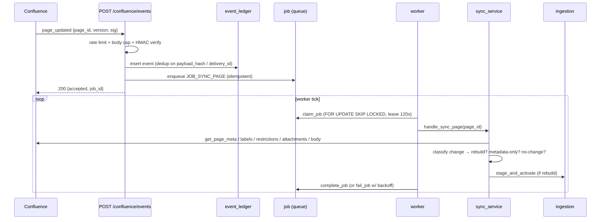

# Phase 1 — Confluence sync

**Status:** ✅ done (pre-dates `PLAN.md`'s numbered sub-steps; hardened further under Phase 4.6 —
see [phase-4.6.md](./phase-4.6.md)). This is the "getting data IN" half of the write path: it
decides *when* a page needs re-indexing and hands the fetched content to ingestion
([phase-2.md](./phase-2.md)). It never touches embeddings or chunks itself.

## Files & folders used

```
apps/automation/app/features/confluence_sync/
├── server/webhook.py                  POST /confluence/events
├── application/
│   ├── event_service.py               ingest_event: dedup + enqueue
│   ├── worker.py                      run_once/drain/reap — 3-transaction discipline
│   ├── sync_service.py                handle_sync_page: fetch, classify, rebuild-or-not
│   └── reconciliation.py              scheduled drift sweeps
├── domain/scope_resolver.py           source_scope tree-walk (Phase 3.5.6, see phase-3.5.md)
├── infrastructure/event_repo.py       event_ledger persistence
├── schemas/events.py                  EventEnvelope (Pydantic)
└── tests/                             test_webhook.py, test_worker_sync.py, test_reconciliation.py,
                                        test_event_dedup.py, test_scope_resolver.py

apps/automation/app/platform/jobs/queue.py       generic crash-safe job queue (enqueue/claim/complete/fail/reap)
apps/automation/app/platform/clients/
├── confluence_client.py               HttpConfluenceClient (live REST v1/v2)
└── fixture_confluence_client.py       FixtureConfluenceGateway (offline double)
apps/automation/tests/fixtures/confluence/       the canned corpus (pages 1001-2003)
```

## The sequence



The webhook does almost nothing itself — validate, record, enqueue, return in a few milliseconds
(`webhook.py:88-134`). All expensive work (fetch/parse/chunk/embed) happens later on the worker.

## 1. The webhook (`server/webhook.py`)

`POST /confluence/events`, security controls in call order:

1. **Rate limit** — per-client-IP sliding window (`_rate_limiter`, `webhook.py:80-85`,
   `webhook_rate_limit_per_minute`).
2. **Body-size cap** — `webhook_max_body_bytes` → 413 (`webhook.py:100-101`).
3. **Signature** — `HMAC-SHA256(raw_body)` vs `X-Hub-Signature-256`, constant-time compare
   (`_verify_signature`, `webhook.py:67-77`). **Fails closed**: an unset
   `confluence_webhook_secret` returns 503 rather than accepting an unauthenticated event.
4. **Parse + validate** — JSON → Pydantic `EventEnvelope` (`schemas/events.py`).
5. **`ingest_event`** — writes the `event_ledger` row and enqueues the job (`application/
   event_service.py`).

Full `security_baseline` control-by-control mapping is in the module docstring
(`webhook.py:1-25`).

## 2. Deduplication (`event_ledger`)

Two independent unique constraints stop the same change being processed twice:

- **`payload_hash`** — a byte-identical redelivery no-ops. Hash covers `{event_type, page_id,
  cf_version, space_id, status, event_timestamp, delivery_id}`, excluding actor/receive-time so a
  genuine redelivery collapses but a real new change doesn't.
- **`delivery_id`** (partial-unique) — Confluence's own delivery id, when present.

`event_repo.py::record_event` uses a **target-less** `ON CONFLICT DO NOTHING` (no
`index_elements=`) so a violation on *either* constraint is absorbed in one round trip — this was
fixed under 4.6.11; see [phase-4.6.md](./phase-4.6.md).

**Self-edit loop guard:** when the actor is our own `confluence_service_account_id`, the event is
recorded but marked `done` and **not enqueued** — otherwise the app re-indexing a page would echo
back as a webhook and loop forever.

Idempotency is layered three deep: event dedup → job `idempotency_key` (`ON CONFLICT DO NOTHING`,
`queue.py:38-53`) → `sync_service`'s own version-guarded handler, so even a job that somehow runs
twice never blindly re-embeds.

## 3. The job queue (`platform/jobs/queue.py`)

Generic, crash-safe, on the `job` table:

- **`enqueue_job`** (`queue.py:25-53`) — idempotent insert.
- **`claim_job`** (`queue.py:56-87`) — `FOR UPDATE SKIP LOCKED`, sets `status=running`, a **120s
  lease**, increments `attempts`.
- **`complete_job`** (`queue.py:90-95`) — `status=succeeded`, clears the lease.
- **`fail_job`** (`queue.py:98-117`) — records the error; **dead-letter** past `max_attempts`
  (default 5), else exponential backoff `5 · 2^(attempts-1)`s, capped at 1 hour.
- **`reap_expired`** (`queue.py:120-131`) — reclaims jobs whose lease expired.

## 4. The worker's three-transaction discipline (`application/worker.py`)

`run_once` (`worker.py:85-128`) runs each job across three transactions so bookkeeping and work
can never be lost to the same rollback:

1. **Claim** (`worker.py:94-99`) — commits the lease + attempts increment before any work runs.
2. **Handle + complete** (`worker.py:111-120`) — the index mutation and the `succeeded` transition
   commit together.
3. **Fail** (`worker.py:121-128`) — if the handler raises, transaction 2 rolls back cleanly and
   the failure is recorded independently.

Because every handler is idempotent and version-guarded, re-running a reclaimed or retried job is
always safe. `drain` (`worker.py:131-146`) loops `run_once` until the queue is empty or `max_jobs`.

## 5. What the sync handler decides (`application/sync_service.py`)

`handle_sync_page(page_id)` (`sync_service.py:76-184`):

1. `gateway.get_page_meta(page_id)` — `None` (gone/inaccessible) → **deactivate**, outcome `gone`.
2. Fetch `labels`, `restrictions`, `attachments`. Fetch the body only if `decide_body_fetch` says
   it's needed.
3. `classify(...)` compares fetched state to `local` (our stored hashes) and emits change classes,
   resolving to one outcome:
   - **`indexed`** — content/structure changed or a pipeline-config bump (`_REBUILD_CLASSES`,
     `sync_service.py:35-54`) → full `stage_and_activate` rebuild, including re-downloading and
     re-extracting every attachment on the page (`_attachment_blocks`, `sync_service.py:187-233` —
     see [phase-4.6.md](./phase-4.6.md) for how attachment content became searchable).
   - **`metadata_only`** — title/URL/ACL/labels changed but content didn't → `_apply_metadata_only`
     updates the registry and propagates to chunks **without re-embedding**.
   - **`no_change`** — just touches `last_reconciled_at`.
   - **`deactivated`** — trashed/archived/deleted → chunks removed from the live index.

Note: `ChangeClass.attachment_changed` is deliberately **not** in `_REBUILD_CLASSES`
(`sync_service.py:43-54` explains why — Confluence attachments don't bump `cf_version`, so treating
an attachment-only change as its own rebuild trigger collides with the `document_version` unique
constraint). An attachment-only edit is picked up at the next rebuild-triggering event instead.

## 6. Reconciliation (the safety net) (`application/reconciliation.py`)

Two scheduled sweeps (wired in `main.py`) catch webhooks that got missed:

- **Lightweight** — nightly cron, a cheap body-free comparison; enqueues a sync job only for
  drifted pages, keyed so an unchanged page produces the same idempotency key (no duplicate job).
- **Complete** — every N days, re-enqueues every live page (key suffixed with the run id).

Both detect orphans (registered as `current` but no longer live) and deactivate them, and both
write a `reconciliation_run` report. **Scope** — which spaces/pages get swept, and what gets purged
when scope shrinks — is governed by the `source_scope` table
([phase-3.5.md](./phase-3.5.md#confluence-source-scoping-3-5-6)), not an env var.

**On-demand re-pull — `make reingest` (PLAN 3c, 2026-09-12).** The scheduled sweeps and the
in-process worker only run when `enable_background_jobs=true` (`settings.py`, default **False**),
and a live Confluence webhook is only wired in a deployed environment. So when the backend runs
locally with the defaults, **editing a Confluence page re-indexes nothing** — no webhook fires, no
sweep runs, no worker drains. The change-detection/versioning path is correct (a body edit bumps the
Confluence version → body fetch → content-hash mismatch → re-embed → atomic swap, old chunks
`is_active=False`); it just isn't triggered. `make reingest` (→ `scripts/run_reconciliation_once.py`)
runs a **complete sweep + drain against live Confluence** so edits propagate on demand; it refuses
against the offline fixture. (Secondary gotcha: the in-process answer cache,
`chat_answer_cache_ttl_seconds=300`, can replay a pre-edit answer for ~5 min on an *identical*
repeated question; it clears on restart.)

**Auto-propagate in DEV — fast reconcile poll (PLAN item A, 2026-09-12).** For a local runtime that
keeps itself current without a manual `make reingest`, turn on the background scheduler and give it a
short lightweight-reconcile interval. In `.env`:

```
ENABLE_BACKGROUND_JOBS=true
DEV_RECONCILE_INTERVAL_SECONDS=30
WORKER_TICK_SECONDS=5
```

Then run `uvicorn app.main:app`. `_build_scheduler` registers an extra `dev_lightweight_reconcile`
interval job **in addition to** the daily `lightweight_recon_cron` (unchanged): every N seconds it
runs the *same* `scheduled_lightweight_reconcile` against live Confluence, so an edited page is
enqueued within N s and the existing `worker_tick` drains it into a new `document_version` — edit →
answer reflects it in ~30–60 s. This adds no new gateway/network surface (same client, timeouts, and
retries as the cron); `DEV_RECONCILE_INTERVAL_SECONDS` unset (prod default) leaves the scheduler
exactly as before. `make reingest` remains the on-demand fallback when background jobs are off. The
answer-cache caveat above still applies: an *identical* repeated question can replay a pre-edit
answer for up to `chat_answer_cache_ttl_seconds` (~5 min) — restart the server or reword to see the
fresh answer.

## 7. The Confluence gateway (live vs. fixture)

`main.build_gateway` picks the client at startup:

- **`HttpConfluenceClient`** (`platform/clients/confluence_client.py`) — used when
  `confluence_base_url` **and** `confluence_api_token` are set. Talks to Confluence Cloud with
  `BasicAuth`, tenacity retries, and — since Phase 4.6.7 — a consecutive-failure circuit breaker.
  See [phase-4.6.md](./phase-4.6.md) for the restrictions-endpoint fix (v2 → v1) and the group-
  membership expansion, both of which live in this file.
- **`FixtureConfluenceGateway`** (`platform/clients/fixture_confluence_client.py`) — otherwise.
  Serves the canned corpus in `apps/automation/tests/fixtures/confluence/` (pages 1001–2003). This
  is what makes the whole system runnable with no Confluence credentials.

**Current status (per `PLAN.md` §0, 2026-08-19/21):** the live Confluence token now works
(previously dead). No `source_scope` rows are seeded yet, so nothing actually syncs against the
real tenant until `scripts/seed_source_scope.py` is run — everything today runs against the fixture
corpus in tests and dev.

## Not this file

- Turning the fetched blocks into chunks/embeddings — [phase-2.md](./phase-2.md).
- The ACL/restriction fail-closed fix, attachment content becoming searchable, the client hardening
  batch — [phase-4.6.md](./phase-4.6.md).
- Provider tags + source scoping — [phase-3.5.md](./phase-3.5.md).
