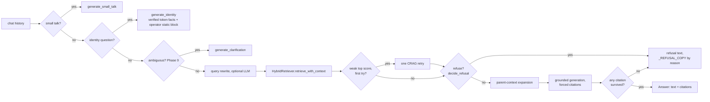

# Phase 4 — Answer runtime + chat

**Status:** ✅ done (`docs/rag/PLAN.md` lines 2070–2135, sub-steps 4.1–4.5).

## What happened

Phase 4 built the `rag_agent` feature — a fixed function pipeline (ADR-0005 §5: "not an agent loop")
that turns a retrieval into a grounded, cited, streamed chat answer — and wired it to HTTP.

### 4.1 — `rag_agent` scaffold

New feature, own public root (`app/features/rag_agent/__init__.py`) and own `FEATURES.md` entry
(machine-enforced boundary, see the root `CLAUDE.md`). DTOs (`schemas.py`: `ChatMessage`, `Citation`,
`Answer`) and the refusal/citation domain core:

- `domain/refusal.py::decide_refusal(top_score, threshold, has_image)` — pure, data-driven.
- `domain/citations.py::enforce_citations(answer_text, valid_markers)` — strips any sentence that
  doesn't cite a valid marker; a marker pointing at a page never retrieved is dropped, not trusted.

### 4.2 — `AnswerService` (the fixed pipeline)

`app/features/rag_agent/application/answer_service.py::AnswerService.answer(history, scope)`:

1. **Query rewrite** (optional, `rewrite_enabled`) — one cheap LLM call turning multi-turn history
   into a standalone question. Single-turn history skips the call entirely.
2. **Retrieve** — `HybridRetriever.retrieve_with_context` (see [phase-3.5.md](./phase-3.5.md)).
3. **CRAG retry** (`_apply_crag_retry`) — runs *between* retrieval and the refusal check: on a weak
   first result, retry with the user's verbatim query and keep whichever scored higher. A no-op if
   rewrite is disabled or produced an identical query.
4. **Refusal** (`domain/refusal.py::decide_refusal`) — below `refusal_min_rerank_score` (default
   0.10), refuse rather than hallucinate.
5. **Parent-context expansion** — `HybridRetriever.fetch_parent_texts` joins each winning **child**
   hit to its **parent** chunk so the generator sees full section context, not an isolated ~400-token
   window (see [`../ingestion/phase-2.md`](../ingestion/phase-2.md) for how parent/child chunks are
   built).
6. **Grounded generation** — `domain/prompt.py::build_evidence_block` + `build_answer_prompt`, sent to
   the configured `AnswerGenerator`.
7. **Citation enforcement** — `enforce_citations`; if nothing survives, this degrades to a refusal
   (reason `no_citations`) rather than returning an empty or ungrounded answer.

Every retrieval-driving branch persists its result onto the same `query_trace` row Phase 3.5.4 wrote
(`_persist` → `trace_repo.update_query_trace_answer`). The small-talk and (Phase 9) clarification
branches bypass this pipeline entirely and write no `query_trace` row — they were never a retrieval
event.

### Identity short-circuit (per-user identity, operator-requested 2026-09-12)

A basic identity question — "which integration do we use?", "what company am I?", "who am I" — is
not a retrieval failure: no document states it, so the normal pipeline scored ~0.02 and refused it
as `off_topic`. But the answer is already carried by the verified edge token (`AuthContext`,
[phase-11.1c.md](./phase-11.1c.md)). `AnswerService.answer` now checks `domain/identity.py::
is_identity_question` right after small-talk (before rewrite/retrieval) and, on a match, short-
circuits to `AnswerGenerator.generate_identity(query, facts)` — an ungrounded reply seeded with the
token's `integration`/`company_name`/`company_id` plus an operator-editable static block. Same shape
as small-talk: no retrieval/CRAG/refusal/citation-enforcement, no `query_trace` row, `refused=False`,
no citation markers.

- **Detection** (`domain/identity.py`) is a closed exact-match set, exactly like `small_talk.py`, so
  a real documentation question that merely shares words ("how do I set up the mews integration")
  still runs the full grounded pipeline. Accepted v1 tradeoff: recall — an unusual phrasing falls
  through to retrieval rather than the identity reply.
- **Prompt assembly** (`domain/prompt.py`): a **cached** system block = persona + operator static
  facts (`build_identity_system_prompt`), plus an **uncached** per-user block = the verified identity
  (`build_identity_context_block`), so per-user variation never busts the shared prompt cache. The
  identity facts are from the *verified* token but presented as facts, never instructions (same anti-
  injection posture as the image/clarification prompts). Fails open to a static reply on any LLM error.
- **Operator static block** lives at repo-root `config/obi_identity.md`, loaded via
  `settings.obi_identity_text` (missing file → empty, not an error) and injected by `main.py` into
  `AnthropicAnswerGenerator`. The same "operator edits a file at `config/`" surface as
  `platforms.json`/`knowledge_scopes.json`.
- **Tokenless/general path**: no business identity → the per-user block says so honestly and the
  reply answers from the static block alone, rather than refusing.
- **Live proof surface** (`apps/web`, operator-requested 2026-09-13): `/test-hosts/multi`
  (`app/test-hosts/multi/page.tsx` → `multi-user-content.tsx`) hosts all three business users
  (Mews/Toast/Opera Cloud) from the single `TEST_HOSTS` source and switches between them — at random
  or by name — always showing who is active. Switching re-points the embedded widget with
  `Obi.init({ tokenUrl })`, which is now **idempotent**: `features/embed/loader.ts` gained
  `Obi.destroy()` and `init` tears down the previous user's launcher + iframe first, so no
  conversation or cached answer bleeds across identities (backend answer/idempotency caches are
  already keyed per verified identity; the risk was purely client-side widget state). `pnpm --filter
  web build:obi` rebuilds `public/obi.js` from that source.

### 4.3 — Real principal ACL storage

`app/features/retrieval/infrastructure/search_repo.py::fetch_page_scopes` replaces the old
fixture-fed `PrincipalPermissionPolicy` construction: `HybridRetriever._search` now builds a fresh
policy per search from **live** `page_source`/`page_restriction` rows, scoped to the fused candidate
set (never the whole corpus, since a page's principal list can change on any sync). See
[`../ingestion/phase-4.6.md`](../ingestion/phase-4.6.md) for how `page_restriction` rows get their
group-membership expansion at write time.

### 4.4 — `POST /chat` SSE endpoint + feedback

`app/features/rag_agent/server/router.py`:

- **`POST /chat`** — SSE stream (`start` → `token`×N → `citations` → `done`). Both a STATE-MUTATING
  surface (writes/updates `query_trace`) and an LLM-CALL surface (rewrite + generation), so it
  carries the full `securing-http-and-llm-endpoints` control set — see the router's own
  `security_baseline` docstring for the exact control-by-control mapping (auth, rate limit, input
  validation incl. per-turn image caps, timeout/retry/breaker, output-size cap + paced streaming, PII
  redaction, idempotency, audit logging, abuse caps).
- **`PATCH /chat/{trace_id}/feedback`** — `+1`/`-1` on the `query_trace` row an answer was logged
  under.
- Dependencies (`get_answer_service_dep`, etc.) read a singleton `AnswerProvider` off `app.state`,
  built once at startup by `main.build_answer_service` — which may return the plain `AnswerService` or
  `answer_cache.CachingAnswerService` wrapping it (Phase 5.2, see [phase-5.md](./phase-5.md)).

### 4.5 — Web chat UI + contract extension (backend surface only)

The frontend build itself (`apps/web`, the Obi widget) is out of scope for this folder — see
[`../OBI-WIDGET-DESIGN.md`](../OBI-WIDGET-DESIGN.md). What Phase 4.5 changed on the backend contract
side: `packages/contracts` gained the `ChatTurn`/`ChatDoneEvent` wire shapes `router.py`'s SSE payload
and `ChatRequestBody`/`Answer` mirror.

## Files & folders used

- `app/features/rag_agent/` — the whole feature: `application/answer_service.py`, `domain/refusal.py`,
  `domain/citations.py`, `domain/prompt.py`, `infrastructure/llm_client.py`, `schemas.py`,
  `server/router.py`.
- `app/features/retrieval/infrastructure/search_repo.py::fetch_page_scopes`,
  `fetch_parent_context` — the retrieval-side calls this pipeline depends on.
- `app/platform/clients/anthropic_client.py` — `AnthropicMessagesClient` (timeout/retry/breaker),
  `cached_system_block`.
- `app/main.py` — `build_answer_service`, chat router mount.
- `packages/contracts` — the wire shapes shared with `apps/web`.

See [`../how_this_works.md`](../how_this_works.md) §7.3–7.4 for the full pipeline narrative and
`docs/adr/0005-Reranking-And-Answer-Pipeline.md` for the governing decisions.
