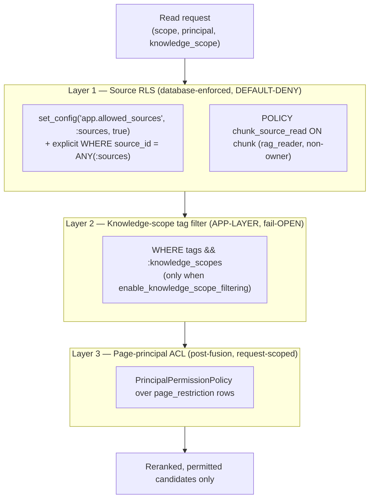

# 05 — Security & Isolation

The system's isolation story is a **layered model**, applied on every read, plus a writer/reader role
split. This document also **honestly records the two known open issues** in the model (PLAN §0) —
neither is smoothed over, because both must be understood before a public deploy.

## The three layers (all apply on every read)



Caption: Layer 1 (source RLS) is a hard, database-enforced, default-deny boundary. Layer 2
(knowledge-scope) is an application-layer SQL predicate that is **fail-open** and gated by a flag.
Layer 3 (page-principal ACL) runs after fusion, before rerank, on the candidate set only.

### Layer 1 — Source-level Postgres RLS (ADR-0004)

Isolates whole **source systems** (`source_id`, e.g. `confluence:default`; later `zendesk:*`, etc.).
Enforced in the database by a non-owner role so it survives an application bug.

- **Policy** (`apply_chunk_rls`, schema.py:52-68):
  ```sql
  ALTER TABLE chunk ENABLE ROW LEVEL SECURITY;
  ALTER TABLE chunk FORCE  ROW LEVEL SECURITY;               -- schema.py:60 (see Known Issue 1)
  CREATE POLICY chunk_source_read ON chunk FOR SELECT
    USING (source_id = ANY(string_to_array(current_setting('app.allowed_sources', true), ',')));
  ```
- **GUC** — the scope is bound **per transaction** as a parameter, never `SET LOCAL`: `SELECT
  set_config('app.allowed_sources', :s, true)` (search_repo.py:38-49). `SET LOCAL` cannot bind a
  parameter — using it would be an injection vector or a silent default-deny (ADR-0004 decision 5).
- **Default-deny proof:** an unset GUC ⇒ `current_setting(..., true)` returns `NULL` ⇒
  `string_to_array(NULL, ',')` ⇒ `source_id = ANY(NULL)` is never true ⇒ **zero rows**. A retrieval
  that forgets to scope leaks nothing; it returns nothing (schema.py:55-56). Asserted by a negative
  isolation test (a wrong `source_id` → 0 rows).
- **Belt-and-suspenders recall:** `_base_filters` also carries the explicit `source_id = ANY(:sources)`
  predicate (search_repo.py:63), and `ix_chunk_active_source` lets the planner use it. RLS is the
  security net; the explicit `WHERE` is correctness + recall.
- **pgvector ≥ 0.8 prerequisite:** a narrow RLS predicate prunes the HNSW candidate set, so an ANN
  scan can under-return. `hnsw.iterative_scan='relaxed_order'` (pgvector 0.8+) is the safety valve, set
  per transaction alongside the scope GUC.

### Layer 2 — Knowledge-scope tag filter (ADR-0011)

Scopes answers to a declared platform (`general` + the active one of `mews`/`opera-cloud`/`toast`).
A **hard SQL filter** — `AND tags && :knowledge_scopes` (Postgres array-overlap) — backed by
`ix_chunk_tags_gin` (search_repo.py:64-69). **Double-gated:** applied only when the
`enable_knowledge_scope_filtering` construction flag is on **and** the caller passed scopes
(retriever.py:116, 128-132). A chunk with empty `tags` overlaps nothing and drops out. The resolved
allow-list always includes `general` (`resolve_allowed_scopes`), so a scoped bot always sees shared
docs. **This layer is NOT database-enforced RLS** — it is an application predicate (see Known Issue 2).

### Layer 3 — Page-level principal ACL (ADR-0005 / Phase 4.3)

Enforces per-page read restrictions *within* a source. `page_restriction` persists the real principal
list per page (written by `confluence_sync`; any row ⇒ restricted, zero rows ⇒ unrestricted). At query
time, `fetch_page_scopes` loads the candidate set's `space_id` + principals **fresh**, builds a
request-scoped `PrincipalPermissionPolicy`, and filters after fusion, **before** rerank
(retriever.py:167-176). `classify_scope` interprets the incoming scope: all-digits ⇒ space-level
trust, otherwise a principal string. (A Phase 4.6 fix removed the domain layer's ability to reinterpret
a numeric principal as space-level trust by shape alone; numeric principals are rejected at the HTTP
boundary, router.py:178-188.)

## The writer / reader role split

| Role | Grants | Used by |
|---|---|---|
| **writer** (table owner; today also `SUPERUSER` locally) | owns tables, effectively bypasses RLS | worker / webhook / reconcile / ingestion + all `query_trace` inserts and feedback updates |
| **`rag_reader`** | `LOGIN`, **non-owner**, `NOSUPERUSER NOCREATEDB NOCREATEROLE NOBYPASSRLS`, `GRANT SELECT` on read tables | `HybridRetriever` (the search transaction) |

`ensure_reader_role` (schema.py:78-102) creates the reader with the restrictive attributes and grants
`SELECT` (+ default privileges). The reader engine (`get_reader_engine`, engine.py:49-64) binds to
`database_reader_url`, and **fails closed** (`ReaderRoleMisconfiguredError`) if that is empty outside an
offline env — so a misconfigured deploy cannot silently run reads on the RLS-bypassing owner
connection (a Phase 4.6.10 fix). Writes stay on the owner engine, so RLS never blocks ingestion or the
trace insert.

## Answer-path security controls (`POST /chat`)

`POST /chat` and `PATCH /chat/{trace_id}/feedback` are both an HTTP and an LLM surface and carry the
full `securing-http-and-llm-endpoints` control set — auth (Bearer, fail-closed, dual-key constant-time
compare), IP-keyed rate limiting, strict input validation, timeout/retry/breaker, output cap, PII
redaction, idempotency, audit logging, and per-call token/cost caps. See
[`03-retrieval.md`](./03-retrieval.md) §1 for the control table. `CHAT_API_KEY` is a server-to-server
secret, never sent to the browser and never logged; its overlap-window rotation is documented in
`docs/runbooks/chat-api-key-rotation.md`.

## Known open issues (recorded honestly, from PLAN §0)

### Issue 1 — `FORCE ROW LEVEL SECURITY` + no superuser on managed Postgres

`chunk` is under **`FORCE ROW LEVEL SECURITY`** (schema.py:60), which makes even the table *owner*
subject to the policy. Today the writer escapes the default-deny policy **only because it is a
`SUPERUSER`** locally. **Managed Postgres (Supabase, RDS, Aurora) gives no true superuser** — so on the
production host the writer would be filtered to zero rows and **ingestion would break**.

- **The fix (specced, TDD-gated, part of Phase 6 / ADR-0013):** the writer **owns** the tables; keep
  RLS **`ENABLE`d but drop `FORCE`**. A non-owner is still policy-bound (so `rag_reader`'s isolation is
  unchanged), while the owner is exempt without needing `SUPERUSER` or `BYPASSRLS`. This is a small,
  security-sensitive change to `apply_chunk_rls` plus a migration and isolation tests. It is required
  on **either** managed host and must land before the migration.
- Status: **not yet applied.** It is step 1 of the agreed Phase 6 setup order (write ADR-0013 + the
  `FORCE`-RLS fix with isolation tests, code-only).

### Issue 2 — CRITICAL: customer-axis knowledge-scope isolation **fails OPEN** (Phase 11.1a)

The knowledge-scope boundary (Layer 2) that keeps one platform's docs (`mews` / `opera-cloud` /
`toast` / `general`) out of another platform's answers is enforced **only** by an application-layer
`tags && :scopes` SQL predicate. Unlike source RLS (Layer 1), it is **not** backed by a database
policy on the customer axis:

- All four scopes live under **one `source_id`**, so source RLS does not separate them.
- The predicate is applied **only when `enable_knowledge_scope_filtering` is on** and a caller passes
  scopes (retriever.py:128-132) — i.e. it **fails open**: flag off, or one dropped/forgotten predicate,
  and **all four customers' content is visible to every query**.
- `curated_knowledge_entry` has **no RLS at all**; tag filtering is its only access control
  (curated_knowledge_repo.py:5-7).

Source RLS fails *closed* (unset scope ⇒ zero rows); the customer scope fails *open* (unset ⇒
everything). That asymmetry is the finding.

- **The fix (Phase 11.1a, scoped, not built):** add a **database backstop** for the customer axis so
  the boundary fails closed like source RLS. The user has decided this **must be fixed before the
  backend goes public** (e.g. on Railway / after the Supabase migration).
- Status: **not built.** It is explicitly sequenced *before* any public deploy in the PLAN §0 setup
  order. Until then, the knowledge-scope filter is a correctness/recall feature, **not** a hard
  security boundary between customers.

## Summary of what is hard vs. soft today

| Boundary | Mechanism | Fails | Hard security boundary? |
|---|---|---|---|
| Source system (`source_id`) | Postgres RLS, default-deny, non-owner role | closed | **Yes** (once Issue 1's `FORCE` fix lands on managed PG) |
| Page principal (ACL) | request-scoped policy over `page_restriction`, pre-rerank | closed (no principal ⇒ unrestricted only) | Yes, within a source |
| Knowledge scope (customer/platform) | app-layer `tags && :scopes`, flag-gated | **open** | **No — Issue 2, until Phase 11.1a** |
