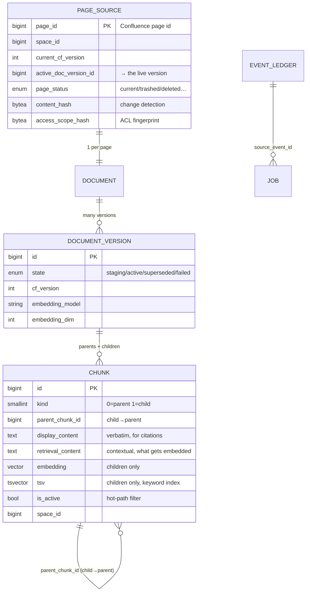
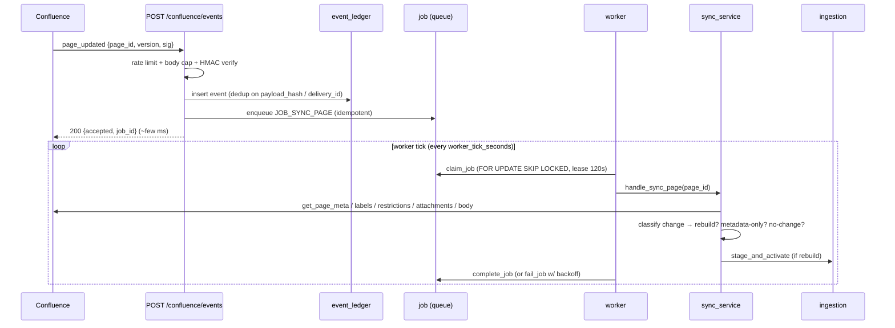
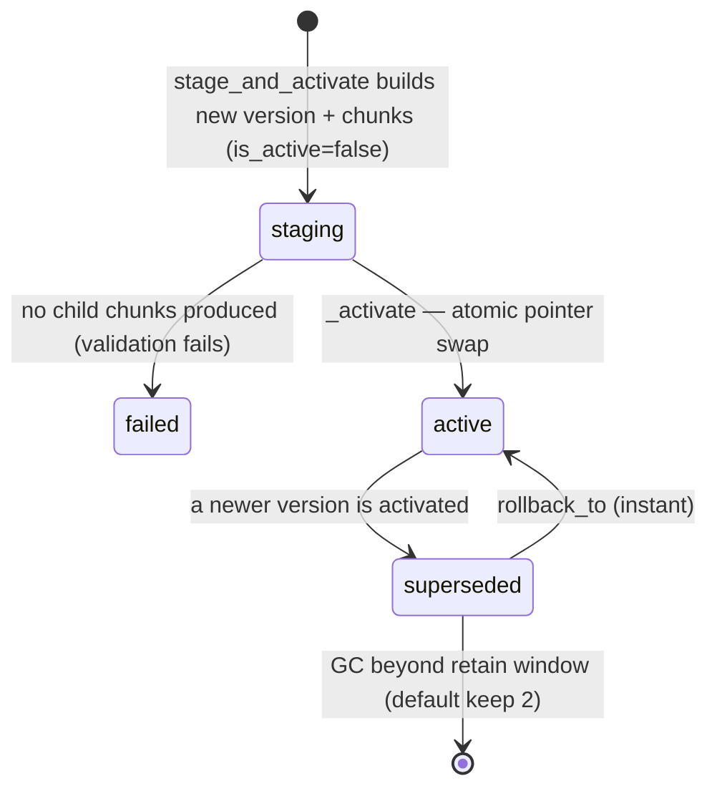
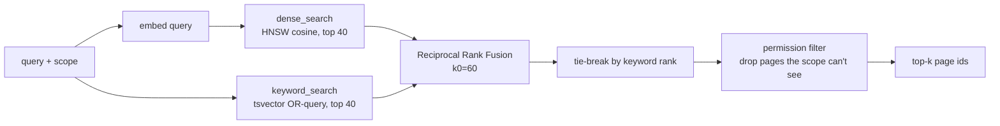

# How This Works — Omniboost RAG, A-to-Z

> The single explainer for how the Confluence RAG system ingests, stores, retrieves, and (soon)
> answers. It describes **what runs today** (Phases 1–3, verified: 99 tests green) and, marked
> clearly, **what the plan adds** (Phases 3.5 → 5). The plan itself is [`PLAN.md`](./PLAN.md); this
> doc is the map you read alongside it to evaluate "are we building the right thing?".
>
> Every claim is anchored to a file so you can check it against the code. `TODAY` = shipped;
> `PLANNED` = specified in `PLAN.md`, not yet built.

---

## 0. Table of contents

1. [The 60-second picture](#1-the-60-second-picture)
2. [Where the code lives](#2-where-the-code-lives)
3. [The data model (the 7 tables)](#3-the-data-model-the-7-tables)
4. [Getting data IN — Confluence sync](#4-getting-data-in--confluence-sync)
5. [Turning a page into chunks — ingestion](#5-turning-a-page-into-chunks--ingestion)
6. [Versioning, activation, rollback](#6-versioning-activation-rollback)
7. [Getting answers OUT — retrieval](#7-getting-answers-out--retrieval)
8. [Measuring quality — evaluation](#8-measuring-quality--evaluation)
9. [A full worked example (end to end)](#9-a-full-worked-example-end-to-end)
10. [What the PLAN adds (3.5 → 5)](#10-what-the-plan-adds-35--5)
11. [How to evaluate "are we doing the right thing?"](#11-how-to-evaluate-are-we-doing-the-right-thing)
12. [Open design discussion — Confluence source scoping](#12-open-design-discussion--confluence-source-scoping)

---

## 1. The 60-second picture

Two independent flows share one Postgres corpus.

```mermaid
flowchart LR
  subgraph IN["INGESTION  (write path — TODAY)"]
    CF[Confluence] -->|webhook / poll| WH[webhook + job queue]
    WH --> WK[worker]
    WK --> SYNC[sync_service: fetch + classify change]
    SYNC --> CHUNK[chunk → contextualize → embed]
    CHUNK --> VER[stage new version → atomic activate]
  end
  subgraph DB[(Postgres + pgvector)]
    T1[page_source]
    T2[document_version]
    T3[chunk: parents + children<br/>embedding + tsv]
  end
  VER --> DB
  subgraph OUT["RETRIEVAL  (read path)"]
    Q[user question] --> R[HybridRetriever]
    R -->|dense ∥ keyword → RRF → permission| DB
    DB --> RANK[ranked page ids]
  end
  RANK -.PLANNED.-> RER[rerank → parent expand → grounded answer → SSE chat]
```

- **Write path (ingestion)** is fully built and verified. Confluence changes flow through a webhook,
  a crash-safe job queue, and an idempotent, version-aware indexer that produces **parent + child
  chunks** with **dense embeddings** and **keyword vectors**.
- **Read path (retrieval)** is built as a library (`HybridRetriever`) and exercised by the
  evaluation harness, but **not yet wired to an HTTP endpoint** — that is Phase 4.
- Everything to the right of the dotted line (rerank, grounded answers, streaming chat, per-source
  security isolation) is **PLANNED** — see [§10](#10-what-the-plan-adds-35--5) and `PLAN.md`.

**Core design choices** (why it looks the way it does):

| Choice | Why |
|---|---|
| **Parent/child chunking** | children are small + precise for matching; parents give the model enough surrounding context to answer |
| **Hybrid search (dense + keyword)** | semantic recall *and* exact-term precision; fused with RRF so neither dominates |
| **Immutable versions + atomic activation** | an index update is all-or-nothing; the live corpus is never half-rebuilt, and rollback is instant |
| **Contextual retrieval** | each child is embedded with a short situating context, which materially lifts recall on terse Confluence snippets |
| **Deterministic offline mode** | a `Fake` embedder + fixture Confluence corpus means the whole system runs and tests without any API key |

---

## 2. Where the code lives

```
apps/automation/app/
├── main.py                     # FastAPI wiring: gateway choice, webhook router, scheduler
├── features/
│   ├── confluence_sync/        # IN: webhook, job queue/worker, reconciliation
│   ├── ingestion/              # transform: chunking, contextualization, versioning, change-detect
│   ├── retrieval/              # OUT: hybrid search + permission filtering
│   └── evaluation/             # quality: metrics + datasets + baseline runner
├── platform/
│   ├── clients/                # Confluence, embeddings, Anthropic, (PLANNED) reranker
│   ├── db/                     # models.py (the 7 tables), engine.py (sessions)
│   ├── jobs/                   # the generic job queue (claim/complete/fail/reap)
│   └── config/settings.py      # all env-driven config
└── shared/hashing.py           # sha256 helpers used across features
```

Each feature exposes **one public `__init__.py`**; other code imports only through that root
(machine-enforced by `tools/check_feature_boundaries.py`, run via `make boundaries`). This matters
when you read the code: `from app.features.ingestion import stage_and_activate` is the contract;
reaching into `app.features.ingestion.application.versioning` from outside would fail the build.

---

## 3. The data model (the 7 tables)

Defined in `app/platform/db/models.py`. The relationships:



Table by table:

| Table | One row per | Purpose |
|---|---|---|
| **`page_source`** | Confluence page | canonical registry: title, space, `active_doc_version_id` pointer, change-detection hashes, pipeline version stamps |
| **`document`** | page | stable logical identity (survives across versions) |
| **`document_version`** | (page × cf_version × pipeline-config) | immutable snapshot; `state` ∈ staging/active/superseded/failed; **at most one `active` per document** (partial unique index) |
| **`chunk`** | parent section OR child window | the searchable rows. `kind=0` parent (not embedded), `kind=1` child (embedded + `tsv`). Hot-path filter columns (`is_active`, `space_id`, `page_status`) are denormalized here so search never joins |
| **`event_ledger`** | webhook/reconcile delivery | dedup + audit. Unique on `payload_hash`; partial-unique on `delivery_id` |
| **`job`** | unit of background work | crash-safe queue. Unique on `idempotency_key` |
| **`reconciliation_run`** | drift sweep | report: pages scanned, drift detected, jobs enqueued |

**Two search indexes on `chunk`** (both partial — they only cover *active child* rows, which keeps
them small and fast; `models.py:58-74, 267-272`):

- **Dense (HNSW):** over `embedding`, cosine. For models > 2000 dims (e.g. OpenAI-3072) the index is
  a `halfvec(3072)` cast — pgvector caps a full `vector` HNSW at 2000 dims, and half-precision has
  negligible recall impact. `WHERE is_active AND kind = 1 AND embedding IS NOT NULL`.
- **Keyword (GIN):** over `tsv`. `WHERE is_active AND kind = 1`.

---

## 4. Getting data IN — Confluence sync

`app/features/confluence_sync/`. Two entry points feed the same queue: **webhooks** (real-time) and
**reconciliation** (a safety net that catches missed events).

### 4.1 The sequence



The webhook does **almost nothing** — it validates, records, enqueues, and returns in a few
milliseconds. All the expensive work (fetch, parse, chunk, embed) happens later on the worker. This
keeps Confluence's webhook delivery fast and the failure boundary clean.

### 4.2 The webhook (`server/webhook.py`)

`POST /confluence/events`. Security controls, in order (`webhook.py:115-161`):

1. **Rate limit** — per-client-IP sliding window, `webhook_rate_limit_per_minute` (default 300).
2. **Body-size cap** — `webhook_max_body_bytes` (default 512 KiB) → 413 if exceeded.
3. **Signature** — `HMAC-SHA256(raw_body)` compared constant-time against `X-Hub-Signature-256`.
   **Fail-closed:** if `confluence_webhook_secret` is unset the endpoint returns 503 (it is not safe
   to accept unauthenticated state-changing events).
4. **Parse + validate** — JSON → Pydantic `EventEnvelope`; unsubscribed event types are dropped.
5. **`ingest_event`** — writes the `event_ledger` row and enqueues the job.

The response is a small JSON ack: `{accepted, duplicate, ignored, self_generated, event_id, job_id}`.

### 4.3 Deduplication (`event_ledger`)

Two guards stop the same change being processed twice (`models.py:310-317`):

- Unique on **`payload_hash`** — an identical redelivered payload is a no-op insert. The hash covers
  `{event_type, page_id, cf_version, space_id, status, event_timestamp, delivery_id}` but
  **excludes** the actor and the receive-time, so a genuine redelivery collapses while a real new
  change does not.
- Partial-unique on **`delivery_id`** — Confluence's delivery id, when present.

**Self-edit loop guard:** when our own service account (`confluence_service_account_id`) is the
actor, the event is recorded but marked `done` and **not enqueued** — otherwise the app re-indexing a
page would echo back as a webhook and index it again forever.

Idempotency is layered three deep: event dedup (above) → job `idempotency_key`
(`ON CONFLICT DO NOTHING`) → the sync handler itself is version-guarded, so even a job that runs
twice never blindly re-embeds.

### 4.4 The job queue (`platform/jobs/queue.py`)

A generic, crash-safe queue on the `job` table. Four operations:

- **`enqueue_job`** — `INSERT ... ON CONFLICT (idempotency_key) DO NOTHING`. Enqueuing the same
  logical work twice is a no-op, returning `None`.
- **`claim_job`** — selects the highest-priority runnable job `FOR UPDATE SKIP LOCKED`, so multiple
  workers never grab the same row. Sets `status=running`, a **120 s lease**, and increments
  `attempts`.
- **`complete_job`** — `status=succeeded`, clears the lease.
- **`fail_job`** — records the error; if `attempts >= max_attempts` (default 5) → **`dead_letter`**,
  else `status=failed` with **exponential backoff** `5 · 2^(attempts-1)` seconds (capped at 1 hour).
- **`reap_expired`** — reclaims jobs whose lease expired (a crashed worker) back to `pending`.

### 4.5 The worker's three-transaction discipline (`application/worker.py`)

Each job runs in **three separate transactions** (`worker.py:1-15, 84-129`) so work and bookkeeping
can never be lost to the same rollback:

1. **Claim** — commit the lease + attempts increment *before* any work runs. A crash after this
   leaves a leased job the reaper reclaims.
2. **Handle + complete** — the index mutation and the `succeeded` transition commit **together**. A
   job is never marked done with its work rolled back.
3. **Fail** — if the handler raises, transaction 2 rolls back cleanly and the failure is recorded
   independently.

Because every handler is **idempotent and version-guarded**, re-running a reclaimed or retried job
is always safe.

### 4.6 What the sync handler decides (`application/sync_service.py`)

`handle_sync_page(page_id)` is where a job becomes an index update (`sync_service.py:59-135`):

1. `gateway.get_page_meta(page_id)` — if `None` (page gone/inaccessible) → **deactivate** the page,
   outcome `gone`.
2. Fetch `labels`, `restrictions` (ACL), `attachments`. Fetch the **body only if needed**
   (`decide_body_fetch` — skip re-downloading an unchanged body).
3. **`classify(...)`** compares the fetched state to `local` (our stored hashes) and emits a set of
   change classes. The outcome is one of:
   - **`indexed`** — a content/structure change (`body_changed`, `section_added/updated/removed/moved`,
     or a pipeline-config bump) → full **`stage_and_activate`** rebuild.
   - **`metadata_only`** — title / URL / ACL / labels changed but content didn't → update the
     registry and propagate to chunks **without re-embedding** (`_apply_metadata_only`).
   - **`no_change`** — nothing meaningful changed → just touch `last_reconciled_at`.
   - **`deactivated`** — trashed/archived/deleted → remove chunks from the live index.

### 4.7 Reconciliation (the safety net)

Webhooks get missed (outages, misconfiguration). Two scheduled sweeps (`main.py:54-95`) catch drift:

- **Lightweight** — cron `lightweight_recon_cron` (default `0 3 * * *`, nightly): a cheap,
  body-free comparison (`_needs_sync`: version / status / parent / title). Enqueues a sync job
  **only for drifted pages**, with an idempotency key that encodes the version/status/parent — so an
  unchanged page produces the *same* key and no duplicate job.
- **Complete** — every `complete_recon_interval_days` (default 14): re-enqueues **every** live page
  (key suffixed with the run id, so exactly one sync per page per run).

Both detect **orphans** (in our registry as `current` but no longer live in Confluence) and
deactivate them. Each writes a `reconciliation_run` report (pages scanned, drift detected, jobs
enqueued, orphans deleted). The scheduler + in-process worker only run when
`enable_background_jobs=true`.

### 4.8 The Confluence gateway (live vs fixture)

`main.build_gateway` (`main.py:43-48`) picks the client at startup:

- **`HttpConfluenceClient`** — used when `confluence_base_url` **and** `confluence_api_token` are
  set. Talks to the Confluence Cloud **REST v2** API (`/api/v2/pages/…`) with `BasicAuth(email,
  token)`, an 8 s timeout, and tenacity retries (3 attempts, exponential backoff, retry on 5xx /
  transport errors). It fetches page meta, storage-format body (`?body-format=storage`), labels,
  read-restrictions, and attachments.
- **`FixtureConfluenceGateway`** — otherwise. Serves a canned corpus from
  `apps/automation/tests/fixtures/confluence/` (pages 1001–2003, with versions, labels, restrictions,
  attachments). This is what makes the system runnable **with no credentials**.

> ⚠️ **Current status:** the live Confluence token is **dead** (401/403 — no Confluence seat / empty
> `CONFLUENCE_SPACES`). Until a fresh token lands, everything runs against the fixture corpus. This
> does not block Phases 3.5–4, which are all offline-measurable.

---

## 5. Turning a page into chunks — ingestion

`app/features/ingestion/`. This is the transform: raw Confluence storage HTML → normalized blocks →
parent/child chunks → contextual text → embeddings → rows.

### 5.1 The chunking rules (`domain/chunking.py`)

Two tiers, sizes from `ChunkConfig` (`chunking.py:31-39`):

| Tier | `kind` | Target tokens | Bounds | Overlap | Embedded? |
|---|---|---|---|---|---|
| **Parent** (section context) | 0 | ~1200 | ≤ 2000 (`parent_max`) | — | **No** (`embedding=None`) |
| **Child** (match unit) | 1 | ~400 | 150–750 | 12% (`child_overlap_ratio`) | **Yes** |

Splitting descends structural boundaries so it never cuts mid-idea unless forced:

```
page → heading section → block (tables/code kept whole) → paragraph → sentence/word → token
```

- `_pack_parents` groups a section's blocks into ≤ `parent_target` spans; an oversize single block
  is token-split.
- `_split_children` slices a parent into overlapping ~400-token windows; a too-small trailing window
  is merged back into the previous one (so you never get a 20-token orphan child).

Each chunk carries three keys that power incremental re-embedding (`chunking.py:11-18`):

- **`section_key`** — identity of the owning section (independent of edits to *other* sections).
- **`positional_key`** — where the chunk sits (section + ordinals), independent of its text.
- **`content_key`** — hash of the chunk's own text.
- **`stable_key`** = position + content, unique per document version.

### 5.2 Two contents per chunk: display vs retrieval

This distinction is central (`versioning.py:106-128`):

- **`display_content`** — the **verbatim** chunk text. This is what a citation shows the user. Never
  altered.
- **`retrieval_content`** — the text that actually gets **embedded** and keyword-indexed. It is the
  chunk **plus a situating context**, so a short snippet still matches a broad question.

### 5.3 Contextual retrieval (`application/contextualizer.py`)

For each child, `retrieval_content` is built as:

```
<page title> — <heading path>          ← metadata prefix (always)
<1–2 sentence situating context>       ← optional, LLM-written (Anthropic)
                                          only if contextualization_enabled + a key is present
<the verbatim child text>
```

The LLM step uses the **whole page as a prompt-cached system block** (billed once per page, not once
per chunk — `contextualizer.py:50-63`). If the model is unavailable or errors, the chunk **degrades
to the metadata-only prefix** — ingestion never fails because of contextualization. Offline (no key),
you get the metadata prefix only, which is still a meaningful recall boost over raw text.

### 5.4 The keyword vector (`tsv`)

Each child's `tsv` is `to_tsvector('english', title + heading_path + child_text)`
(`versioning.py:35-38, 128`). Including the title and heading path means a query term that appears in
the *section heading* but not the chunk body still matches.

### 5.5 Incremental re-embedding (`domain/chunk_diff.py`, `versioning.py:137-172`)

Embedding is the expensive step, so we avoid redoing it. When a page is re-indexed:

1. `diff_chunks(old_children, new_child_plans)` matches old chunks to new ones by the stable keys.
2. **Reuse** — an unchanged child keeps its prior `embedding` and `retrieval_content` (zero API
   cost).
3. **Re-embed** — only new/edited children are contextualized + embedded.

But reuse is **disabled entirely** when the *pipeline config* changed — a different
`embedding_model`, `embedding_dim`, `contextualization_version`, or `retrieval_schema_version` makes
old vectors incomparable (or the wrong width). Then **every** child is rebuilt under the new config
(the "full re-embed release gate", `versioning.py:238-271`). This is how you safely switch embedders:
bump the config, and the next index of each page transparently re-embeds it, with the old version
retained for rollback.

> Note: offline, `embedder.model == "fake"` is recorded on the version. The day you add a real key,
> that reads as an embedding-model change and correctly triggers a rebuild.

---

## 6. Versioning, activation, rollback

`application/versioning.py`. An index update is **immutable and atomic**: build a new version fully,
validate it, then swap a single pointer.



`stage_and_activate` (`versioning.py:175-235`), all in **one transaction**:

1. `ensure_document` — get/create the logical `document`.
2. Load `reusable_active_children` (empty if the pipeline config changed).
3. Insert a `document_version` in state **`staging`**; build all chunks with `is_active=False`.
4. `_link_chunks` — wire each child to its parent (`parent_chunk_id`) and set `prev/next` sibling
   links in reading order.
5. **Validate** — if staging produced no child chunks, mark the version `failed` and raise (the live
   index is untouched).
6. `_activate` — the **pointer swap**: supersede the old version + set its chunks `is_active=False`;
   activate the new version + set its chunks `is_active=True`; update `page_source.active_doc_version_id`
   and all the hashes/version-stamps. A partial unique index guarantees **at most one active version
   per document**.
7. `_gc_superseded` — delete versions beyond the **retain window** (default 2); their chunks cascade.

Because retrieval only ever reads `is_active AND kind=1` rows, and activation flips `is_active` in
the same transaction as the pointer swap, **readers always see a consistent corpus** — never a
half-rebuilt page.

**Rollback** (`rollback_to`, `versioning.py:391-418`) is the same pointer swap in reverse: point at a
retained superseded version, flip `is_active`. Instant, no re-embedding.

**Deletion** (`deactivate_page`) sets the page status and flips its chunks `is_active=False` — the
content stays in the DB (for audit / undo) but leaves the live index immediately.

---

## 7. Getting answers OUT — retrieval

`app/features/retrieval/`. Today this is a **library**, exercised by the evaluation harness. It is
**not yet wired to an HTTP endpoint** (`retrieval/__init__.py:8-10`) — that is Phase 4.

### 7.1 The pipeline (`application/retriever.py`)

`HybridRetriever.retrieve(query, scope, k=5)` (`retriever.py:45-62`):



1. **Embed** the query with the same provider used at ingestion.
2. **Dense search** (`search_repo.dense_search`) — cosine distance over the HNSW index, casting to
   `halfvec(3072)` for the >2000-dim model so the index is actually used. Returns `candidate_k`
   (default **40**) page ids.
3. **Keyword search** (`search_repo.keyword_search`) — `ts_rank` over the GIN index. Natural-language
   questions rarely have every term in one chunk, so `plainto_tsquery`'s implicit AND is rewritten to
   an **OR query** (`_OR_TSQUERY`, `search_repo.py:29`) — any term can match, and `ts_rank` orders by
   how well each chunk matches. Postgres does the lexemizing, so it stays injection-safe.
4. **RRF fusion** (`domain/fusion.py`) — `score = Σ 1/(60 + rank)`. Rank-based, so it is robust to
   the two retrievers using totally different score scales.
5. **Tie-break** by keyword rank, so lexical relevance decides when RRF scores tie (important when
   the offline `Fake` embedder gives weak dense signal).
6. **Permission filter** — drop any page the scope may not see (see below), then return the top `k`
   **page ids as strings** (the id space the evaluation set uses).

### 7.2 Permission model (`domain/permission.py`)

`PrincipalPermissionPolicy` decides visibility from plain data (so it's framework-free and testable).
Two scope kinds (`permission.py:1-13, 31-37`):

- **Space scope** (numeric, e.g. `"100"`) — space-level trust: every page in that space is visible.
  This is how the retrieval smoke set is scoped.
- **Principal scope** (e.g. `"acct-alice"`) — a page is visible only if it is unrestricted **or** the
  principal is in the page's read-restriction set. This is what stops cross-scope leaks.

> Today the policy is fed by **fixtures** (the DB stores only an access-scope *hash*, not principal
> lists). Phase 4 replaces this with real, queryable principal-list storage. See [§10](#10-what-the-plan-adds-35--5).

---

## 8. Measuring quality — evaluation

`app/features/evaluation/`. The harness is how we prove a change actually helped.

- **`evaluate(dataset, rank_fn, now_iso, k=5)`** (`runner.py:38-76`) runs an injected ranking
  function over every labelled case and computes **recall@k, precision@k, MRR, NDCG@k, hit_rate@k**
  (`metrics/retrieval_metrics.py`).
- The ranker is **injected** (`RankFn = (question, scope) -> list[str]`), so the *same* harness scores
  the trivial baseline today and real `HybridRetriever` later — no change to the runner. This is the
  seam the reranker plugs into in Phase 3.5.
- **Datasets** (`evaluation/datasets/`): `retrieval_smoke.json` (relevance), `permission.json`
  (isolation / no-leak), `ambiguity.json`. Today's gold set is **12 synthetic cases**; a real-ticket
  set is a Phase 5 deliverable.
- **`make eval`** (`run_baseline.py`) runs a naive manifest-order ranker and writes JSON + Markdown to
  `eval-reports/`. It exists **to be beaten** — it's the honest floor.

A dataset case looks like this (`datasets/retrieval_smoke.json`):

```json
{ "id": "rs-01",
  "question": "How do I request access to core systems when I join?",
  "relevant_chunk_ids": ["1001"],
  "scope": "100",
  "kind": "retrieval" }
```

---

## 9. A full worked example (end to end)

Using the real fixture page **1001 "Onboarding Guide"** (`tests/fixtures/confluence/page-1001.json`,
space `100`, version 3) and eval case **rs-01**.

### 9.1 Ingestion

The page's storage HTML has sections: *Getting Access*, *Development Environment*, *Key Contacts*,
*Troubleshooting → SSO login fails / VPN drops*. Ingestion produces roughly:

```
document_version (page 1001, cf_version 3, state=active)
└── chunk kind=0 PARENT  "Onboarding Guide > Getting Access"           (context unit, not embedded)
    ├── chunk kind=1 CHILD   display="Request access to the core systems via the IT portal…"
    │                        retrieval="Onboarding Guide — Getting Access\n
    │                                   <1-2 sentence context>\n\nRequest access to the core systems…"
    │                        embedding=[3072 floats]   tsv=to_tsvector(title+heading+text)
    │                        is_active=true  space_id=100  parent_chunk_id → the PARENT above
    └── … more children …
└── chunk kind=0 PARENT  "Onboarding Guide > Troubleshooting > SSO login fails"
    └── chunk kind=1 CHILD   "Clear your browser cache and retry. If it persists, contact #it-support."
```

`page_source[1001].active_doc_version_id` points at this version; the previous version (if any) is
`superseded` and retained for rollback.

### 9.2 Retrieval

Question: *"How do I request access to core systems when I join?"*, scope `"100"`.

1. Embed the question → query vector.
2. Dense search returns children near it (the *Getting Access* child ranks high); keyword search
   matches on `access`, `core`, `systems`.
3. RRF fuses both lists; page **1001** surfaces at the top.
4. Scope `"100"` is a space scope → page 1001 (space 100) is visible → kept.
5. Return `["1001", …]`.

### 9.3 Evaluation

The case's `relevant_chunk_ids` is `["1001"]`. Since `1001` is rank 1, this case scores
**MRR = 1.0, recall@5 = 1.0, hit_rate@5 = 1.0**. Averaged across all 12 cases, that's the retrieval
baseline `make eval` reports.

### 9.4 What Phase 4 will add on top

The same retrieval, then: rerank the survivors with a cross-encoder → expand each winning child to
its **parent** text → send parents to the answer model → generate a grounded answer with a numbered
citation to page 1001's *Getting Access* section → stream it to the chat UI. See below.

---

## 10. What the PLAN adds (3.5 → 5)

Everything above is **TODAY**. `PLAN.md` layers accuracy + multi-source security + a real chatbot on
top, without rebuilding what works (RRF, parent/child chunking, contextual retrieval, versioning are
all kept). Target pipeline:

```
scope → conversational rewrite → embed → (RLS-scoped) dense ∥ keyword → RRF
      → permission filter → cross-encoder rerank(≤75 → k) → parent-context expansion
      → grounded generation w/ forced citations → refusal threshold → one CRAG retry → SSE stream
```

Mapped to where it lands in this system:

| PLAN item | What changes here | Phase |
|---|---|---|
| **Provider tagging** | add `source_type` / `source_id` / `tags` to `page_source` + `chunk`; ingestion writes `source_id="confluence:default"` at the activation point (§6) | 3.5.3 |
| **Row-Level Security** | Postgres RLS on `chunk` keyed by `source_id`; a non-owner **`rag_reader`** role for retrieval; **default-deny** when the scope GUC is unset. Writer path (§4, §6) stays `rag_writer`/`BYPASSRLS` | 3.5.3 |
| **Reranker** | new `platform/clients/reranker_client.py` (Cohere `rerank-v3.5` + `Fake`), a `fetch_rerank_texts` refactor in `search_repo.py`, inserted into `retriever.py` **after** the permission filter (§7.1) | 3.5.2 |
| **pgvector 0.8 + iterative scan** | pin the image; set `hnsw.iterative_scan` per-txn so narrow RLS scopes don't silently under-return | 3.5.1 |
| **Request tracing** | a `query_trace` table written on every retrieval (retrieved ids, rerank scores, `allowed_sources`, latency) | 3.5.4 |
| **Answer runtime** | new **`rag_agent`** feature: query rewrite → retrieve → rerank → **parent-context expansion** (join `parent_chunk_id`, feed parent text, §5.1) → grounded generation with **forced citations** → **refusal** below a score threshold → **one CRAG retry** | 4 |
| **Real principal ACL** | replace the fixture-backed policy (§7.2) with persisted, queryable principal lists, enforced pre-search alongside RLS | 4 |
| **Chat** | `POST /chat` SSE endpoint on the reader engine; `PATCH /chat/{trace_id}/feedback`; the `apps/web` chat UI wired to it | 4 |
| **Optimization + proof** | embedder bake-off (§5.5 gate makes this safe), caching, adaptive routing, red-team, latency/cost proof | 5 |

**Two layered security controls** (both always apply): source-level **RLS** (3.5) isolates whole
source systems; page-level **principal ACL** (4) enforces per-page read restrictions. RLS is the
security net; an explicit `WHERE source_id = ANY(:sources)` is added alongside it for recall +
planner-friendliness.

---

## 11. How to evaluate "are we doing the right thing?"

Use this doc as the reference and check each claim against reality:

- **Ingestion correctness** — `make test` (99 tests). Chunk sizes/overlap match §5.1? Re-embed reuse
  fires only when config is unchanged (§5.5)?
- **Atomicity** — is the live corpus ever half-rebuilt? (It shouldn't be — §6. `is_active` flips in
  the activation transaction.)
- **Retrieval quality** — `make eval`. Does real `HybridRetriever` beat the naive baseline? After
  Phase 3.5, does the report show **rerank lift** (Precision@5 / NDCG@10 before vs after)?
- **Isolation (post-3.5)** — a query scoped to `confluence:default` returns rows; a **wrong**
  `source_id` returns **zero** (RLS default-deny); the reader role cannot see unscoped rows.
- **Groundedness (post-4)** — does every answer carry a citation to a real chunk? Does refusal fire
  when nothing is relevant, instead of hallucinating?
- **The gate** — from `apps/automation`, `make check` (boundaries + `pytest -q`) stays green and
  `make boundaries` exits 0 on every change.

If any of the above disagrees with what this doc says, the doc (or the code) is wrong — file it, and
fix whichever drifted. Keep this file updated as Phases 3.5–5 land so it stays the honest map.

---

## 12. Open design discussion — Confluence source scoping

**Status: mid-brainstorm (`superpowers:brainstorming`), NOT decided, no code written.** Today (§4) a
Confluence "source" is scoped at the **whole-space** level only — `settings.confluence_scope_list`
(`CONFLUENCE_SPACES`) exists but has zero consumers anywhere in the app (confirmed by grep). There is
no way to say "sync just this page" or "just this page-subtree" narrower than a full space.

The user wants that narrower granularity — inspired by a prior project's (Mewsy)
`fetch_sources.json` pattern of listing folder root page IDs and recursively syncing descendants —
but explicitly **not** a checked-in config file (flat markdown/JSON "in the plan doc" was called out
as the wrong home). The leading direction is a **DB-backed scope table** that extends this system's
existing `reconciliation.py` diff/deactivate engine (§4.7) and composes with the `source_id`/RLS
isolation model (§10) — consistent with PLAN.md §1.1's "easy per-source CRUD" product goal, and with
this repo being Postgres-native everywhere else. Mewsy's deletion check has a real gap (only fires
when a *whole folder* is removed from its config, not an individual page removed from Confluence
inside a still-configured folder) — this repo's `reconciliation.py` already does that correctly and
is the base to extend, not replace.

**Once decided, this will change:** §3 (a new table alongside the 7), §4 (sync narrows from
whole-space to configured page-trees), and possibly §4.7 (reconciliation's per-source scan). This
section is a pointer, not the design — full status, research findings, and open questions live in
`docs/rag/PLAN.md` §0 ("Side-thread — Confluence source scoping") and `docs/rag/DESIGN.md` §10. This
file gets its real update once a design is approved and implemented.

---

### Anchor index (for quick verification)

| Concept | File |
|---|---|
| App wiring, gateway choice, scheduler | `app/main.py` |
| The 7 tables + indexes | `app/platform/db/models.py` |
| Webhook + security controls | `app/features/confluence_sync/server/webhook.py` |
| Job queue (claim/complete/fail/reap) | `app/platform/jobs/queue.py` |
| Worker 3-transaction discipline | `app/features/confluence_sync/application/worker.py` |
| Change classification + sync outcome | `app/features/confluence_sync/application/sync_service.py` |
| Chunk sizing + keys | `app/features/ingestion/domain/chunking.py` |
| Contextual retrieval | `app/features/ingestion/application/contextualizer.py` |
| Versioning / activation / rollback | `app/features/ingestion/application/versioning.py` |
| Hybrid retriever | `app/features/retrieval/application/retriever.py` |
| Dense + keyword SQL | `app/features/retrieval/infrastructure/search_repo.py` |
| RRF | `app/features/retrieval/domain/fusion.py` |
| Permission policy | `app/features/retrieval/domain/permission.py` |
| Eval runner + metrics | `app/features/evaluation/runner.py`, `metrics/retrieval_metrics.py` |
| All config | `app/platform/config/settings.py` |
| The upgrade plan | `docs/rag/PLAN.md` |
