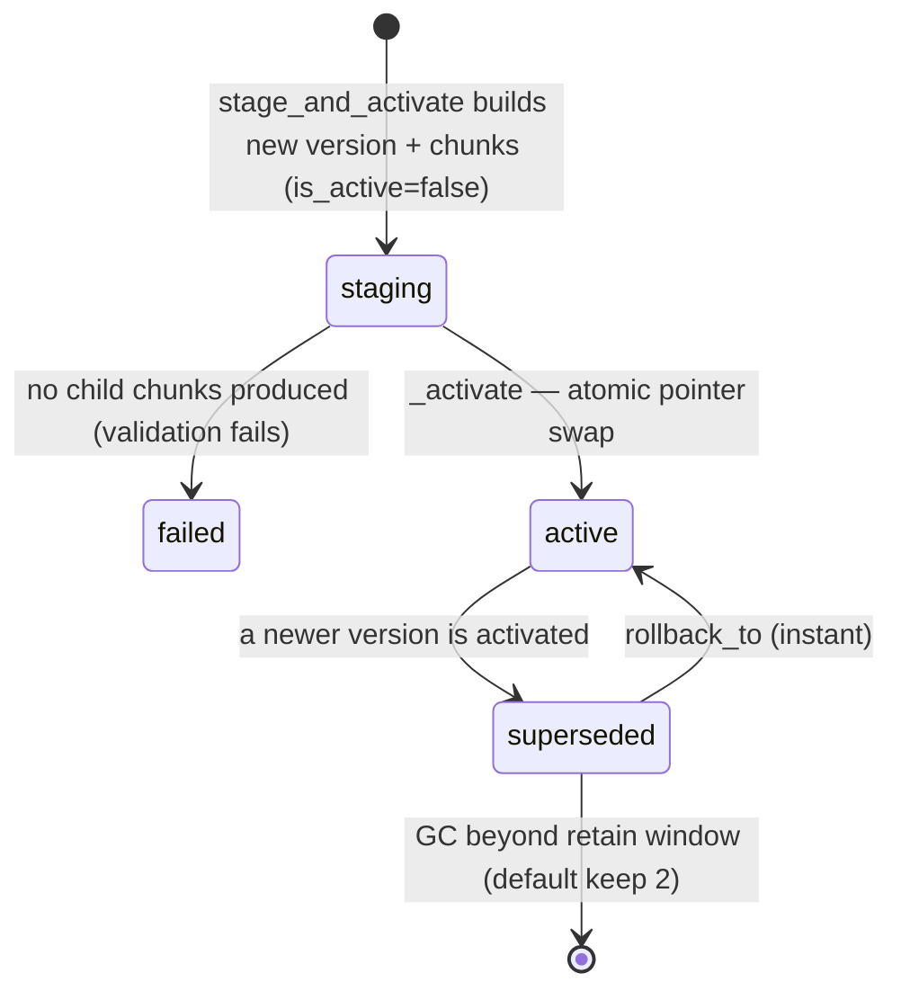

# Phase 2 — Ingestion (the transform)

**Status:** ✅ done. This is the "turning a page into chunks" half of the write path: raw
Confluence storage HTML (plus, since Phase 4.6, attachment text) → normalized blocks → parent/child
chunks → contextual text → embeddings → rows, staged and atomically activated.

## Files & folders used

```
apps/automation/app/features/ingestion/
├── domain/
│   ├── normalization.py        HTML → Block/Section (norm.normalize_body, content_hash)
│   ├── chunking.py             plan_chunks: parent/child split + stable keys
│   ├── chunk_diff.py           diff_chunks: exact/moved/edited-in-slot reuse matching
│   ├── change_detection.py     classify(): what changed since last sync
│   ├── tokenization.py         TokenCounter: count/split by tokens
│   └── attachment_extraction.py attachment_to_blocks (see phase-4.6.md for wiring)
├── application/
│   ├── contextualizer.py       Contextualizer: builds retrieval_content
│   ├── versioning.py           build_chunks, stage_and_activate, rollback_to, deactivate_page
│   └── services.py             build_ingestion_services: wires config + counter + embedder
├── infrastructure/page_source_repo.py   ensure_document
└── tests/                      test_chunking.py, test_chunk_diff.py, test_contextualizer.py,
                                 test_attachment_extraction.py, test_pipeline_reuse.py, test_tokenization.py
```

## 1. Chunking rules (`domain/chunking.py`)

Two tiers, sizes from `ChunkConfig` (`chunking.py:31-38`):

| Tier | `kind` | Target tokens | Bounds | Overlap | Embedded? |
|---|---|---|---|---|---|
| **Parent** | 0 | ~1200 | ≤2000 (`parent_max`) | — | No (`embedding=None`) |
| **Child** | 1 | ~400 | 150–750 | 12% (`child_overlap_ratio`) | Yes |

`plan_chunks` (`chunking.py:62-117`) descends structural boundaries per section — never cuts
mid-idea unless forced: `_pack_parents` (`chunking.py:129-147`) groups a section's units into
≤`parent_target` spans, token-splitting an oversize single unit; `_split_children`
(`chunking.py:150-159`) slices a parent into overlapping ~400-token windows, merging a too-small
trailing window back into the previous one.

Each planned chunk carries three keys (`chunking.py:42-53`) that power incremental re-embedding:

- **`section_key`** — identity of the owning section, independent of edits to *other* sections.
- **`positional_key`** — where the chunk sits, independent of its text.
- **`content_key`** — hash of the chunk's own text.
- **`stable_key`** = position + content, unique per document version.

## 2. Two contents per chunk: display vs. retrieval

Central distinction (`versioning.py::build_chunks`, `versioning.py:59-146`):

- **`display_content`** — the verbatim chunk text; what a citation shows the user. Never altered.
- **`retrieval_content`** — the text that actually gets embedded and keyword-indexed: the chunk
  plus a situating context, so a short snippet still matches a broad question.

## 3. Contextual retrieval (`application/contextualizer.py`)

`Contextualizer.contextualize` (`contextualizer.py:50-63`) builds each child's `retrieval_content`
as a metadata prefix (`_metadata_prefix`, `contextualizer.py:79-86`: page title + heading path,
always present) plus an optional 1–2 sentence LLM-written situating context, plus the verbatim
child text (`_compose`, `contextualizer.py:89-91`). The LLM step uses the **whole page as a
prompt-cached system block** — billed once per page, not once per chunk
(`contextualizer.py:50-54`, `cached_system_block`). If the model errors, `_llm_context`
catches `AnthropicError` and the chunk degrades to the metadata-only prefix — ingestion never fails
because of contextualization. Offline (no key), `_enabled` is `False` (`contextualizer.py:45`) and
you get the metadata prefix only.

**Meta-refusal guard (PLAN 3b, 2026-09-12).** A *successful* API call can still return a meta-reply
about the model's own lack of access (*"I don't have access to the overall document…"*) instead of
real situating context. `_llm_context` now runs `_is_meta_refusal(reply)` and **discards** such a
reply — degrading to the deterministic metadata prefix exactly like a transport error, logging
`contextualization_meta_refusal_discarded` — rather than baking it into `retrieval_content`. Left
un-discarded, that text is embedded and cross-encoder-reranked (the `tsv` keyword vector is built
from the *raw* chunk text in §4 and is immune), depressing the relevance signal below the 0.10
refusal threshold and causing false "routed to a human" answers on pages that do have content. The
detector is deliberately conservative (a false positive merely falls back to the safe prefix).
`contextualization_version` was bumped **1→2** so v1-poisoned chunks re-contextualize + re-embed on
their next reconcile (diff-reuse is disabled on a version mismatch); run `make reingest` to clear
live pollution on demand. Tests: `test_contextualizer.py` (`test_llm_meta_refusal_is_discarded_*`,
`test_llm_real_context_first_person_is_not_discarded`).

## 4. The keyword vector (`tsv`)

Each child's `tsv` is `to_tsvector('english', title + heading_path + child_text)`
(`versioning.py::_tsv`, `versioning.py:40-43`, applied at `versioning.py:140`). Including the title
and heading path means a query term that only appears in the *section heading* still matches.

## 5. Incremental re-embedding (`domain/chunk_diff.py`, `versioning.py::_resolve_children`)

`diff_chunks(old, new)` (`chunk_diff.py:56-113`) matches old chunks to new ones in three passes,
each consuming from a pool of not-yet-matched old chunks:

1. **exact** — same `stable_key` (position *and* content identical) → reuse.
2. **moved** — same `content_key` at a different position → content is byte-identical → reuse.
3. **edited-in-slot** — same `positional_key`, different content → re-embed (old chunk consumed).

Unmatched new chunks are inserts (re-embed); unmatched old chunks are deletes. `_resolve_children`
(`versioning.py:149-184`) applies the diff: reused children keep their prior `embedding` and
`retrieval_content` at zero API cost; only `reembed_indexes` are contextualized + embedded.

**Reuse is disabled entirely** when the pipeline config changed — `reusable_active_children`
(`versioning.py:258-280`) returns `[]` unless `_pipeline_config_matches`
(`versioning.py:283-291`) holds (`embedding_model`, `embedding_dim`, `contextualization_version`,
`retrieval_schema_version` all unchanged). Then every child rebuilds under the new config — the
"full re-embed release gate." This is how switching embedders is safe: bump the config, and the
next index of each page transparently re-embeds it, with the old version retained for rollback.

## 6. Versioning, activation, rollback (`application/versioning.py`)

An index update is immutable and atomic: build a new version fully, validate it, then swap one
pointer.



`stage_and_activate` (`versioning.py:187-255`), all in one transaction:

1. `ensure_document` — get/create the logical `document`.
2. Load `reusable_active_children` (empty if the pipeline config changed).
3. Insert a `document_version` in state `staging`; build all chunks with `is_active=False`.
4. `_link_chunks` (`versioning.py:294-311`) — wire each child to its parent (`parent_chunk_id`) and
   set `prev/next` sibling links.
5. **Validate** — if staging produced no child chunks, mark the version `failed` and raise
   (`versioning.py:238-242`); the live index is untouched.
6. `_activate` (`versioning.py:314-375`) — the pointer swap: supersede the old version + flip its
   chunks `is_active=False`; activate the new version + flip its chunks `is_active=True`; update
   `page_source.active_doc_version_id` and every hash/version stamp.
7. `_gc_superseded` (`versioning.py:378-399`) — delete versions beyond the retain window
   (default 2); chunks cascade via FK.

Because retrieval only ever reads `is_active AND kind=1` rows, and activation flips `is_active` in
the same transaction as the pointer swap, readers always see a consistent corpus.

**Rollback** (`rollback_to`, `versioning.py:419-460`) is the same pointer swap in reverse: point at
a retained superseded version, flip `is_active`. Since Phase 4.6.5 it also restores the 8
change-detection/pipeline fields `PageSource` shares with `DocumentVersion` (`content_hash`,
`structure_hash`, `parser_version`, `chunker_version`, `contextualization_version`,
`embedding_model`, `embedding_dim`, `retrieval_schema_version`) — see
[phase-4.6.md](./phase-4.6.md) for why that mattered.

**Deletion** (`deactivate_page`, `versioning.py:402-416`) sets the page status and flips its chunks
`is_active=False` — content stays in the DB for audit/undo but leaves the live index immediately.

## Not this file

- How a page gets fetched and when a rebuild is triggered — [phase-1.md](./phase-1.md).
- Provider tags (`source_id`/`source_type`/`tags`) stamped at the activation point in this same
  file — [phase-3.5.md](./phase-3.5.md).
- Attachment text becoming part of `blocks` before it ever reaches `plan_chunks` — that's a
  `confluence_sync`-side orchestration concern, [phase-4.6.md](./phase-4.6.md).
- Reading these chunks back out — `../retrieval/phase-3.md`.
